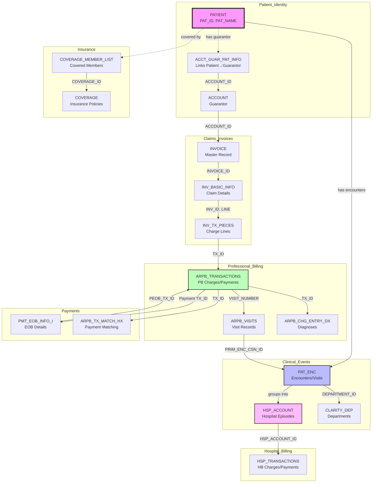
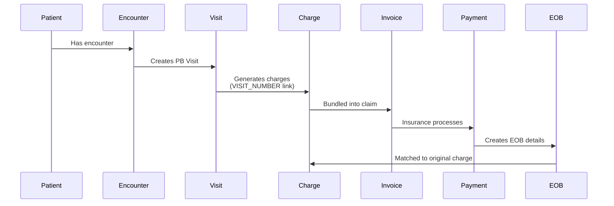
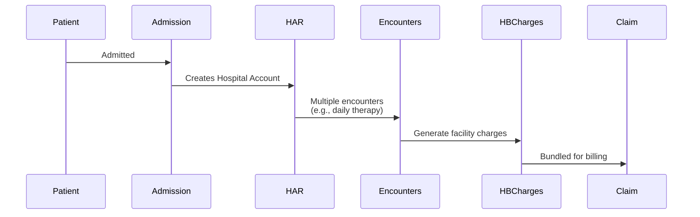

# Epic Financial Data Model - Visual Guide

## Overview Diagram



## Professional Billing Flow



## Hospital Billing Flow



## Key Relationships Summary

### 1. Patient → Financial Responsibility
- **Direct**: `PATIENT` → `ACCT_GUAR_PAT_INFO` → `ACCOUNT`
- **Purpose**: Links patient to guarantor (responsible party)

### 2. Charge → Encounter (Professional)
- **Path**: `ARPB_TRANSACTIONS` → `ARPB_VISITS` → `PAT_ENC`
- **Key**: VISIT_NUMBER
- **Discovery**: This linkage enables 100% encounter attribution

### 3. Charge → Episode (Hospital)
- **Direct**: `HSP_TRANSACTIONS.HSP_ACCOUNT_ID` → `HSP_ACCOUNT`
- **Nature**: Episode-based, not encounter-based

### 4. Charge → Invoice → Payment
- **Path**: `ARPB_TRANSACTIONS` → `INV_TX_PIECES` → `INVOICE` → `PMT_EOB_INFO_I`
- **Purpose**: Tracks claim submission and payment

### 5. Payment → Charge Matching
- **Table**: `ARPB_TX_MATCH_HX`
- **Purpose**: Records how payments are applied to charges

## Common Query Patterns

### Get All Charges for an Encounter
```sql
SELECT t.* 
FROM ARPB_TRANSACTIONS t
JOIN ARPB_VISITS v ON t.VISIT_NUMBER = v.PB_VISIT_NUM
WHERE v.PRIM_ENC_CSN_ID = :encounter_id
  AND t.TX_TYPE_C_NAME = 'Charge'
```

### Get All Encounters for a Hospital Stay
```sql
SELECT e.*, d.DEPARTMENT_NAME
FROM PAT_ENC e
LEFT JOIN CLARITY_DEP d ON e.DEPARTMENT_ID = d.DEPARTMENT_ID
WHERE e.HSP_ACCOUNT_ID = :har_id
ORDER BY e.CONTACT_DATE
```

### Get Insurance Coverage for a Patient
```sql
SELECT c.*, cm.*
FROM COVERAGE c
JOIN COVERAGE_MEMBER_LIST cm ON c.COVERAGE_ID = cm.COVERAGE_ID
WHERE cm.PAT_ID = :patient_id
  AND cm.MEM_EFF_FROM_DATE <= :service_date
  AND (cm.MEM_EFF_TO_DATE IS NULL OR cm.MEM_EFF_TO_DATE >= :service_date)
```

### Get Payment Details for a Charge
```sql
SELECT 
  m.MTCH_TX_HX_ID as payment_tx_id,
  m.MTCH_TX_HX_AMT as matched_amount,
  e.PAID_AMT,
  e.ALLOWED_AMT,
  e.DED_AMT,
  e.COPAY_AMT,
  e.DENIAL_CODES
FROM ARPB_TX_MATCH_HX m
LEFT JOIN PMT_EOB_INFO_I e ON m.MTCH_TX_HX_ID = e.TX_ID
WHERE m.TX_ID = :charge_tx_id
  AND m.MTCH_TX_HX_UN_DT IS NULL  -- Not unmatched
```

## Data Integrity Rules

1. **One Patient per HAR**: Each hospital account should have only one patient
2. **One Primary Encounter per Visit**: ARPB_VISITS.PRIM_ENC_CSN_ID
3. **Charges Balance**: Sum of charges should equal invoice total billed
4. **Payment Balance**: Matched amounts should not exceed payment amount
5. **Coverage Dates**: Member effective dates should encompass service dates

## Performance Considerations

### Large Table Warnings
- `ARPB_TRANSACTIONS`: Can have millions of rows
- `PAT_ENC`: High volume in large health systems
- `PMT_EOB_INFO_I`: Multiple rows per payment

### Optimization Strategies
1. Always filter by date range when possible
2. Use covering indexes for common joins
3. Consider partitioning by service date
4. Archive historical data appropriately