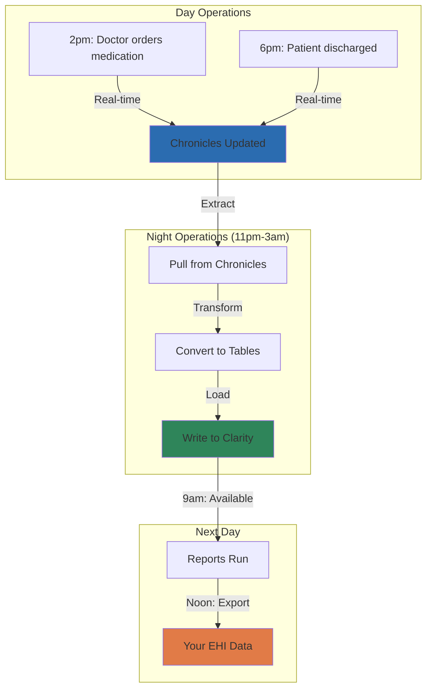

# Chapter 1.1: Chronicles → Clarity → EHI (Why Three Layers)

*This chapter explains Epic's three-tier data architecture and why your export is structured the way it is, including the critical "one-day lag" that affects every query you write.*

### The Journey of Your Data

Every piece of information in your Epic EHI export has traveled through three distinct systems, each designed for a different purpose. Understanding this journey explains why your data looks the way it does and helps you work with it more effectively.

<example-query description="Check how old your newest data is - spoiler: it's at least one day behind">
-- The ETL process runs nightly, so your data is always historical
SELECT 
  MAX(CONTACT_DATE) as newest_data,
  julianday('now') - julianday(MAX(CONTACT_DATE)) as days_behind_real_time
FROM PAT_ENC
WHERE CONTACT_DATE IS NOT NULL;
</example-query>

### The Three-Layer Architecture

#### Layer 1: Chronicles - The Living Database

**Chronicles** is Epic's real-time operational database where clinicians work. It's built on InterSystems Caché (now IRIS), a hierarchical database with roots in 1960s MUMPS technology from Massachusetts General Hospital.

Think of Chronicles as a massive tree structure:
```
Patient (Z7004242)
├── Demographics
│   ├── Name: "John Doe"
│   └── DOB: "1/1/1970"
├── Encounters
│   ├── Office Visit (1/15/2024)
│   │   ├── Diagnoses
│   │   │   ├── [1] Hypertension
│   │   │   └── [2] Diabetes
│   │   └── Orders
│   │       └── [1] Lisinopril
│   └── Hospital Stay (3/1/2024)
└── Insurance
    ├── [1] Medicare
    └── [2] Supplemental
```

This hierarchical structure is perfect for clinical workflows:
- **Sub-second response times** for patient care
- **Natural data relationships** (a patient has encounters, which have orders)
- **Flexible storage** (sparse arrays mean empty fields use no space)
- **2.5 million concurrent users** across all Epic systems

But it's terrible for analytics. You can't run SQL queries against a tree.

#### Layer 2: Clarity - The Reporting Database

**Clarity** solves the analytics problem by creating a relational mirror of Chronicles. Every night, an ETL (Extract, Transform, Load) process converts the hierarchical data into SQL tables.

<example-query description="See how hierarchical data becomes relational tables with LINE numbers">
-- In Chronicles, this would be stored as Patient->Encounter->Diagnoses[1,2,3]
-- In Clarity, it becomes rows with LINE numbers
SELECT 
  PAT_ENC_CSN_ID,
  LINE,
  CASE WHEN PRIMARY_DX_YN = 'Y' THEN 'Primary' ELSE 'Secondary' END as dx_type
FROM PAT_ENC_DX
WHERE PAT_ENC_CSN_ID = 720803470
ORDER BY LINE;
</example-query>

The transformation is massive:
- One patient object → 50+ related tables
- Multi-value fields → Rows with LINE numbers
- Tree navigation → SQL JOINs
- Real-time → Batch snapshots

#### Layer 3: EHI Export - The Snapshot

Your **EHI export** is a point-in-time extract from Clarity, delivered as TSV (Tab-Separated Value) files. It contains a subset of Clarity tables as required by the 21st Century Cures Act.

<example-query description="Count the tables in your export by module prefix">
-- Epic organizes tables by functional area
SELECT 
  CASE 
    WHEN name LIKE 'PAT_%' THEN 'Patient'
    WHEN name LIKE 'HSP_%' THEN 'Hospital Billing'
    WHEN name LIKE 'ARPB_%' THEN 'Professional Billing'
    WHEN name LIKE 'ORDER_%' THEN 'Orders'
    WHEN name LIKE 'CLARITY_%' THEN 'Reference Data'
    ELSE 'Other'
  END as module,
  COUNT(*) as table_count
FROM sqlite_master 
WHERE type = 'table'
GROUP BY module
ORDER BY table_count DESC;
</example-query>

### The Nightly ETL Process

The magic (and the lag) happens during the ETL process:



Key timing facts:
- **Monday-Saturday**: ETL runs midnight to ~7:30 AM
- **Sunday**: No ETL (maintenance window)
- **Monday Special**: Contains 48 hours of data (Saturday + Sunday)
- **Database Locked**: Clarity unavailable during ETL

### Why This Architecture Exists

#### Historical Evolution

1. **1979**: Epic founded, builds on MUMPS hierarchical database
2. **1990s**: SQL becomes industry standard, users demand reporting
3. **Solution**: Keep hierarchical for operations, add SQL mirror for reporting
4. **Today**: This dual architecture serves 78% of US patients

#### Technical Reasons

Each layer optimizes for different needs:

<example-query description="Demonstrate why complex analytics can't run on the operational system">
-- This query joins multiple tables - imagine running this 
-- on the live system while doctors are placing orders!
SELECT 
  pe.PAT_ENC_CSN_ID,
  COUNT(DISTINCT pd.LINE) as diagnosis_count,
  COUNT(DISTINCT op.ORDER_PROC_ID) as order_count
FROM PAT_ENC pe
LEFT JOIN PAT_ENC_DX pd ON pe.PAT_ENC_CSN_ID = pd.PAT_ENC_CSN_ID
LEFT JOIN ORDER_PROC op ON pe.PAT_ENC_CSN_ID = op.PAT_ENC_CSN_ID
GROUP BY pe.PAT_ENC_CSN_ID
HAVING diagnosis_count > 0 OR order_count > 0
ORDER BY diagnosis_count DESC
LIMIT 10;
</example-query>

**Performance isolation** is critical:
- Clinical work gets sub-second response
- Analytics don't impact patient care
- Each database optimized for its workload

### The "One-Day Lag" - Critical Concept

Your data is **always at least one day old**. This isn't a bug - it's architectural.

<example-query description="Understand what 'yesterday's data' really means">
-- If today is Tuesday, this shows Sunday's data (at best)
SELECT 
  DATE(MAX(CONTACT_DATE)) as latest_data_date,
  CASE 
    WHEN julianday('now') - julianday(MAX(CONTACT_DATE)) < 2 THEN 'Fresh (1-2 days old)'
    WHEN julianday('now') - julianday(MAX(CONTACT_DATE)) < 7 THEN 'Recent (less than a week)'
    ELSE 'Stale (check your export date!)'
  END as data_freshness
FROM PAT_ENC
WHERE CONTACT_DATE IS NOT NULL;
</example-query>

#### Use Cases by Data Freshness

| What You Need | Where to Get It | Data Lag |
|--------------|-----------------|----------|
| Current patient location | Chronicles (not in export) | Real-time |
| Today's appointments | Chronicles (not in export) | Real-time |
| Yesterday's visits | Your EHI export | 1-2 days |
| Last month's billing | Your EHI export | Perfect |
| Historical analysis | Your EHI export | Perfect |

### Data Transformation Examples

Understanding how data transforms helps you query it effectively:

#### Multi-Value Fields → LINE Pattern

In Chronicles, a patient's diagnoses are stored as an array. In your export, they become rows:

<example-query description="See the LINE pattern that appears everywhere in Epic data">
-- The LINE column preserves the original array order
SELECT 
  'Encounter ' || PAT_ENC_CSN_ID as encounter,
  'Diagnosis #' || LINE as position,
  CASE 
    WHEN LINE = 1 THEN 'Primary Diagnosis'
    ELSE 'Secondary Diagnosis'
  END as diagnosis_type
FROM PAT_ENC_DX
WHERE PAT_ENC_CSN_ID IN (
  SELECT PAT_ENC_CSN_ID 
  FROM PAT_ENC_DX 
  GROUP BY PAT_ENC_CSN_ID 
  HAVING COUNT(*) >= 3
  LIMIT 1
)
ORDER BY LINE;
</example-query>

#### Object Relationships → Foreign Keys

Chronicles navigates relationships through its tree structure. Your export uses foreign keys:

<example-query description="Trace relationships through foreign keys instead of tree navigation">
-- What would be Patient->Encounter->HSP_Account in Chronicles
-- becomes a chain of foreign keys in your export
SELECT 
  p.PAT_ID,
  pe.PAT_ENC_CSN_ID,
  pe.HSP_ACCOUNT_ID,
  ha.TOT_CHGS as total_charges
FROM PATIENT p
JOIN PAT_ENC pe ON p.PAT_ID = pe.PAT_ID
JOIN HSP_ACCOUNT ha ON pe.HSP_ACCOUNT_ID = ha.HSP_ACCOUNT_ID
WHERE ha.TOT_CHGS > 0
LIMIT 5;
</example-query>

### Why You Should Care

Understanding this architecture helps you:

1. **Set Realistic Expectations**: Don't promise real-time reporting from EHI data
2. **Optimize Queries**: Work with the relational structure, not against it
3. **Understand Limitations**: Some real-time fields simply aren't available
4. **Explain Quirks**: That weird LINE pattern? Now you know why

### Working With the Lag

Strategies for success:

1. **Accept It**: Most analytics are retrospective anyway
2. **Plan For It**: Schedule reports to run after data is available
3. **Communicate It**: Make sure stakeholders understand
4. **Design Around It**: Build workflows that accommodate the delay

<example-query description="Build lag awareness into your queries">
-- Always show users how current the data is
SELECT 
  'Data current through: ' || DATE(MAX(CONTACT_DATE)) as data_currency,
  'Report generated on: ' || DATE('now') as report_date,
  'This report contains data that is ' || 
  CAST(julianday('now') - julianday(MAX(CONTACT_DATE)) as INTEGER) || 
  ' days old' as age_warning
FROM PAT_ENC
WHERE CONTACT_DATE IS NOT NULL;
</example-query>

### Common Misconceptions

❌ **"The export has today's data"**  
✅ Reality: It has yesterday's data at best

❌ **"I can see patients currently in the ED"**  
✅ Reality: You can see patients who were in the ED yesterday

❌ **"Updates flow through automatically"**  
✅ Reality: Full replacement every night

❌ **"Small changes arrive quickly"**  
✅ Reality: All changes wait for the nightly ETL

---

### Key Takeaways

- Your data flows through three systems: Chronicles → Clarity → EHI Export
- Each layer serves a different purpose and uses different technology
- The one-day lag is architectural, not a limitation that can be "fixed"
- Understanding the transformation helps explain patterns like LINE numbers
- Different use cases need different data sources - EHI is great for historical analysis
