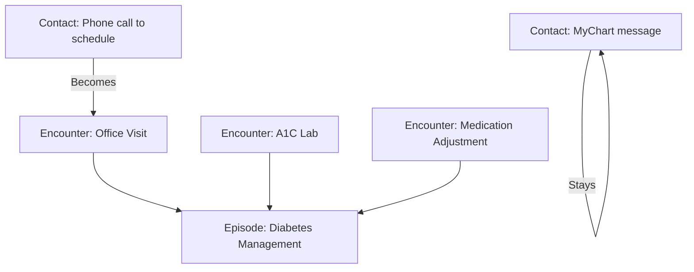

# Chapter 2.1: Epic Speak Crash Course

*Purpose: Master the essential terminology that makes Epic data suddenly comprehensible, transforming cryptic table names and column suffixes into a logical system you can navigate with confidence.*

### The Vocabulary Gap

You open your Epic export and see tables named `HSP_ACCOUNT`, columns ending in `_C`, and references to "buckets" and "filing orders." It feels like everyone's speaking a language you weren't taught. That's because they are.

Epic has evolved its own terminology over 40+ years, blending healthcare jargon with technical conventions. This chapter gives you the decoder ring. Once you understand these ~30 core terms, the 18,000 tables start making sense.

### The Clinical Trinity: Patient → Encounter → Provider

Let's start with the three most fundamental relationships in any Epic system:

<example-query description="See the core clinical relationship">
-- The Clinical Trinity: Every healthcare interaction connects these three
SELECT 
  p.PAT_ID,
  p.PAT_NAME,
  pe.PAT_ENC_CSN_ID,  -- The magic linking number
  pe.CONTACT_DATE,
  pe.VISIT_PROV_ID,
  pe.DEPARTMENT_ID
FROM PATIENT p
JOIN PAT_ENC pe ON p.PAT_ID = pe.PAT_ID
WHERE pe.PAT_ENC_CSN_ID = 720803470;  -- A specific encounter
</example-query>

**Patient**: The person receiving care. One record per human.

**Encounter**: Any documented interaction between patient and healthcare system. This gets its own **CSN** (Contact Serial Number) - the single most important ID in Epic. 

**Provider**: And here's your first surprise - in Epic, a "provider" isn't just a doctor. It's ANY entity that can provide care or be scheduled:
- Physicians and nurses
- Departments and clinics  
- MRI machines and OR rooms
- Lab instruments
- Even therapy dogs (really!)

<example-query description="See different types of providers">
-- Providers aren't just people
SELECT 
  PROV_ID,
  PROV_NAME,
  -- In real data, PROV_TYPE would tell us: Person, Resource, Department, etc.
  EXTERNAL_NAME_
FROM CLARITY_SER
WHERE PROV_ID IN ('24', '17', '32')
LIMIT 10;
</example-query>

### Contact vs. Encounter vs. Episode: The Hierarchy of Interactions

Epic uses three overlapping terms that confuse everyone initially:

**Contact**: The broadest term. ANY interaction - could be a phone call, portal message, appointment scheduling. Gets a Contact Date.

**Encounter**: A contact where care was delivered. Has clinical documentation. Gets a CSN.

**Episode**: A series of related encounters. Think "pregnancy" or "cancer treatment" - multiple visits, one clinical journey.



### The Financial Flow: Encounter → HAR → Buckets

Now let's follow the money. Every clinical encounter can generate charges, and Epic tracks this through a specific flow:

<example-query description="See the financial flow from encounter to account">
-- How clinical encounters link to financial accounts
SELECT 
  pe.PAT_ENC_CSN_ID,
  pe.CONTACT_DATE,
  ha.HSP_ACCOUNT_ID,  -- The HAR
  ha.ACCT_BILLSTS_HA_C_NAME as billing_status,
  ha.TOT_CHGS as total_charges
FROM PAT_ENC pe
JOIN HSP_ACCOUNT ha ON pe.HSP_ACCOUNT_ID = ha.HSP_ACCOUNT_ID
WHERE ha.HSP_ACCOUNT_ID = 377811219;
</example-query>

**HAR** (Hospital Account Record): The financial container for facility charges. One encounter might map to one HAR, or multiple encounters might share a HAR (like a 5-day admission).

**Bucket**: Where financial liability sits. Think of three buckets in a row:
1. **Pre-Bill Bucket**: Charges being prepared
2. **Insurance Bucket**: Sent to insurance, awaiting payment
3. **Self-Pay Bucket**: Patient responsibility

As payments come in or denials occur, amounts "pour" from one bucket to the next.

### The LINE Pattern: Epic's Answer to One-to-Many

How do you store multiple diagnoses for one encounter? Multiple insurances for one patient? Epic uses a simple pattern everywhere: the **LINE** number.

<example-query description="See the LINE pattern with encounter diagnoses">
-- One encounter, multiple diagnoses, distinguished by LINE
SELECT 
  PAT_ENC_CSN_ID,
  LINE,  -- 1, 2, 3... The sequence number
  DX_ID,
  PRIMARY_DX_YN  -- 'Y' for primary diagnosis
FROM PAT_ENC_DX
WHERE PAT_ENC_CSN_ID = 720803470
ORDER BY LINE;
</example-query>

The pattern is always:
- Primary Key = (ID + LINE)
- LINE 1 = Primary/First/Most Important
- LINE 2+ = Secondary/Additional

You'll see this in diagnoses, procedures, medications, insurances, and dozens of other areas.

### Filing Order: The Insurance Hierarchy

When a patient has multiple insurances, who pays first? Epic uses **Filing Order**:

- **1** = Primary Insurance (pays first)
- **2** = Secondary Insurance (pays remaining)
- **3** = Tertiary Insurance (pays what's left)
- **4+** = Self-Pay (patient responsibility)

This number appears everywhere in financial tables and drives the entire billing flow.

### Table Prefix Decoder

Epic tables follow consistent naming patterns. Master these prefixes:

| Prefix | Meaning | Example |
|--------|---------|---------|
| `PAT_` | Patient clinical data | `PAT_ENC` (encounters) |
| `HSP_` | Hospital billing | `HSP_ACCOUNT` (HARs) |
| `ARPB_` | Professional billing | `ARPB_TRANSACTIONS` |
| `CLARITY_` | Reference/Master data | `CLARITY_SER` (providers) |
| `ORDER_` | Orders and results | `ORDER_PROC` |
| `ZC_` | Category lists | `ZC_SEX` |
| `V_` | Pre-built views | `V_PAT_ENC` |

The prefix instantly tells you which Epic module and workflow created this data.

### Column Suffix Patterns

Epic columns also follow patterns:

| Suffix | Meaning | Example |
|--------|---------|---------|
| `_C` | Category code (number) | `SEX_C` = 1 |
| `_C_NAME` | Decoded category | `SEX_C_NAME` = "Female" |
| `_ID` | Internal identifier | `PAT_ID` |
| `_DTTM` | Date and time | `ENTRY_DTTM` |
| `_DATE` | Date only | `CONTACT_DATE` |
| `_YN` | Yes/No flag | `PRIMARY_DX_YN` |
| `_HX` | History table | `PAT_ADDR_HX` |

### Epic's Special Terms

Some terms are pure Epic-speak:

**SmartTools**: Templates and automation
- SmartPhrases: Text snippets
- SmartSets: Order sets
- SmartForms: Data collection

**Work Queues (WQ)**: Task distribution system. Claims WQ, Refill WQ, etc.

**In Basket**: Internal messaging between staff

**Break the Glass**: Emergency access override

**INI**: Configuration settings that control behavior

**Flowsheets**: Structured data entry (vitals, assessments)

### Chronicles vs. Clarity: Why Your Data Looks This Way

Your export comes from **Clarity** (the reporting database), not **Chronicles** (the live system). Key implications:

- Data is 1+ days old (nightly ETL)
- Optimized for queries, not transactions
- Some real-time fields excluded
- Table structure is flattened from hierarchical

Think of it: Chronicles serves the ICU nurse at 3 AM. Clarity serves your analytical queries.

### Common Confusions Clarified

**CSN vs. HAR**: CSN identifies clinical encounters. HAR identifies financial accounts. One admission might have one CSN but multiple HARs if billing is split.

**Provider vs. User**: Providers deliver care (including departments). Users log into Epic.

**Guarantor vs. Subscriber**: Guarantor pays the bill. Subscriber holds the insurance policy. Often the same person, but not always (pediatrics, spouses).

**Department vs. Location**: Departments are functional units ("Cardiology"). Locations are physical places ("3rd Floor East").

### Your Epic Vocabulary Card

Print this and keep it handy:

```
CLINICAL:
Patient (PAT_) → Encounter (CSN) → Provider (SER)
Contact > Encounter > Episode

FINANCIAL:  
Encounter → HAR → Buckets → Transactions
Filing Order: 1=Primary Ins, 2=Secondary, 3=Tertiary

PATTERNS:
(ID, LINE) = One-to-many relationships
_C = Code, _C_NAME = Description
HSP_ = Hospital, ARPB_ = Professional, CLARITY_ = Reference

REMEMBER:
- Providers include machines and departments
- CSN is your universal tracking number
- Data is from Clarity (1-day old), not Chronicles (live)
```

---

### Key Takeaways

- Epic terminology seems alien but follows consistent patterns
- Master ~30 core terms and 18,000 tables become navigable  
- The Clinical Trinity (Patient-Encounter-Provider) connects everything
- Financial flow follows Encounter→HAR→Buckets→Transactions
- Table prefixes (`HSP_`, `PAT_`) and column suffixes (`_C`, `_ID`) are your guide
- LINE numbers handle one-to-many relationships everywhere
- Your data comes from Clarity (reporting) not Chronicles (operational)
- When confused, trace back to the CSN - it links everything