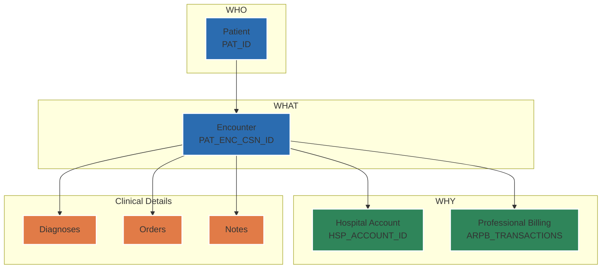

# Chapter 2.2: The Identifier Trinity

*Purpose: To master the three core identifiers that form the backbone of every Epic data relationship.*

### The Three Pillars of Epic Data

Every piece of data in Epic ultimately links back to three fundamental identifiers. Understanding these three keys unlocks the entire dataset.

Think of them as answering three essential questions:
- **WHO** is the patient? → `PAT_ID`
- **WHAT** clinical interaction occurred? → `PAT_ENC_CSN_ID` (CSN)
- **WHY** are we billing? → `HSP_ACCOUNT_ID` (HAR)

<example-query description="See the trinity in action">
SELECT 
  p.PAT_ID as who_patient,
  pe.PAT_ENC_CSN_ID as what_encounter,
  pe.HSP_ACCOUNT_ID as why_billing
FROM PATIENT p
JOIN PAT_ENC pe ON p.PAT_ID = pe.PAT_ID
WHERE pe.HSP_ACCOUNT_ID IS NOT NULL
LIMIT 5;
</example-query>



### PAT_ID: The Person (WHO)

The **PAT_ID** is the permanent, enterprise-wide identifier for a person. Once assigned, it never changes—even if patient records are merged.

#### Key Characteristics
- **Scope**: Identifies a person across all time and all facilities
- **Format**: Alphanumeric (organization-specific, often starts with 'Z')
- **Permanence**: Survives merges, never recycled
- **Uniqueness**: One person = one PAT_ID (ideally)

<example-query description="Explore patient identity">
SELECT 
  PAT_ID,
  PAT_NAME,
  BIRTH_DATE
FROM PATIENT
WHERE PAT_ID = 'Z7004242';
</example-query>

#### Where You'll Find PAT_ID
Nearly every clinical table contains PAT_ID as a foreign key. It's the universal patient linker. You can find all tables that link directly to a patient using the `_metadata` table.

<example-query description="Count tables that link directly to PATIENT">
SELECT 
  COUNT(*) as tables_with_pat_id
FROM _metadata
WHERE column_name = 'PAT_ID';
</example-query>

#### Common Confusion: PAT_ID vs MRN
- **PAT_ID**: Internal Epic identifier, never shown to users
- **MRN (Medical Record Number)**: What clinicians see and use
- In exports, you typically get PAT_ID, not MRN

### CSN: The Clinical Event (WHAT)

The **Contact Serial Number (CSN)** uniquely identifies every clinical interaction—from a phone call to a hospital stay. It's the atomic unit of clinical activity.

#### Key Characteristics
- **Scope**: One specific encounter/visit/contact
- **Format**: Numeric (store as TEXT to preserve leading zeros)
- **Creation**: Generated when appointment scheduled or patient arrives
- **The Universal FK**: Links everything clinical

<example-query description="One patient, many encounters">
SELECT 
  PAT_ID,
  COUNT(DISTINCT PAT_ENC_CSN_ID) as total_encounters,
  MIN(CONTACT_DATE) as first_visit,
  MAX(CONTACT_DATE) as last_visit
FROM PAT_ENC
WHERE PAT_ID = 'Z7004242'
GROUP BY PAT_ID;
</example-query>

#### The CSN Web
A single CSN connects to dozens of related tables. Think of it as the hub of a wheel:

<example-query description="Everything linked to one encounter">
SELECT 
  'Encounter Info' as data_type,
  COUNT(*) as records
FROM PAT_ENC 
WHERE PAT_ENC_CSN_ID = '720803470'
UNION ALL
SELECT 'Diagnoses', COUNT(*)
FROM PAT_ENC_DX
WHERE PAT_ENC_CSN_ID = '720803470'
UNION ALL
SELECT 'Orders', COUNT(*)
FROM ORDER_PROC
WHERE PAT_ENC_CSN_ID = '720803470';
</example-query>

#### CSN Gotchas
- A multi-day hospital stay = one CSN
- But ancillary services (lab, radiology) during that stay may generate additional CSNs
- Not all CSNs have financial data (HAR)

### HAR: The Financial Container (WHY)

The **Hospital Account Record (HAR)** is Epic's financial grouping mechanism. It answers: "How do we bill for these services?"

#### Key Characteristics
- **Scope**: Groups related services for billing
- **Creation**: When facility charges need tracking
- **Relationship**: Can span multiple encounters
- **Module**: Only exists for Hospital Billing, not Professional Billing

<example-query description="HARs group multiple encounters">
SELECT 
  HSP_ACCOUNT_ID,
  COUNT(*) as encounters_in_har,
  MIN(CONTACT_DATE) as first_encounter,
  MAX(CONTACT_DATE) as last_encounter
FROM PAT_ENC
WHERE HSP_ACCOUNT_ID IS NOT NULL
GROUP BY HSP_ACCOUNT_ID
HAVING COUNT(*) > 1;
</example-query>

#### HAR Business Rules
Epic groups encounters into HARs based on complex rules:
- Same-day procedures often share a HAR
- Medicare's 3-day rule bundles related services
- Readmissions within timeframes may combine

<example-query description="Financial view of a HAR">
SELECT 
  ha.HSP_ACCOUNT_ID,
  ha.TOT_CHGS as total_charges,
  -- Note: Total payments would need to be calculated from HSP_TRANSACTIONS
  ha.TOT_CHGS - ha.TOT_ADJ as net_charges,
  ha.ACCT_BILLSTS_HA_C_NAME as billing_status
FROM HSP_ACCOUNT ha
WHERE ha.HSP_ACCOUNT_ID = '376684810';
</example-query>

#### Not Everything Has a HAR
Professional-only encounters (physician office visits) may have charges but no HAR. They use a different billing system (ARPB tables).

### The Trinity in Action

The real power comes from combining all three identifiers:

<example-query description="Complete patient journey">
SELECT 
  -- Patient info
  p.PAT_NAME,
  -- Encounter details
  pe.PAT_ENC_CSN_ID,
  pe.CONTACT_DATE,
  pe.DEPARTMENT_ID,
  -- Financial linkage
  pe.HSP_ACCOUNT_ID,
  -- Clinical data (diagnosis)
  dx.DX_ID,
  dx.LINE as diagnosis_priority
FROM PATIENT p
JOIN PAT_ENC pe ON p.PAT_ID = pe.PAT_ID
LEFT JOIN PAT_ENC_DX dx ON pe.PAT_ENC_CSN_ID = dx.PAT_ENC_CSN_ID
WHERE p.PAT_ID = 'Z7004242'
  AND pe.CONTACT_DATE >= '2019-01-01'
ORDER BY pe.CONTACT_DATE, dx.LINE
LIMIT 20;
</example-query>

### Common Join Patterns

#### Pattern 1: Clinical-Only Analysis
When you only need clinical data, join through CSN:

<example-query description="Clinical data via CSN">
SELECT 
  pe.PAT_ENC_CSN_ID,
  pe.CONTACT_DATE,
  COUNT(DISTINCT ord.ORDER_PROC_ID) as orders_placed,
  COUNT(DISTINCT dx.LINE) as diagnoses_recorded
FROM PAT_ENC pe
LEFT JOIN ORDER_PROC ord ON pe.PAT_ENC_CSN_ID = ord.PAT_ENC_CSN_ID
LEFT JOIN PAT_ENC_DX dx ON pe.PAT_ENC_CSN_ID = dx.PAT_ENC_CSN_ID
WHERE pe.PAT_ID = 'Z7004242'
GROUP BY pe.PAT_ENC_CSN_ID, pe.CONTACT_DATE
ORDER BY pe.CONTACT_DATE DESC
LIMIT 10;
</example-query>

#### Pattern 2: Financial-Only Analysis
For billing analysis, focus on HAR:

<example-query description="Financial data via HAR">
SELECT 
  ha.HSP_ACCOUNT_ID,
  ha.ACCT_BILLSTS_HA_C_NAME as status,
  ha.TOT_CHGS as charges,
  ha.TOT_ADJ as adjustments,
  ha.TOT_CHGS - ha.TOT_ADJ as net_charges
FROM HSP_ACCOUNT ha
WHERE ha.ACCT_BILLSTS_HA_C_NAME != 'Unbilled'
ORDER BY ha.TOT_CHGS DESC
LIMIT 5;
</example-query>

#### Pattern 3: Full Clinical-Financial Picture
Most complex analyses require all three:

<example-query description="Complete view using all three identifiers">
SELECT 
  -- WHO
  p.PAT_ID,
  p.PAT_NAME,
  -- WHAT  
  pe.PAT_ENC_CSN_ID,
  pe.CONTACT_DATE,
  edg.DX_NAME as primary_diagnosis,
  -- WHY
  ha.HSP_ACCOUNT_ID,
  ha.TOT_CHGS as total_charges
FROM PATIENT p
JOIN PAT_ENC pe ON p.PAT_ID = pe.PAT_ID
LEFT JOIN PAT_ENC_DX dx ON pe.PAT_ENC_CSN_ID = dx.PAT_ENC_CSN_ID 
  AND dx.LINE = 1 -- Primary diagnosis only
LEFT JOIN CLARITY_EDG edg ON dx.DX_ID = edg.DX_ID
LEFT JOIN HSP_ACCOUNT ha ON pe.HSP_ACCOUNT_ID = ha.HSP_ACCOUNT_ID
WHERE pe.CONTACT_DATE BETWEEN '2020-01-01' AND '2020-12-31'
  AND ha.HSP_ACCOUNT_ID IS NOT NULL
ORDER BY pe.CONTACT_DATE
LIMIT 10;
</example-query>

### Understanding Null Values

Not every relationship exists:

<example-query description="Encounters without financial data">
SELECT 
  COUNT(*) as total_encounters,
  SUM(CASE WHEN HSP_ACCOUNT_ID IS NULL THEN 1 ELSE 0 END) as no_har,
  ROUND(100.0 * SUM(CASE WHEN HSP_ACCOUNT_ID IS NULL THEN 1 ELSE 0 END) / COUNT(*), 1) as pct_no_har
FROM PAT_ENC
WHERE PAT_ID = 'Z7004242';
</example-query>

This is normal! Many encounters (phone calls, messages, non-billable visits) don't generate hospital accounts.

### Validation Queries

Always validate your understanding of the relationships:

<example-query description="Check data integrity">
-- Encounters without patients (should be 0)
SELECT COUNT(*) as orphan_encounters
FROM PAT_ENC pe
LEFT JOIN PATIENT p ON pe.PAT_ID = p.PAT_ID
WHERE p.PAT_ID IS NULL;
</example-query>

<example-query description="Multiple HARs per encounter (should be 0)">
-- Each encounter should link to at most one HAR
SELECT 
  PAT_ENC_CSN_ID,
  COUNT(DISTINCT HSP_ACCOUNT_ID) as har_count
FROM PAT_ENC
WHERE HSP_ACCOUNT_ID IS NOT NULL
GROUP BY PAT_ENC_CSN_ID
HAVING COUNT(DISTINCT HSP_ACCOUNT_ID) > 1;
</example-query>

### Mental Models

#### The Hierarchy
```
1 Patient (PAT_ID)
  → Many Encounters (CSN)
    → Many Orders, Diagnoses, Notes, etc.
  → Many Financial Accounts (HAR)
    → Many Charges, Payments, Adjustments
```

#### The Venn Diagram
- **Clinical Data**: Centered on CSN
- **Financial Data**: Centered on HAR
- **Overlap**: Where CSN and HAR both exist
- **Patient**: The universal container

### Quick Decision Tree

**Q: What identifier should I use?**

1. **Need patient demographics?** → Start with PAT_ID
2. **Need visit details, diagnoses, orders?** → Use CSN
3. **Need charges, payments, insurance?** → Use HAR
4. **Need everything?** → Join all three

**Q: What join type should I use?**
- **INNER JOIN**: When you MUST have the relationship
- **LEFT JOIN**: When the relationship might not exist (especially for HAR)

---

### Key Takeaways

1. **PAT_ID** = The person (permanent, enterprise-wide)
2. **CSN** = The clinical event (atomic unit of care)
3. **HAR** = The financial container (billing grouper)
4. **CSN is King**: Most clinical data hangs off CSN
5. **Not everything has a HAR**: Only hospital billing
6. **Left joins are your friend**: Many relationships are optional
7. **The trinity pattern**: Master these three and you've mastered Epic data