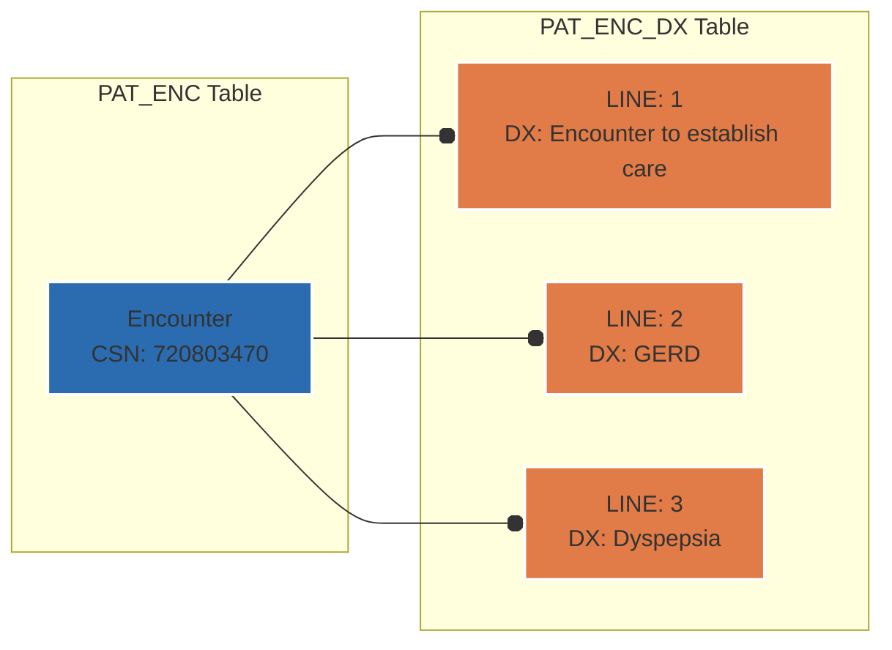

# Chapter 2.3: The (ID, LINE) Paradigm

*Purpose: Master Epic's most pervasive pattern—the composite key structure that enables one-to-many relationships throughout the entire data model.*

### The Problem Epic Solved

Healthcare data is inherently multi-valued. A single patient encounter generates multiple diagnoses, procedures, providers, insurance claims, and medications. Epic's original hierarchical Chronicles database handled this naturally through its tree structure. But when that data gets flattened into relational tables for reporting, you need a different approach.

Epic's solution? The **(ID, LINE)** composite key pattern—a deceptively simple mechanism that preserves hierarchical relationships in a relational world.

### What LINE Does

The **LINE** field serves as a sequence number within a parent record, creating a composite primary key when combined with the parent ID. Think of it as adding a "row number" to handle multiple related items.

<example-query description="See how diagnoses use LINE numbers for a single encounter">
SELECT 
  ped.PAT_ENC_CSN_ID,
  ped.LINE,
  edg.DX_NAME,
  ped.PRIMARY_DX_YN,
  CASE 
    WHEN ped.LINE = 1 THEN 'Primary'
    ELSE 'Secondary' 
  END as dx_type
FROM PAT_ENC_DX ped
LEFT JOIN CLARITY_EDG edg ON ped.DX_ID = edg.DX_ID
WHERE ped.PAT_ENC_CSN_ID = 720803470
ORDER BY ped.LINE;
</example-query>



The genius is in its simplicity: instead of creating separate tables for every one-to-many relationship, Epic adds a LINE column. This keeps related data close together while maintaining uniqueness through the composite key.

### Core Characteristics of LINE

**Starting Value**: LINE typically starts at 1, not 0. This follows healthcare conventions where the "primary" item (diagnosis, procedure, insurance) is considered "#1."

**Sequential but Not Continuous**: LINE values often have gaps. If a user deletes LINE 2, LINE 3 doesn't automatically become LINE 2. This is intentional—renumbering would break historical references and audit trails.

<example-query description="Check LINE sequences across multiple encounters">
SELECT 
  PAT_ENC_CSN_ID,
  GROUP_CONCAT(LINE, ', ') as line_numbers,
  COUNT(*) as total_diagnoses
FROM PAT_ENC_DX 
GROUP BY PAT_ENC_CSN_ID
HAVING COUNT(*) >= 2
ORDER BY total_diagnoses DESC
LIMIT 5;
</example-query>

**Composite Key Enforcement**: The combination of (ID, LINE) must be unique. You cannot have two LINE 1 records for the same parent ID.

### Common Tables Using (ID, LINE)

The pattern appears throughout Epic's data model:

<example-query description="See LINE pattern in allergy reactions">
SELECT 
  a.ALLERGY_ID,
  ar.LINE,
  ar.REACTION_C_NAME_ as reaction
FROM ALLERGY a
LEFT JOIN ALLERGY_REACTIONS ar ON a.ALLERGY_ID = ar.ALLERGY_ID
WHERE a.ALLERGY_ID IN (30689238, 30689295)
ORDER BY a.ALLERGY_ID, ar.LINE;
</example-query>

Common tables include:
- `PAT_ENC_DX`: Multiple diagnoses per encounter
- `ALLERGY_REACTIONS`: Multiple reactions per allergy
- `COVERAGE_MEMBER_LIST`: Multiple members per insurance coverage
- `ORDER_RESULTS`: Multiple result components per lab order
- `HSP_ACCT_DX_LIST`: Multiple diagnoses per hospital account

### Query Patterns for LINE Data

#### Pattern 1: Get All Related Records

<example-query description="Retrieve all diagnoses for encounters with multiple conditions">
SELECT 
  ped.PAT_ENC_CSN_ID,
  ped.LINE,
  edg.DX_NAME,
  ped.DX_CHRONIC_YN as is_chronic
FROM PAT_ENC_DX ped
JOIN CLARITY_EDG edg ON ped.DX_ID = edg.DX_ID
WHERE ped.PAT_ENC_CSN_ID IN (
  -- Find encounters with 3+ diagnoses
  SELECT PAT_ENC_CSN_ID 
  FROM PAT_ENC_DX 
  GROUP BY PAT_ENC_CSN_ID 
  HAVING COUNT(*) >= 3
)
ORDER BY ped.PAT_ENC_CSN_ID, ped.LINE
LIMIT 10;
</example-query>

#### Pattern 2: Get Primary Item Only

LINE = 1 typically indicates the primary or most important item. This is a healthcare convention, not a technical requirement.

<example-query description="Get only primary diagnoses across all encounters">
SELECT 
  pe.PAT_ENC_CSN_ID,
  pe.CONTACT_DATE,
  edg.DX_NAME as primary_diagnosis
FROM PAT_ENC pe
LEFT JOIN PAT_ENC_DX ped 
  ON pe.PAT_ENC_CSN_ID = ped.PAT_ENC_CSN_ID 
  AND ped.LINE = 1  -- Primary diagnosis only
LEFT JOIN CLARITY_EDG edg 
  ON ped.DX_ID = edg.DX_ID
WHERE pe.CONTACT_DATE >= '2018-01-01'
  AND edg.DX_NAME IS NOT NULL
ORDER BY pe.CONTACT_DATE DESC
LIMIT 10;
</example-query>

#### Pattern 3: Pivot Lines to Columns

Transform multiple rows into columns for reporting:

<example-query description="Show first three diagnoses as columns">
SELECT 
  PAT_ENC_CSN_ID,
  COUNT(*) as total_dx,
  MAX(CASE WHEN LINE = 1 THEN dx_name END) as primary_dx,
  MAX(CASE WHEN LINE = 2 THEN dx_name END) as secondary_dx,
  MAX(CASE WHEN LINE = 3 THEN dx_name END) as tertiary_dx
FROM (
  SELECT ped.PAT_ENC_CSN_ID, ped.LINE, edg.DX_NAME as dx_name
  FROM PAT_ENC_DX ped
  LEFT JOIN CLARITY_EDG edg ON ped.DX_ID = edg.DX_ID
  WHERE edg.DX_NAME IS NOT NULL
)
GROUP BY PAT_ENC_CSN_ID
HAVING COUNT(*) >= 2
ORDER BY total_dx DESC
LIMIT 10;
</example-query>

#### Pattern 4: Aggregate Across Lines

<example-query description="Count diagnosis frequency across all encounters">
SELECT 
  edg.DX_NAME,
  COUNT(DISTINCT ped.PAT_ENC_CSN_ID) as encounter_count,
  COUNT(*) as total_occurrences,
  SUM(CASE WHEN ped.LINE = 1 THEN 1 ELSE 0 END) as times_primary,
  ROUND(
    100.0 * SUM(CASE WHEN ped.LINE = 1 THEN 1 ELSE 0 END) / COUNT(*), 
    1
  ) as pct_primary
FROM PAT_ENC_DX ped
JOIN CLARITY_EDG edg ON ped.DX_ID = edg.DX_ID
GROUP BY edg.DX_NAME
HAVING COUNT(*) >= 3
ORDER BY encounter_count DESC
LIMIT 10;
</example-query>

### Common Mistakes and Solutions

#### Mistake 1: Forgetting LINE in Joins

When joining tables with LINE fields, forgetting to handle the one-to-many relationship creates cartesian products:

<example-query description="WRONG - Creates duplicate encounter rows">
-- This query duplicates encounters for each diagnosis
SELECT COUNT(*) as apparent_encounters
FROM PAT_ENC pe
JOIN PAT_ENC_DX ped ON pe.PAT_ENC_CSN_ID = ped.PAT_ENC_CSN_ID
WHERE pe.CONTACT_DATE >= '2020-01-01';
</example-query>

<example-query description="CORRECT - Counts unique encounters">
-- This properly counts distinct encounters
SELECT COUNT(DISTINCT pe.PAT_ENC_CSN_ID) as actual_encounters
FROM PAT_ENC pe
JOIN PAT_ENC_DX ped ON pe.PAT_ENC_CSN_ID = ped.PAT_ENC_CSN_ID
WHERE pe.CONTACT_DATE >= '2020-01-01';
</example-query>

#### Mistake 2: Assuming Sequential LINEs

Never assume LINE values are continuous. Use LEFT JOINs to handle missing LINE numbers:

<example-query description="Handle potentially missing secondary diagnoses">
SELECT 
  dx1.PAT_ENC_CSN_ID,
  edg1.DX_NAME as primary_dx,
  edg2.DX_NAME as secondary_dx  -- May be NULL
FROM PAT_ENC_DX dx1
JOIN CLARITY_EDG edg1 ON dx1.DX_ID = edg1.DX_ID
LEFT JOIN PAT_ENC_DX dx2 
  ON dx1.PAT_ENC_CSN_ID = dx2.PAT_ENC_CSN_ID 
  AND dx2.LINE = 2
LEFT JOIN CLARITY_EDG edg2 ON dx2.DX_ID = edg2.DX_ID
WHERE dx1.LINE = 1
  AND dx1.PAT_ENC_CSN_ID IN (720803470, 725327197, 799951565)
ORDER BY dx1.PAT_ENC_CSN_ID;
</example-query>

#### Mistake 3: Performance Problems with Multiple LINE Tables

Joining multiple tables with LINE fields can explode result sets. Aggregate first:

<example-query description="Efficient aggregation before joining">
-- Pre-aggregate diagnosis counts
WITH dx_summary AS (
  SELECT 
    PAT_ENC_CSN_ID,
    COUNT(*) as dx_count,
    MAX(CASE WHEN ped.LINE = 1 THEN edg.DX_NAME END) as primary_dx
  FROM PAT_ENC_DX ped
  JOIN CLARITY_EDG edg ON ped.DX_ID = edg.DX_ID
  GROUP BY PAT_ENC_CSN_ID
)
SELECT 
  pe.PAT_ENC_CSN_ID,
  pe.CONTACT_DATE,
  ds.dx_count,
  ds.primary_dx
FROM PAT_ENC pe
JOIN dx_summary ds ON pe.PAT_ENC_CSN_ID = ds.PAT_ENC_CSN_ID
WHERE ds.dx_count >= 3
ORDER BY pe.CONTACT_DATE DESC
LIMIT 10;
</example-query>

### Understanding LINE Behavior

#### Why Gaps Exist

LINE gaps are normal and expected. They occur due to:
- **Deletions**: Removed items leave gaps
- **Performance**: Pre-allocating LINE ranges
- **Migrations**: Historical data imports
- **User Actions**: Manual reordering

#### LINE = 1 Is Special

In healthcare, the "primary" concept is fundamental:
- Primary diagnosis (drives reimbursement)
- Primary insurance (billed first)
- Primary procedure (main reason for visit)

Epic consistently uses LINE = 1 for these primary items, making it safe to filter on `LINE = 1` when you need just the main item.

#### Maximum LINE Values

While technically unlimited, practical LINE values rarely exceed:
- Diagnoses: 10-20 per encounter
- Procedures: 5-15 per encounter
- Medications: 20-30 active per patient
- Lab results: 50-100 components per order

### Performance Considerations

The (ID, LINE) pattern requires specific indexing strategies:

```sql
-- Composite indexes are essential
-- Epic typically creates: INDEX (PARENT_ID, LINE)
-- This supports both lookups and ordering
```

When working with LINE data:
1. **Always ORDER BY LINE** to maintain sequence
2. **Use composite indexes** on (ID, LINE)
3. **Aggregate before joining** multiple LINE tables
4. **Consider partitioning** for very large LINE sets

### Real-World Example: Insurance Coverage Over Time

<example-query description="Track insurance coverage periods using LINE">
SELECT 
  cm.COVERAGE_ID,
  cm.LINE,
  cm.PAT_ID,
  cm.MEM_COVERED_YN as is_active,
  cov.CVG_EFF_DT as EFF_FROM_DATE,
  cov.CVG_TERM_DT as EFF_TO_DATE
FROM COVERAGE cov
JOIN COVERAGE_MEMBER_LIST cm 
  ON cov.COVERAGE_ID = cm.COVERAGE_ID 
WHERE cm.PAT_ID = 'Z1489173'
ORDER BY cov.CVG_EFF_DT, cm.LINE;
</example-query>

This shows how LINE preserves the order of coverage periods, essential for determining which insurance was active when.

---

### Key Takeaways

1. **The (ID, LINE) pattern is everywhere**—once you recognize it, Epic's data model becomes much clearer
2. **LINE = 1 means primary**—a consistent convention across all Epic modules
3. **Gaps are normal**—don't write queries assuming sequential LINE values
4. **Composite keys require composite thinking**—always include both ID and LINE in joins
5. **Performance matters**—aggregate before joining multiple LINE tables

### Quick Reference

| Task | SQL Pattern |
|------|-------------|
| Get primary only | `WHERE LINE = 1` |
| Get all items | `ORDER BY LINE` |
| Count items | `COUNT(*) GROUP BY ID` |
| Handle missing | `LEFT JOIN ... AND LINE = n` |
| Pivot to columns | `MAX(CASE WHEN LINE = n THEN field END)` |
| Check for gaps | `GROUP_CONCAT(LINE, ', ')` |

### Common Gotchas Checklist

- [ ] Did you include LINE in your join conditions?
- [ ] Did you use LEFT JOIN for potentially missing LINE values?
- [ ] Did you ORDER BY LINE when displaying results?
- [ ] Did you consider aggregating before joining?
- [ ] Did you handle the primary (LINE = 1) case specially?

---

### Next Steps
→ Continue to Chapter 2.4: Dates & Times