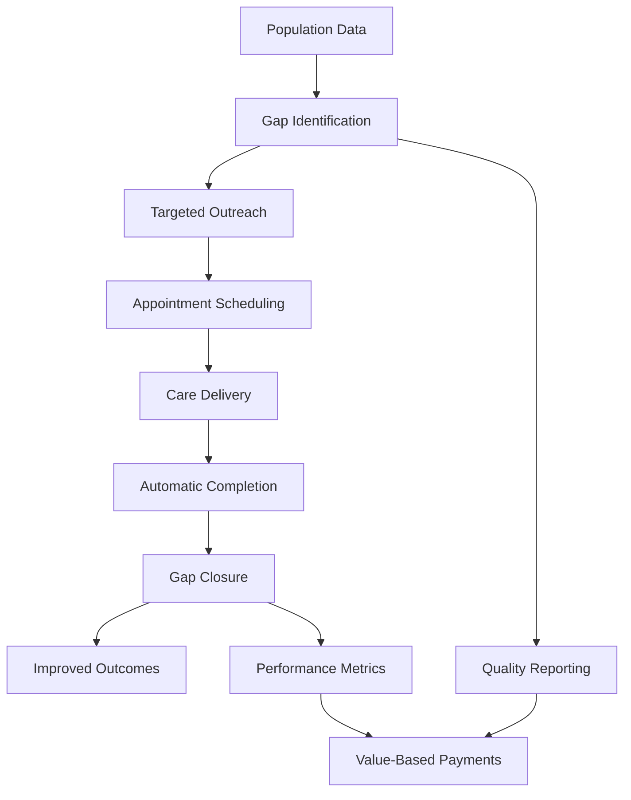

# Closing Care Gaps Through Preventive Health Tracking

*Discover how Epic's Health Maintenance system transforms preventive care from reactive reminders to proactive population health management.*

### The Prevention Paradox

Healthcare's greatest victories often come not from treating disease, but from preventing it entirely. Yet preventive care faces a fundamental challenge: how do you systematically track what hasn't happened yet? In Epic's EHI data, the Health Maintenance & Population Health domain solves this paradox across 9 tables managing 23 different preventive care topics. Our sample database tracks over 13,000 status records and 5,400 completions, revealing patterns of both success and missed opportunities in preventive care delivery.

Let's explore how Epic orchestrates this complex prevention symphony.

### The Preventive Care Universe

First, let's see what health maintenance topics Epic tracks:

<example-query description="Explore all available health maintenance topics and categorize them">
SELECT 
    HM_PLAN_ID,
    HM_PLAN_NAME as Topic,
    CASE 
        WHEN HM_PLAN_NAME LIKE '%Vaccine%' THEN 'Immunization'
        WHEN HM_PLAN_NAME LIKE '%Screening%' THEN 'Screening'
        WHEN HM_PLAN_NAME LIKE '%Visit%' THEN 'Wellness Visit'
        ELSE 'Other Prevention'
    END as Category
FROM HM_PLAN_INFO
ORDER BY Category, Topic;
</example-query>

The system tracks:
- **14 Immunizations**: From childhood vaccines to travel immunizations
- **3 Screenings**: Cholesterol, Hepatitis C, and embedded in names
- **1 Wellness Visit**: Age-specific annual checkups
- **5 Other**: Specialized preventive care topics

### Understanding the Status Lifecycle

Health maintenance items flow through these key statuses:
- **Not Due**: Up to date
- **Due Soon**: Coming due within warning period  
- **Due On**: Currently due
- **Overdue**: Past due date
- **Completed**: Service done
- **Hidden**: Not shown to patients
- **Aged Out**: Too old for service

### Patient-Specific Prevention Journey

Let's follow one patient's preventive care status:

<example-query description="View current health maintenance status for a specific patient">
SELECT 
    ps.ACTIVE_HM_PLAN_ID_HM_PLAN_NAME as Topic,
    hs.HM_STATUS_C_NAME as Status,
    SUBSTR(hs.NEXT_DUE_DATE, 1, 10) as Due_Date
FROM PATIENT_HMT_STATUS ps
LEFT JOIN HM_HISTORICAL_STATUS hs 
    ON ps.PAT_ID = hs.PAT_ID 
    AND ps.ACTIVE_HM_PLAN_ID = hs.HM_TOPIC_ID
WHERE ps.PAT_ID = 'Z7004242'
  AND hs.LINE = (SELECT MAX(LINE) FROM HM_HISTORICAL_STATUS 
                 WHERE PAT_ID = ps.PAT_ID 
                 AND HM_TOPIC_ID = ps.ACTIVE_HM_PLAN_ID)
ORDER BY Topic;
</example-query>

This patient shows:
- HPV vaccine overdue since September 2023
- Multiple vaccines without status (may need assessment)
- Some items hidden or aged out

### How Completions Are Recognized

Epic recognizes preventive care completions from multiple sources:

<example-query description="Analyze how health maintenance items get completed across the system">
SELECT 
    HM_COMP_TYPE_C_NAME as Completion_Source,
    COUNT(*) as Total_Completions,
    ROUND(COUNT(*) * 100.0 / (SELECT COUNT(*) FROM HM_HISTORY), 2) as Percentage,
    MIN(SUBSTR(HM_COMP_UTC_DTTM, 1, 10)) as Earliest,
    MAX(SUBSTR(HM_COMP_UTC_DTTM, 1, 10)) as Latest
FROM HM_HISTORY
GROUP BY HM_COMP_TYPE_C_NAME
ORDER BY Total_Completions DESC;
</example-query>

Completion sources:
- **Immunization (70%)**: Direct vaccine administration
- **Result Component (23%)**: Lab results satisfying requirements
- **LOS Code (4%)**: Hospital stays triggering completion
- **E/M Code (3%)**: Specific visit types

### Tracking Immunization Completions

The system tracks when immunizations are given, often recording multiple vaccines administered during a single visit for efficiency.

### Population Health Analytics

Let's analyze care gaps across the entire population:

<example-query description="Identify the most common overdue preventive care items">
WITH OverdueStats AS (
    SELECT 
        hs.HM_TOPIC_ID_NAME as Topic,
        COUNT(DISTINCT hs.PAT_ID) as Overdue_Patients
    FROM HM_HISTORICAL_STATUS hs
    WHERE hs.HM_STATUS_C_NAME = 'Overdue'
      AND hs.HM_TOPIC_ID_NAME IS NOT NULL
    GROUP BY hs.HM_TOPIC_ID_NAME
),
TotalStats AS (
    SELECT 
        HM_TOPIC_ID_NAME as Topic,
        COUNT(DISTINCT PAT_ID) as Total_Patients
    FROM HM_HISTORICAL_STATUS
    WHERE HM_TOPIC_ID_NAME IS NOT NULL
    GROUP BY HM_TOPIC_ID_NAME
)
SELECT 
    os.Topic,
    os.Overdue_Patients,
    ts.Total_Patients,
    ROUND(os.Overdue_Patients * 100.0 / ts.Total_Patients, 1) as Overdue_Rate
FROM OverdueStats os
JOIN TotalStats ts ON os.Topic = ts.Topic
WHERE ts.Total_Patients >= 1
ORDER BY os.Overdue_Patients DESC
LIMIT 10;
</example-query>

This reveals organizational care gaps requiring targeted interventions.

### The Forecasting Engine

Epic's HM_FORECAST_INFO table calculates when services will be due, enabling:
- Proactive scheduling
- Reminder timing
- Pre-visit planning
- Population outreach

### Age-Based Eligibility

Many preventive services are age-specific. The "Aged Out" status indicates when patients exceed eligibility:
- HPV: Ages 9-26
- Shingles: 50+
- RSV: Under 20 months

### Lab Results Driving Completions

Some screenings complete automatically when lab results are received. This automation:
- Reduces manual documentation
- Ensures accurate tracking
- Closes care gaps automatically
- Improves data quality

### Building Outreach Lists

Healthcare teams can query for patients with overdue preventive care to enable:
- Targeted outreach campaigns
- Resource allocation
- Priority scheduling
- Performance tracking

### Best Practices for Preventive Care

**1. Use Latest Status Records**
```sql
-- Always get the most recent status
WITH LatestStatus AS (
    SELECT *,
        ROW_NUMBER() OVER (PARTITION BY PAT_ID, HM_TOPIC_ID ORDER BY LINE DESC) as rn
    FROM HM_HISTORICAL_STATUS
)
SELECT * FROM LatestStatus WHERE rn = 1;
```

**2. Consider All Completion Sources**
```sql
-- Don't miss any completion types
SELECT * FROM HM_HISTORY
WHERE HM_COMP_TYPE_C_NAME IN ('Immunization', 'Result Component', 'E/M Code', 'LOS Code');
```

**3. Respect Patient Preferences**
```sql
-- Check for postponements
SELECT * FROM PATIENT_HMT_STATUS
WHERE HMT_PPN_UNTL_DT IS NOT NULL;
```

**4. Filter Hidden Items**
```sql
-- Exclude clinical-only items from patient views
SELECT * FROM HM_HISTORICAL_STATUS
WHERE HM_STATUS_C_NAME != 'Hidden';
```

### The Population Health Impact

Health maintenance data enables a transformation in care delivery:



### Summary

Epic's Health Maintenance & Population Health domain demonstrates sophisticated preventive care management:

- **Comprehensive Tracking**: 23 topics covering vaccines, screenings, and wellness
- **Lifecycle Management**: 8 statuses tracking from "Not Due" to "Aged Out"
- **Multiple Completion Sources**: Automatic recognition from 4 different systems
- **Population Analytics**: Identifies care gaps across patient populations
- **Proactive Forecasting**: Calculates when services will be due

Key insights from our analysis:
- 34% of records are hidden (clinical use only)
- 70% of completions come from immunizations
- Multiple vaccines often given in single visits
- Lab results automatically satisfy screening requirements
- Age-based eligibility drives many status transitions

Mastering health maintenance data enables you to:
- Close care gaps systematically
- Improve quality scores
- Optimize preventive care delivery
- Support value-based care initiatives
- Enhance population health outcomes

Whether managing individual patient care or population-wide initiatives, the Health Maintenance domain transforms prevention from a series of reminders into a comprehensive, data-driven system for keeping populations healthy.