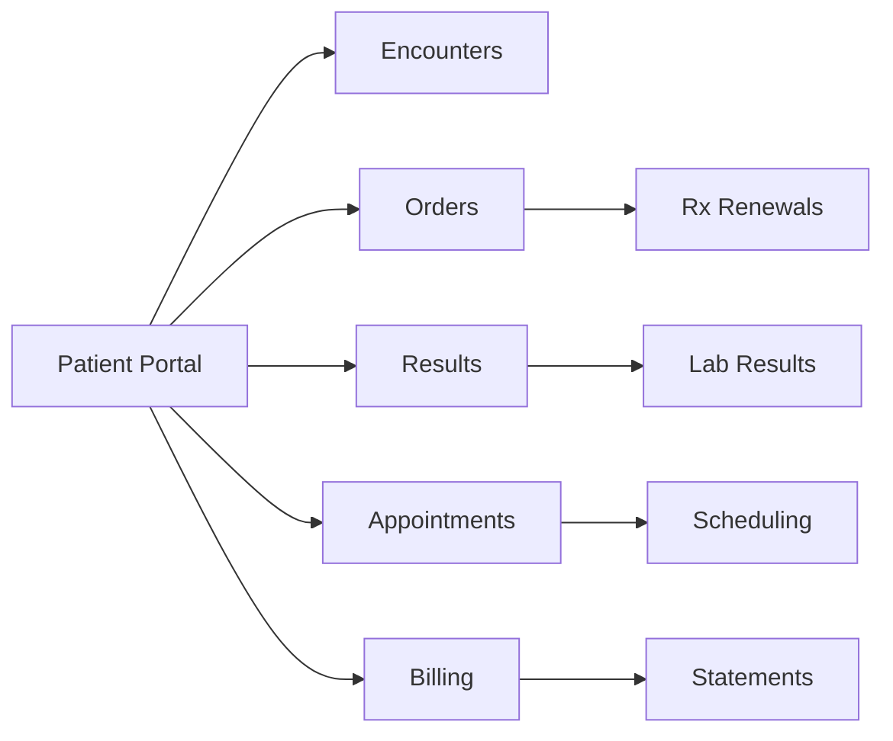

# Connecting Patients Through Portals and Messaging

*Learn how Epic's MyChart patient portal enables secure communication between patients and providers through messaging and preference management.*

### The Digital Front Door to Healthcare

In our sample EHI database, patient Joshua Mandel has exchanged 63 messages with his care team and maintained an active portal account since 2023. This represents the modern reality of healthcare: patients expect digital access to their providers, and Epic's Patient Communication & Portal domain makes this possible at scale.

Let's explore how this critical infrastructure works, starting with the foundation of patient portal access.

### Understanding Portal Account Management

Every patient's digital journey begins with portal activation. Epic tracks this through two complementary tables:

<example-query description="Check a patient's portal account status and activation details">
SELECT 
    p.PAT_ID,
    p.PAT_NAME,
    pm.MYCHART_STATUS_C_NAME as Portal_Status,
    pm.PAT_ACCESS_STAT_C_NAME as Access_Code_Status,
    pm.DEM_VERIF_DT as Demographics_Verified,
    mp.MYPT_ID as MyChart_Account_ID
FROM PATIENT p
LEFT JOIN PATIENT_MYC pm ON p.PAT_ID = pm.PAT_ID
LEFT JOIN MYC_PATIENT mp ON p.PAT_ID = mp.PAT_ID
WHERE p.PAT_ID = 'Z7004242';
</example-query>

This query reveals the dual nature of portal accounts:
- **PATIENT_MYC** stores activation details at the patient level
- **MYC_PATIENT** creates the actual portal account with its own ID

The separation allows Epic to manage portal accounts independently from patient records, supporting scenarios like proxy access or account recovery.

### Diving into Secure Messaging

The heart of patient-provider digital communication lies in the messaging tables. Let's examine how messages flow through the system:

<example-query description="View recent messages for a patient showing direction and threading">
SELECT 
    m.MESSAGE_ID,
    m.CREATED_TIME,
    m.SUBJECT,
    m.TOFROM_PAT_C_NAME as Direction,
    CASE 
        WHEN m.FROM_USER_ID_NAME IS NOT NULL THEN m.FROM_USER_ID_NAME
        WHEN m.TO_USER_ID_NAME IS NOT NULL THEN m.TO_USER_ID_NAME
        ELSE 'System'
    END as Other_Party,
    CASE 
        WHEN m.PARENT_MESSAGE_ID IS NOT NULL THEN 'Reply'
        ELSE 'New Thread'
    END as Message_Type
FROM MYC_MESG m
WHERE m.PAT_ID = 'Z7004242'
ORDER BY m.CREATED_TIME DESC
LIMIT 10;
</example-query>

Notice how Epic uses:
- **TOFROM_PAT_C_NAME** to indicate message direction
- **PARENT_MESSAGE_ID** to maintain conversation threading
- Denormalized user names for performance

### Reading Message Content

Messages aren't stored as simple text fields. Epic uses a line-based storage pattern that preserves formatting:

<example-query description="Read the complete text of a patient's message about wrist pain">
SELECT 
    m.SUBJECT,
    m.TOFROM_PAT_C_NAME as Direction,
    GROUP_CONCAT(mt.MSG_TXT, CHAR(10)) as Full_Message
FROM MYC_MESG m
JOIN MSG_TXT mt ON m.MESSAGE_ID = mt.MESSAGE_ID
WHERE m.MESSAGE_ID = '27921908'
GROUP BY m.MESSAGE_ID, m.SUBJECT, m.TOFROM_PAT_C_NAME;
</example-query>

The MSG_TXT table uses the familiar ID-LINE pattern, storing each line of the message as a separate row. This approach handles long messages efficiently while preserving exact formatting.

### Organizing Conversations

Individual messages are organized into conversations, providing context and categorization:

<example-query description="Analyze the types of conversations a patient has initiated">
SELECT 
    c.MYC_MSG_TYP_C_NAME as Conversation_Type,
    COUNT(DISTINCT c.THREAD_ID) as Thread_Count,
    COUNT(DISTINCT cm.MESSAGE_ID) as Total_Messages
FROM MYC_CONVO c
LEFT JOIN MYC_CONVO_MSGS cm ON c.THREAD_ID = cm.THREAD_ID
WHERE c.PAT_ID = 'Z7004242'
GROUP BY c.MYC_MSG_TYP_C_NAME
ORDER BY Thread_Count DESC;
</example-query>

Epic categorizes conversations to support different workflows:
- **Patient Medical Advice Request**: Clinical questions requiring provider review
- **Patient Appointment Schedule Request**: Scheduling needs
- **System Message**: Automated notifications
- **User Message**: General communication

### Tracking Message Flow Patterns

Understanding communication patterns helps optimize patient engagement:

<example-query description="Analyze bidirectional message flow for a patient">
WITH MessageStats AS (
    SELECT 
        m.PAT_ID,
        COUNT(*) as Total_Messages,
        SUM(CASE WHEN m.TOFROM_PAT_C_NAME = 'To Patient' THEN 1 ELSE 0 END) as To_Patient,
        SUM(CASE WHEN m.TOFROM_PAT_C_NAME = 'From Patient' THEN 1 ELSE 0 END) as From_Patient,
        MIN(m.CREATED_TIME) as First_Message,
        MAX(m.CREATED_TIME) as Last_Message
    FROM MYC_MESG m
    WHERE m.PAT_ID = 'Z7004242'
    GROUP BY m.PAT_ID
)
SELECT 
    *,
    ROUND(CAST(From_Patient AS FLOAT) / Total_Messages * 100, 1) as Patient_Initiated_Pct
FROM MessageStats;
</example-query>

This reveals engagement levels - in our example, nearly half of messages are patient-initiated, indicating active participation in care.

### Managing Communication Preferences

Patients control how they receive communications through granular preferences:

<example-query description="Explore available communication preference types">
SELECT DISTINCT
    COMMUNICATION_CONCEPT_ID_SETTING_NAME as Preference_Type,
    COMMUNICATION_CONCEPT_ID as Concept_ID
FROM COMMUNICATION_PREFERENCES
WHERE COMMUNICATION_CONCEPT_ID_SETTING_NAME LIKE '%Reminder%'
   OR COMMUNICATION_CONCEPT_ID_SETTING_NAME LIKE '%Message%'
ORDER BY Preference_Type
LIMIT 10;
</example-query>

These preferences ensure patients receive communications through their preferred channels while respecting opt-out choices.

### Building a Complete Portal Activity View

Let's combine everything to create a comprehensive view of patient portal engagement:

<example-query description="Create a complete patient portal engagement summary">
WITH PortalMetrics AS (
    SELECT 
        p.PAT_ID,
        p.PAT_NAME,
        pm.MYCHART_STATUS_C_NAME as Portal_Status,
        
        -- Messaging metrics
        (SELECT COUNT(*) FROM MYC_MESG m WHERE m.PAT_ID = p.PAT_ID) as Total_Messages,
        (SELECT COUNT(DISTINCT THREAD_ID) FROM MYC_CONVO c WHERE c.PAT_ID = p.PAT_ID) as Total_Conversations,
        
        -- Recent activity
        (SELECT MAX(CREATED_TIME) FROM MYC_MESG m WHERE m.PAT_ID = p.PAT_ID) as Last_Message_Date
        
    FROM PATIENT p
    LEFT JOIN PATIENT_MYC pm ON p.PAT_ID = pm.PAT_ID
    WHERE p.PAT_ID = 'Z7004242'
)
SELECT 
    PAT_NAME,
    Portal_Status,
    Total_Messages || ' messages in ' || Total_Conversations || ' conversations' as Messaging_Activity,
    Last_Message_Date as Last_Portal_Activity
FROM PortalMetrics;
</example-query>

This holistic view helps identify engaged patients and those who might benefit from additional portal education.

### Best Practices for Portal Data Analysis

**1. Always Check Account Status First**
```sql
-- Verify portal activation before analyzing engagement
SELECT PAT_ID, MYCHART_STATUS_C_NAME 
FROM PATIENT_MYC 
WHERE PAT_ID = ? AND MYCHART_STATUS_C_NAME = 'Activated';
```

**2. Use Message Threading for Context**
```sql
-- Get all messages in a conversation thread
SELECT m.* 
FROM MYC_MESG m
WHERE m.MESSAGE_ID = ? 
   OR m.PARENT_MESSAGE_ID = ?
ORDER BY m.CREATED_TIME;
```

**3. Respect Communication Preferences**
```sql
-- Check preferences before sending communications
SELECT COMMUNICATION_CONCEPT_ID_SETTING_NAME
FROM COMMUNICATION_PREFERENCES
WHERE PREFERENCES_ID = ?
  AND COMMUNICATION_CONCEPT_ID_SETTING_NAME LIKE '%opt out%';
```

### Clinical Workflow Integration

The portal domain doesn't exist in isolation. It connects to:



Each connection point requires careful data coordination to maintain consistency across the Epic ecosystem.

### Summary

Epic's Patient Communication & Portal domain demonstrates sophisticated design patterns:

- **Dual-table architecture** (PATIENT_MYC + MYC_PATIENT) separates account management from patient identity
- **Line-based message storage** preserves formatting while enabling efficient queries
- **Conversation threading** provides context through parent-child relationships
- **Flexible preference management** respects patient communication choices

Understanding these patterns helps you:
- Measure patient engagement effectively
- Identify portal adoption barriers
- Analyze communication patterns
- Support population health initiatives
- Ensure regulatory compliance

As healthcare continues its digital transformation, mastering portal data analysis becomes increasingly critical for understanding and improving the patient experience.