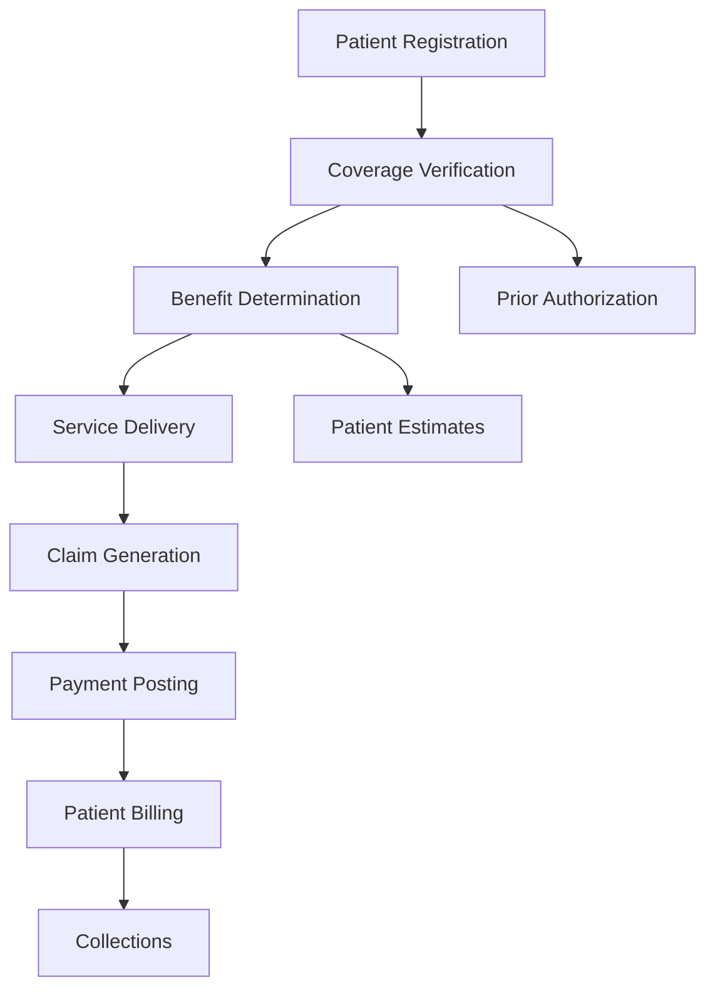

# Decoding Insurance Coverage and Benefits

*Navigate the complex world of healthcare insurance data to understand how Epic tracks coverage, calculates benefits, and determines patient financial responsibility.*

### The Financial Foundation of Healthcare

Every healthcare encounter involves a critical question: who pays and how much? In Epic's EHI data, the Insurance & Coverage domain answers this question through an intricate web of relationships linking patients, accounts, coverages, and benefits. Our sample patient has Blue Cross of Wisconsin PPO coverage through Microsoft, with a $1,500 deductible and varying coinsurance rates depending on the service type.

Let's unravel how Epic structures this complex financial data, starting with the basic building blocks.

### Understanding the Coverage Hierarchy

Epic organizes insurance information in a multi-level hierarchy. Let's trace how a patient connects to their insurance:

<example-query description="Show how patients link to insurance coverage through accounts">
SELECT 
    pac.PAT_ID,
    pac.ACCOUNT_ID,
    pac.ACCOUNT_TYPE_C_NAME as Account_Type,
    pac.FIN_CLASS_NAME as Financial_Class,
    ac.COVERAGE_ID,
    c.PAYOR_ID_PAYOR_NAME as Insurance_Company,
    c.PLAN_ID_BENEFIT_PLAN_NAME as Plan_Name,
    c.GROUP_NAME as Employer
FROM PAT_ACCT_CVG pac
JOIN ACCT_COVERAGE ac ON pac.ACCOUNT_ID = ac.ACCOUNT_ID
JOIN COVERAGE c ON ac.COVERAGE_ID = c.COVERAGE_ID
WHERE pac.PAT_ID = 'Z7004242'
ORDER BY pac.LINE;
</example-query>

This reveals Epic's architecture:
1. **Patients** have billing **accounts**
2. **Accounts** link to **coverages**
3. **Coverages** contain payer, plan, and group information

Notice how the same coverage (5934765.0) appears on multiple accounts - this allows different billing scenarios while maintaining consistent insurance information.

### Exploring Coverage Details

Let's dive deeper into what a coverage record contains:

<example-query description="Examine comprehensive coverage information including member details">
SELECT 
    c.COVERAGE_ID,
    c.PAYOR_ID_PAYOR_NAME as Payer,
    c.PLAN_ID_BENEFIT_PLAN_NAME as Plan,
    c.GROUP_NUM as Group_Number,
    c.GROUP_NAME as Employer,
    c.CVG_EFF_DT as Effective_Date,
    c.CVG_TERM_DT as Termination_Date,
    cm.MEM_NUMBER as Member_ID,
    cm.MEM_REL_TO_SUB_C_NAME as Member_Relationship,
    cm.MEM_COVERED_YN as Is_Covered,
    cm.MEM_EFF_FROM_DATE as Member_Start_Date
FROM COVERAGE c
JOIN COVERAGE_MEMBER_LIST cm ON c.COVERAGE_ID = cm.COVERAGE_ID
WHERE cm.PAT_ID = 'Z7004242';
</example-query>

Key insights:
- Coverage tracks both plan-level information (group, employer) and member-specific details
- The member ID (MSJ60249687901) is what the insurance company uses to identify the patient
- "Self" relationship indicates this patient is the primary subscriber

### Decoding the Benefit Structure

Epic separates benefits into two levels: coverage-wide benefits and service-specific benefits. Let's see how this works:

<example-query description="View the multi-tier benefit structure with deductibles and coinsurance">
WITH BenefitDetails AS (
    SELECT 
        'Overall Coverage' as Benefit_Level,
        cb.DEDUCTIBLE_AMOUNT,
        cb.DEDUCTIBLE_MET_AMT as Deductible_Met,
        cb.DEDUCT_REMAIN_AMT as Deductible_Remaining,
        cb.OUT_OF_POCKET_MAX as OOP_Maximum,
        cb.OUT_OF_PCKT_REMAIN as OOP_Remaining,
        NULL as Service_Type,
        cb.COINS_PERCENT as Coinsurance_Percent
    FROM COVERAGE_BENEFITS cb
    WHERE cb.CVG_ID = 5934765.0
      AND cb.DEDUCTIBLE_AMOUNT IS NOT NULL
    
    UNION ALL
    
    SELECT 
        'Service-Specific' as Benefit_Level,
        sb.DEDUCTIBLE_AMOUNT,
        sb.DEDUCTIBLE_MET_AMT,
        sb.DEDUCT_REMAIN_AMT,
        sb.OUT_OF_POCKET_MAX,
        sb.OUT_OF_PCKT_REMAIN,
        sb.CVG_SVC_TYPE_ID_SERVICE_TYPE_NAME as Service_Type,
        sb.COINS_PERCENT
    FROM SERVICE_BENEFITS sb
    JOIN COVERAGE_BENEFITS cb ON sb.RECORD_ID = cb.RECORD_ID
    WHERE cb.CVG_ID = 5934765.0
      AND sb.CVG_SVC_TYPE_ID_SERVICE_TYPE_NAME IS NOT NULL
)
SELECT * FROM BenefitDetails
WHERE Service_Type IS NULL OR Service_Type IN ('PRIMARY', 'SPEC', 'ED', 'HOSP IP')
ORDER BY Benefit_Level, Service_Type;
</example-query>

This two-tier structure allows:
- Overall deductibles that apply across all services
- Service-specific coinsurance rates after the deductible
- Different benefits for different types of care

### Tracking Real-Time Deductible Accumulation

One of Epic's powerful features is real-time benefit tracking. Let's see how deductibles accumulate:

<example-query description="Analyze deductible accumulation across multiple benefit records">
SELECT 
    ROW_NUMBER() OVER (ORDER BY cb.DEDUCTIBLE_MET_AMT DESC) as Record_Num,
    cb.DEDUCTIBLE_AMOUNT as Annual_Deductible,
    cb.DEDUCTIBLE_MET_AMT as Amount_Applied,
    cb.DEDUCT_REMAIN_AMT as Amount_Remaining,
    ROUND((cb.DEDUCTIBLE_MET_AMT / cb.DEDUCTIBLE_AMOUNT) * 100, 1) as Percent_Met,
    '$' || CAST(cb.DEDUCTIBLE_MET_AMT AS TEXT) || ' of $' || 
        CAST(cb.DEDUCTIBLE_AMOUNT AS TEXT) as Progress
FROM COVERAGE_BENEFITS cb
WHERE cb.CVG_ID = 5934765.0
  AND cb.DEDUCTIBLE_AMOUNT IS NOT NULL
  AND cb.DEDUCTIBLE_AMOUNT > 0
ORDER BY cb.DEDUCTIBLE_MET_AMT DESC;
</example-query>

Multiple records show the deductible at different points in time, allowing Epic to:
- Track accumulation throughout the year
- Handle retroactive adjustments
- Support real-time patient estimates

### Understanding Service-Specific Benefits

Different healthcare services have different coverage rules. Let's explore the complete benefit structure:

<example-query description="Display comprehensive service benefits showing network variations">
SELECT 
    sb.CVG_SVC_TYPE_ID_SERVICE_TYPE_NAME as Service_Type,
    sb.COPAY_AMOUNT as Copay,
    sb.COINS_PERCENT as Coinsurance_Pct,
    sb.IN_NETWORK_YN as Network_Status,
    sb.MAX_VISITS as Visit_Limit,
    sb.REMAINING_VISITS as Visits_Remaining,
    CASE 
        WHEN sb.COPAY_AMOUNT > 0 THEN '$' || CAST(sb.COPAY_AMOUNT AS TEXT) || ' copay'
        WHEN sb.COINS_PERCENT > 0 THEN CAST(sb.COINS_PERCENT AS TEXT) || '% after deductible'
        ELSE 'Covered'
    END as Patient_Responsibility
FROM SERVICE_BENEFITS sb
JOIN COVERAGE_BENEFITS cb ON sb.RECORD_ID = cb.RECORD_ID
WHERE cb.CVG_ID = 5934765.0
  AND sb.CVG_SVC_TYPE_ID_SERVICE_TYPE_NAME IS NOT NULL
ORDER BY 
    CASE sb.CVG_SVC_TYPE_ID_SERVICE_TYPE_NAME
        WHEN 'PRIMARY' THEN 1
        WHEN 'SPEC' THEN 2
        WHEN 'ED' THEN 3
        WHEN 'HOSP IP' THEN 4
        WHEN 'HOSP OP' THEN 5
        ELSE 6
    END,
    sb.COINS_PERCENT;
</example-query>

This reveals a typical PPO structure:
- Lower coinsurance (10%) for in-network services
- Higher coinsurance (30%) for out-of-network
- Special handling for emergency department visits
- No copays for hospital services (coinsurance applies instead)

### Verifying Coverage Status

Insurance verification is a critical workflow. Let's see how Epic tracks this:

<example-query description="Check coverage verification and eligibility status">
SELECT 
    c.COVERAGE_ID,
    c.VERIFY_USER_ID_NAME as Last_Verified_By,
    cm.MEM_VERIF_STAT_C_NAME as Member_Verification_Status,
    cm.LAST_VERIF_DATE as Last_Verification_Date,
    cm.MEM_COVERED_YN as Currently_Covered,
    cm.MEM_EFF_FROM_DATE as Coverage_Start,
    cm.MEM_EFF_TO_DATE as Coverage_End,
    CASE 
        WHEN cm.MEM_EFF_TO_DATE IS NULL THEN 'Active - No End Date'
        WHEN DATE(cm.MEM_EFF_TO_DATE) >= DATE('now') THEN 'Active until ' || cm.MEM_EFF_TO_DATE
        ELSE 'Terminated on ' || cm.MEM_EFF_TO_DATE
    END as Coverage_Status
FROM COVERAGE c
JOIN COVERAGE_MEMBER_LIST cm ON c.COVERAGE_ID = cm.COVERAGE_ID
WHERE cm.PAT_ID = 'Z7004242';
</example-query>

Epic tracks:
- Who verified the coverage
- When it was last verified
- The member's coverage period
- Current coverage status

### Best Practices for Insurance Data Analysis

**1. Always Link Through All Tables**
```sql
-- Don't skip the intermediate tables
SELECT * 
FROM PAT_ACCT_CVG pac
JOIN ACCT_COVERAGE ac ON pac.ACCOUNT_ID = ac.ACCOUNT_ID
JOIN COVERAGE c ON ac.COVERAGE_ID = c.COVERAGE_ID;
```

**2. Consider Both Coverage and Member Dates**
```sql
-- Coverage might be active but member termed
SELECT *
FROM COVERAGE c
JOIN COVERAGE_MEMBER_LIST cm ON c.COVERAGE_ID = cm.COVERAGE_ID
WHERE (c.CVG_TERM_DT IS NULL OR c.CVG_TERM_DT >= DATE('now'))
  AND (cm.MEM_EFF_TO_DATE IS NULL OR cm.MEM_EFF_TO_DATE >= DATE('now'));
```

**3. Handle Multiple Benefit Records**
```sql
-- Use the most recent or highest accumulation
SELECT 
    CVG_ID,
    MAX(DEDUCTIBLE_MET_AMT) as Current_Deductible_Met
FROM COVERAGE_BENEFITS
GROUP BY CVG_ID;
```

**4. Account for Network Status**
```sql
-- Benefits vary by network
SELECT *
FROM SERVICE_BENEFITS
WHERE CVG_SVC_TYPE_ID_SERVICE_TYPE_NAME = 'SPEC'
ORDER BY IN_NETWORK_YN DESC, COINS_PERCENT;
```

### The Bigger Picture

Insurance coverage touches every aspect of healthcare operations:



Understanding Epic's insurance data structure enables:
- Accurate patient financial counseling
- Efficient revenue cycle management
- Compliance with price transparency requirements
- Better patient experience through clear cost communication

### Summary

Epic's Insurance & Coverage domain demonstrates sophisticated healthcare financial data management:

- **Multi-level architecture** links patients → accounts → coverages → benefits
- **Two-tier benefit structure** with coverage-level and service-specific parameters
- **Real-time accumulation tracking** for deductibles and out-of-pocket maximums
- **Network differentiation** supports complex PPO and HMO structures
- **Comprehensive audit trails** for verification and eligibility checks

Mastering this domain helps you:
- Calculate accurate patient estimates
- Verify insurance eligibility efficiently
- Understand claim payment expectations
- Support financial counseling workflows
- Ensure revenue cycle optimization

Whether you're checking a patient's deductible status or analyzing payer mix across your organization, understanding Epic's insurance architecture is essential for healthcare financial operations.