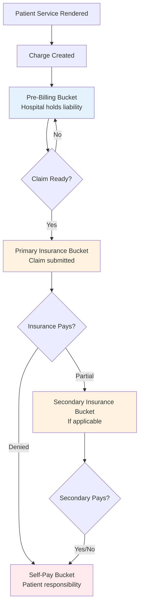

# Chapter 4.2: Buckets & Transactions (HSP_)

*Purpose: Master Epic's unique bucket-based liability tracking system and understand how hospital charges flow through the revenue cycle via transactions.*

### The Bucket Concept: Epic's Financial Innovation

In the world of healthcare billing, tracking who owes what at any given moment is complex. Epic solved this with **buckets** – containers that hold financial liability as it moves through the revenue cycle. Think of buckets as "responsibility folders" that pass charges from one party to another like a relay race.

**Why Buckets Exist**: Before Epic's bucket system, hospitals struggled to track liability as it shifted between the hospital, insurance companies, and patients. Buckets provide a clear audit trail of financial responsibility throughout the billing lifecycle.

<example-query description="View the flow of charges through different transaction types">
SELECT 
  HSP_ACCOUNT_ID,
  TX_TYPE_HA_C_NAME as transaction_type,
  COUNT(*) as count,
  SUM(TX_AMOUNT) as total_amount,
  -- Group transactions by their purpose
  CASE 
    WHEN TX_TYPE_HA_C_NAME = 'Charge' THEN '1. Original Charges'
    WHEN TX_TYPE_HA_C_NAME LIKE '%Adjustment' THEN '2. Adjustments'
    WHEN TX_TYPE_HA_C_NAME = 'Payment' THEN '3. Payments'
    ELSE '4. Other'
  END as transaction_category
FROM HSP_TRANSACTIONS
GROUP BY HSP_ACCOUNT_ID, TX_TYPE_HA_C_NAME
ORDER BY HSP_ACCOUNT_ID, transaction_category;
</example-query>

### Understanding Bucket Types

Epic uses three main bucket types, each representing a different stage of financial responsibility:

1. **Pre-Billing Bucket**: Where charges wait before claims submission
2. **Insurance Buckets**: One per payer, holding charges during insurance processing  
3. **Self-Pay Bucket**: Patient responsibility after insurance

The genius of this system is its simplicity – charges can only exist in one bucket at a time, creating a clear chain of custody.

<example-query description="Trace charge movement between buckets using adjustments">
SELECT 
  HSP_ACCOUNT_ID,
  TX_ID,
  TX_TYPE_HA_C_NAME,
  TX_AMOUNT,
  BUCKET_ID,
  SERVICE_DATE,
  TX_POST_DATE,
  -- Identify bucket transfers by looking for paired adjustments
  CASE 
    WHEN TX_TYPE_HA_C_NAME = 'Credit Adjustment' AND TX_AMOUNT < 0 THEN 'Moving FROM this bucket'
    WHEN TX_TYPE_HA_C_NAME = 'Debit Adjustment' AND TX_AMOUNT > 0 THEN 'Moving TO this bucket'
    ELSE 'Regular transaction'
  END as transfer_direction
FROM HSP_TRANSACTIONS
WHERE BUCKET_ID IS NOT NULL
ORDER BY HSP_ACCOUNT_ID, TX_POST_DATE, TX_ID;
</example-query>

### The Liability Waterfall

Charges flow through buckets in a predictable pattern, like water flowing downhill:

This flow is enforced through **bucket transfers** – special adjustment pairs that move liability between buckets while maintaining a complete audit trail.

### HSP_TRANSACTIONS: The Financial Ledger

The `HSP_TRANSACTIONS` table is the detailed financial ledger for hospital billing. Every charge, payment, and adjustment is recorded here with its associated bucket.

<example-query description="Analyze transaction patterns and their financial impact">
SELECT 
  TX_TYPE_HA_C_NAME as transaction_type,
  COUNT(*) as transaction_count,
  SUM(CASE WHEN TX_AMOUNT > 0 THEN TX_AMOUNT ELSE 0 END) as total_debits,
  SUM(CASE WHEN TX_AMOUNT < 0 THEN ABS(TX_AMOUNT) ELSE 0 END) as total_credits,
  SUM(TX_AMOUNT) as net_impact,
  -- Calculate average transaction size
  AVG(ABS(TX_AMOUNT)) as avg_transaction_size
FROM HSP_TRANSACTIONS
GROUP BY TX_TYPE_HA_C_NAME
ORDER BY transaction_count DESC;
</example-query>

**Key Transaction Types**:
- **Charges** (TX_TYPE = 1): Always positive amounts, increase patient balance
- **Payments** (TX_TYPE = 2): Always negative amounts, decrease patient balance  
- **Adjustments** (TX_TYPE = 3): Can be positive or negative, used for corrections and transfers
- **Refunds** (TX_TYPE = 4): Positive amounts, reverse previous payments

### Transaction Anatomy: Every Field Tells a Story

<example-query description="Examine the complete anatomy of hospital transactions">
SELECT 
  TX_ID,
  HSP_ACCOUNT_ID,
  -- What happened
  TX_TYPE_HA_C_NAME as transaction_type,
  TX_AMOUNT as amount,
  -- When it happened
  SERVICE_DATE,
  TX_POST_DATE,
  CAST(JULIANDAY(TX_POST_DATE) - JULIANDAY(SERVICE_DATE) AS INTEGER) as days_to_post,
  -- Where (bucket)
  BUCKET_ID,
  -- Clinical context
  UB_REV_CODE_ID as revenue_code,
  UB_REV_CODE_ID_REVENUE_CODE_NAME as revenue_description,
  PROC_ID,
  PROCEDURE_DESC as proc_name,
  -- Who posted it
  USER_ID_NAME as posted_by
FROM HSP_TRANSACTIONS
WHERE TX_AMOUNT != 0
ORDER BY TX_POST_DATE DESC
LIMIT 20;
</example-query>

### Revenue Codes: The Service Catalog

Revenue codes tell the story of what services were provided. They map directly to the UB-04 claim form fields and follow a standardized structure:

- **100-219**: Room and Board
- **250-269**: Pharmacy  
- **270-279**: Medical/Surgical Supplies
- **300-319**: Laboratory
- **320-359**: Radiology
- **360-369**: Operating Room
- **430-439**: Occupational Therapy

<example-query description="Analyze services provided by revenue code">
SELECT 
  UB_REV_CODE_ID,
  UB_REV_CODE_ID_REVENUE_CODE_NAME as service_category,
  COUNT(*) as service_count,
  SUM(TX_AMOUNT) as total_charges,
  AVG(TX_AMOUNT) as average_charge,
  MIN(SERVICE_DATE) as first_service,
  MAX(SERVICE_DATE) as last_service
FROM HSP_TRANSACTIONS
WHERE TX_TYPE_HA_C_NAME = 'Charge'
  AND UB_REV_CODE_ID IS NOT NULL
GROUP BY UB_REV_CODE_ID, UB_REV_CODE_ID_REVENUE_CODE_NAME
ORDER BY total_charges DESC;
</example-query>

### Balance Calculations: Following the Money

The universal truth of Epic financial data: **Balance = Sum of all transactions**

<example-query description="Calculate account balances from transaction history">
WITH account_summary AS (
  SELECT 
    HSP_ACCOUNT_ID,
    -- Charges increase balance (positive)
    SUM(CASE WHEN TX_TYPE_HA_C_NAME = 'Charge' THEN TX_AMOUNT ELSE 0 END) as total_charges,
    -- Payments decrease balance (negative amounts)
    SUM(CASE WHEN TX_TYPE_HA_C_NAME = 'Payment' THEN TX_AMOUNT ELSE 0 END) as total_payments,
    -- Adjustments can go either way
    SUM(CASE WHEN TX_TYPE_HA_C_NAME LIKE '%Adjustment' THEN TX_AMOUNT ELSE 0 END) as total_adjustments,
    -- The final balance
    SUM(TX_AMOUNT) as calculated_balance,
    -- Transaction metrics
    COUNT(*) as transaction_count,
    MIN(SERVICE_DATE) as first_service,
    MAX(SERVICE_DATE) as last_service
  FROM HSP_TRANSACTIONS
  GROUP BY HSP_ACCOUNT_ID
)
SELECT 
  *,
  -- Calculate collection rate
  CASE 
    WHEN total_charges > 0 THEN 
      ROUND(ABS(total_payments) / total_charges * 100, 2) 
    ELSE 0 
  END as collection_rate_pct,
  -- Days between first and last service
  CAST(JULIANDAY(last_service) - JULIANDAY(first_service) AS INTEGER) as service_span_days
FROM account_summary
ORDER BY total_charges DESC;
</example-query>

### Paired Transactions: The Bucket Transfer Pattern

When charges move between buckets, Epic creates paired adjustment transactions – one credit (negative) to remove from the source bucket, and one debit (positive) to add to the destination bucket.

<example-query description="Identify paired transactions that represent bucket transfers">
WITH paired_adjustments AS (
  SELECT 
    t1.HSP_ACCOUNT_ID,
    t1.TX_ID as credit_tx_id,
    t1.TX_AMOUNT as credit_amount,
    t1.BUCKET_ID as from_bucket,
    t2.TX_ID as debit_tx_id,
    t2.TX_AMOUNT as debit_amount,
    t2.BUCKET_ID as to_bucket,
    t1.TX_POST_DATE
  FROM HSP_TRANSACTIONS t1
  JOIN HSP_TRANSACTIONS t2 
    ON t1.HSP_ACCOUNT_ID = t2.HSP_ACCOUNT_ID
    AND t1.TX_POST_DATE = t2.TX_POST_DATE
    AND ABS(t1.TX_AMOUNT) = ABS(t2.TX_AMOUNT)
    AND t1.TX_AMOUNT < 0  -- Credit adjustment
    AND t2.TX_AMOUNT > 0  -- Debit adjustment
    AND t1.TX_TYPE_HA_C_NAME = 'Credit Adjustment'
    AND t2.TX_TYPE_HA_C_NAME = 'Debit Adjustment'
)
SELECT 
  HSP_ACCOUNT_ID,
  credit_tx_id,
  debit_tx_id,
  ABS(credit_amount) as transfer_amount,
  from_bucket,
  to_bucket,
  TX_POST_DATE as transfer_date
FROM paired_adjustments
ORDER BY TX_POST_DATE;
</example-query>

### Common Adjustment Patterns

Adjustments tell the story of financial negotiations and corrections:

<example-query description="Analyze adjustment patterns and their business meaning">
SELECT 
  TX_TYPE_HA_C_NAME,
  COUNT(*) as adjustment_count,
  SUM(ABS(TX_AMOUNT)) as total_adjusted,
  AVG(ABS(TX_AMOUNT)) as avg_adjustment,
  -- Categorize by amount direction
  SUM(CASE WHEN TX_AMOUNT < 0 THEN 1 ELSE 0 END) as credit_adjustments,
  SUM(CASE WHEN TX_AMOUNT > 0 THEN 1 ELSE 0 END) as debit_adjustments,
  -- Identify the purpose
  CASE 
    WHEN SUM(CASE WHEN TX_AMOUNT < 0 THEN 1 ELSE 0 END) = 
         SUM(CASE WHEN TX_AMOUNT > 0 THEN 1 ELSE 0 END) 
    THEN 'Likely bucket transfers'
    WHEN TX_AMOUNT < 0 THEN 'Write-offs or contractual'
    ELSE 'Charge corrections'
  END as likely_purpose
FROM HSP_TRANSACTIONS
WHERE TX_TYPE_HA_C_NAME LIKE '%Adjustment'
GROUP BY TX_TYPE_HA_C_NAME
ORDER BY adjustment_count DESC;
</example-query>

### Payment Posting: Show Me the Money

Payments in Epic follow specific patterns that reveal payer behavior:

<example-query description="Analyze payment patterns and timing">
SELECT 
  HSP_ACCOUNT_ID,
  TX_ID,
  ABS(TX_AMOUNT) as payment_amount,
  SERVICE_DATE,
  TX_POST_DATE,
  CAST(JULIANDAY(TX_POST_DATE) - JULIANDAY(SERVICE_DATE) AS INTEGER) as days_to_payment,
  BUCKET_ID,
  -- Identify payment source by amount and timing
  CASE 
    WHEN CAST(JULIANDAY(TX_POST_DATE) - JULIANDAY(SERVICE_DATE) AS INTEGER) < 30 THEN 'Quick pay'
    WHEN CAST(JULIANDAY(TX_POST_DATE) - JULIANDAY(SERVICE_DATE) AS INTEGER) < 60 THEN 'Standard pay'
    WHEN CAST(JULIANDAY(TX_POST_DATE) - JULIANDAY(SERVICE_DATE) AS INTEGER) < 120 THEN 'Slow pay'
    ELSE 'Very slow pay'
  END as payment_speed,
  -- Payment characteristics
  CASE 
    WHEN ABS(TX_AMOUNT) < 50 THEN 'Small payment (likely copay)'
    WHEN ABS(TX_AMOUNT) < 500 THEN 'Medium payment'
    ELSE 'Large payment (likely insurance)'
  END as payment_type
FROM HSP_TRANSACTIONS
WHERE TX_TYPE_HA_C_NAME = 'Payment'
ORDER BY days_to_payment DESC;
</example-query>

### Transaction Chains: Following the Audit Trail

Epic maintains complete audit trails through transaction chains. Each modification creates a new transaction, preserving the complete history:

<example-query description="Trace the complete lifecycle of charges through modifications">
WITH transaction_timeline AS (
  SELECT 
    HSP_ACCOUNT_ID,
    TX_ID,
    TX_TYPE_HA_C_NAME,
    TX_AMOUNT,
    SERVICE_DATE,
    TX_POST_DATE,
    BUCKET_ID,
    -- Create a running balance
    SUM(TX_AMOUNT) OVER (
      PARTITION BY HSP_ACCOUNT_ID 
      ORDER BY TX_POST_DATE, TX_ID
    ) as running_balance,
    -- Number transactions chronologically
    ROW_NUMBER() OVER (
      PARTITION BY HSP_ACCOUNT_ID 
      ORDER BY TX_POST_DATE, TX_ID
    ) as transaction_sequence
  FROM HSP_TRANSACTIONS
)
SELECT 
  transaction_sequence,
  TX_TYPE_HA_C_NAME as transaction_type,
  TX_AMOUNT as amount,
  running_balance,
  SERVICE_DATE,
  TX_POST_DATE,
  BUCKET_ID,
  -- Show balance changes
  CASE 
    WHEN TX_AMOUNT > 0 THEN '↑ Balance increased by $' || TX_AMOUNT
    WHEN TX_AMOUNT < 0 THEN '↓ Balance decreased by $' || ABS(TX_AMOUNT)
    ELSE '→ No balance change'
  END as balance_impact
FROM transaction_timeline
WHERE HSP_ACCOUNT_ID = '376684810'
ORDER BY transaction_sequence;
</example-query>

### Working with Hospital Account Data

The `HSP_ACCOUNT` table provides account-level summaries, while `HSP_TRANSACTIONS` provides the detail. Always validate account totals against transaction sums:

<example-query description="Validate account totals against transaction details">
WITH account_totals AS (
  SELECT 
    HSP_ACCOUNT_ID,
    TOT_CHGS as account_total_charges,
    TOT_ADJ as account_total_adjustments
  FROM HSP_ACCOUNT
),
transaction_totals AS (
  SELECT 
    HSP_ACCOUNT_ID,
    SUM(CASE WHEN TX_TYPE_HA_C_NAME = 'Charge' THEN TX_AMOUNT ELSE 0 END) as calc_total_charges,
    SUM(CASE WHEN TX_TYPE_HA_C_NAME LIKE '%Adjustment' THEN TX_AMOUNT ELSE 0 END) as calc_total_adjustments,
    SUM(CASE WHEN TX_TYPE_HA_C_NAME = 'Payment' THEN TX_AMOUNT ELSE 0 END) as calc_total_payments,
    SUM(TX_AMOUNT) as calc_balance
  FROM HSP_TRANSACTIONS
  GROUP BY HSP_ACCOUNT_ID
)
SELECT 
  a.HSP_ACCOUNT_ID,
  a.account_total_charges,
  t.calc_total_charges,
  a.account_total_charges - t.calc_total_charges as charge_variance,
  a.account_total_adjustments,
  t.calc_total_adjustments,
  t.calc_total_payments,
  t.calc_balance as calculated_balance
FROM account_totals a
JOIN transaction_totals t ON a.HSP_ACCOUNT_ID = t.HSP_ACCOUNT_ID;
</example-query>

### Best Practices for HSP_ Data

1. **Always Include Bucket Context**: Transactions without bucket IDs are usually charges that haven't entered the billing cycle yet.

2. **Watch for Paired Transactions**: Credit/debit adjustment pairs indicate bucket transfers – process them together.

3. **Use Transaction Types Correctly**: The `TX_TYPE_HA_C_NAME` field is more reliable than numeric codes which can vary by Epic version.

4. **Mind the Sign Convention**: 
   - Charges: Positive (increase balance)
   - Payments: Negative (decrease balance)
   - Adjustments: Can be either (context-dependent)

5. **Track Service vs Post Dates**: The gap between `SERVICE_DATE` and `TX_POST_DATE` reveals billing cycle efficiency.

---

### Key Takeaways

1. **Buckets are containers for financial liability** that track who owes what throughout the billing cycle
2. **Charges flow predictably** from pre-billing → insurance → self-pay buckets
3. **Every financial event creates a transaction** in HSP_TRANSACTIONS with complete audit trail
4. **Balance equals sum of all transactions** – Epic's simple but powerful accounting principle
5. **Revenue codes tell the service story** and map directly to UB-04 claim forms
6. **Paired adjustments indicate bucket transfers** – always process them together
7. **The one-day lag matters** – transaction data in EHI exports is always at least one day old

### Common Pitfalls

- **Missing Bucket IDs**: Not all transactions have bucket IDs – charges typically get bucket IDs only after entering the billing workflow
- **Floating Point Precision**: Balance calculations may show tiny residuals due to floating-point math
- **Orphaned Adjustments**: Historical data may have adjustments without corresponding pairs
- **Zero-Amount Transactions**: These exist for audit purposes and should not be ignored

### Next Steps
→ Continue to Chapter 4.3: ARPB Transactions (Professional Billing)