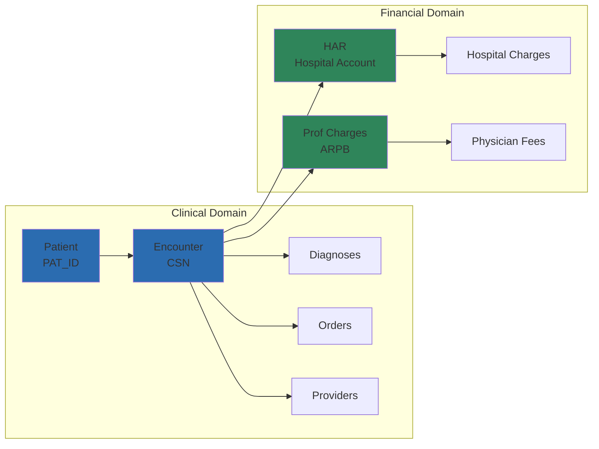

# Chapter 5.4: Cross-Domain Examples

*Learn how to answer complex business questions by linking clinical and financial data across Epic's dual billing systems.*

## The Power of Connected Data

Healthcare's most valuable insights emerge at the intersection of clinical care and financial outcomes. This chapter demonstrates how to bridge Epic's clinical and financial domains to answer critical business questions. You'll learn to calculate the true cost of care, identify opportunities for improvement, and build executive-level analytics.

## Understanding the Clinical-Financial Bridge

Before diving into examples, let's review the key connection points between clinical and financial data:



The **CSN (Contact Serial Number)** is your golden key—it links clinical encounters to both hospital and professional billing systems.

---

## Example 1: Emergency Department Cost Analysis

### The Business Question
"What drives the cost of emergency department visits, and how do diagnoses impact total charges?"

### Building the Analysis

Let's start by finding ED visits with their primary diagnoses:

<example-query description="Identify encounters with primary diagnoses">
SELECT 
    pe.PAT_ENC_CSN_ID,
    pe.CONTACT_DATE,
    pdx.LINE as dx_sequence,
    edg.DX_NAME as primary_diagnosis,
    pe.HSP_ADMSN_TIME,
    pe.HSP_DISCH_TIME
FROM PAT_ENC pe
JOIN PAT_ENC_DX pdx ON pe.PAT_ENC_CSN_ID = pdx.PAT_ENC_CSN_ID
JOIN CLARITY_EDG edg ON pdx.DX_ID = edg.DX_ID
WHERE pdx.LINE = 1  -- Primary diagnosis only
  AND pe.HSP_ADMSN_TIME IS NOT NULL  -- Hospital encounters
ORDER BY pe.CONTACT_DATE DESC
LIMIT 10;
</example-query>

Now let's add financial data to see the charges:

<example-query description="Link clinical encounters to financial charges">
WITH encounter_diagnoses AS (
    SELECT 
        pe.PAT_ENC_CSN_ID,
        pe.CONTACT_DATE,
        edg.DX_NAME as primary_diagnosis,
        pe.HSP_ACCOUNT_ID
    FROM PAT_ENC pe
    JOIN PAT_ENC_DX pdx ON pe.PAT_ENC_CSN_ID = pdx.PAT_ENC_CSN_ID
    JOIN CLARITY_EDG edg ON pdx.DX_ID = edg.DX_ID
    WHERE pdx.LINE = 1
      AND pe.HSP_ACCOUNT_ID IS NOT NULL
)
SELECT 
    ed.PAT_ENC_CSN_ID,
    ed.CONTACT_DATE,
    ed.primary_diagnosis,
    -- Professional charges
    COALESCE(SUM(CASE WHEN at.TX_TYPE_C_NAME = 'Charge' THEN at.AMOUNT ELSE 0 END), 0) as prof_charges,
    -- Payments and adjustments
    COALESCE(SUM(CASE WHEN at.TX_TYPE_C_NAME = 'Payment' THEN at.AMOUNT ELSE 0 END), 0) as payments,
    COALESCE(SUM(CASE WHEN at.TX_TYPE_C_NAME = 'Adjustment' THEN at.AMOUNT ELSE 0 END), 0) as adjustments
FROM encounter_diagnoses ed
LEFT JOIN ARPB_TRANSACTIONS at ON ed.PAT_ENC_CSN_ID = at.PAT_ENC_CSN_ID
GROUP BY ed.PAT_ENC_CSN_ID, ed.CONTACT_DATE, ed.primary_diagnosis
HAVING prof_charges > 0
ORDER BY prof_charges DESC;
</example-query>

### Key Pattern: Aggregating Charges by Type

Notice how we handle Epic's transaction types:
- **Charges**: Positive amounts that increase the balance
- **Payments**: Negative amounts that reduce the balance  
- **Adjustments**: Negative amounts for contractual write-offs

The `CASE` statements let us sum each type separately for clearer analysis.

---

## Example 2: Provider Productivity Dashboard

### The Business Question
"How can we measure provider productivity by combining clinical volume with revenue generation?"

### Multi-Dimensional Analysis

<example-query description="Provider productivity metrics">
WITH provider_visits AS (
    -- Count encounters by provider
    SELECT 
        pe.VISIT_PROV_ID,
        COUNT(DISTINCT pe.PAT_ENC_CSN_ID) as total_encounters,
        COUNT(DISTINCT pe.PAT_ID) as unique_patients,
        COUNT(DISTINCT DATE(pe.CONTACT_DATE)) as days_worked
    FROM PAT_ENC pe
    WHERE pe.VISIT_PROV_ID IS NOT NULL
      AND pe.CONTACT_DATE >= date('now', '-90 days')
    GROUP BY pe.VISIT_PROV_ID
),
provider_revenue AS (
    -- Calculate revenue by billing provider
    SELECT 
        at.BILLING_PROV_ID,
        SUM(CASE WHEN at.TX_TYPE_C_NAME = 'Charge' THEN at.AMOUNT ELSE 0 END) as total_charges,
        SUM(CASE WHEN at.TX_TYPE_C_NAME = 'Payment' THEN -at.AMOUNT ELSE 0 END) as total_payments,
        COUNT(DISTINCT at.PAT_ENC_CSN_ID) as billed_encounters
    FROM ARPB_TRANSACTIONS at
    WHERE at.BILLING_PROV_ID IS NOT NULL
      AND at.SERVICE_DATE >= date('now', '-90 days')
    GROUP BY at.BILLING_PROV_ID
)
SELECT 
    ser.PROV_ID,
    ser.PROV_NAME,
    -- Clinical metrics
    pv.total_encounters,
    pv.unique_patients,
    ROUND(CAST(pv.total_encounters AS REAL) / pv.days_worked, 1) as encounters_per_day,
    -- Financial metrics
    pr.total_charges,
    pr.total_payments,
    ROUND(pr.total_payments * 100.0 / NULLIF(pr.total_charges, 0), 1) as collection_rate,
    -- Efficiency metrics
    ROUND(pr.total_charges / NULLIF(pv.total_encounters, 0), 2) as avg_charge_per_visit
FROM CLARITY_SER ser
LEFT JOIN provider_visits pv ON ser.PROV_ID = pv.VISIT_PROV_ID
LEFT JOIN provider_revenue pr ON ser.PROV_ID = pr.BILLING_PROV_ID
WHERE pv.total_encounters > 0
ORDER BY pr.total_charges DESC;
</example-query>

### Pattern: Joining Across Domains

This query demonstrates a critical pattern:
1. **Aggregate clinical data** (visits, patients) by provider
2. **Aggregate financial data** (charges, payments) separately
3. **Join on provider ID** to create unified metrics
4. **Calculate derived metrics** (collection rate, charges per visit)

---

## Example 3: Chronic Disease Financial Impact

### The Business Question
"What is the financial impact of chronic conditions, and how can we identify high-cost patients for care management?"

### Population Health Analytics

<example-query description="Chronic disease cost analysis">
WITH chronic_patients AS (
    -- Identify patients with chronic conditions
    SELECT DISTINCT
        pl.PAT_ID,
        edg.DX_NAME as chronic_condition,
        pl.NOTED_DATE as diagnosis_date
    FROM PROBLEM_LIST pl
    JOIN CLARITY_EDG edg ON pl.DX_ID = edg.DX_ID
    WHERE pl.PROBLEM_STATUS_C_NAME = 'Active'
),
patient_utilization AS (
    -- Calculate utilization for chronic patients
    SELECT 
        cp.PAT_ID,
        cp.chronic_condition,
        COUNT(DISTINCT pe.PAT_ENC_CSN_ID) as total_encounters,
        COUNT(DISTINCT CASE 
            WHEN pe.HSP_ADMSN_TIME IS NOT NULL 
            THEN pe.PAT_ENC_CSN_ID 
        END) as hospital_admissions,
        MIN(pe.CONTACT_DATE) as first_visit,
        MAX(pe.CONTACT_DATE) as last_visit
    FROM chronic_patients cp
    JOIN PAT_ENC pe ON cp.PAT_ID = pe.PAT_ID
    WHERE pe.CONTACT_DATE >= cp.diagnosis_date
    GROUP BY cp.PAT_ID, cp.chronic_condition
),
patient_costs AS (
    -- Calculate total costs by patient
    SELECT 
        pe.PAT_ID,
        SUM(CASE WHEN at.TX_TYPE_C_NAME = 'Charge' THEN at.AMOUNT ELSE 0 END) as total_charges,
        SUM(CASE WHEN at.TX_TYPE_C_NAME = 'Payment' THEN -at.AMOUNT ELSE 0 END) as total_payments,
        SUM(CASE WHEN at.TX_TYPE_C_NAME = 'Adjustment' THEN -at.AMOUNT ELSE 0 END) as total_adjustments
    FROM PAT_ENC pe
    JOIN ARPB_TRANSACTIONS at ON pe.PAT_ENC_CSN_ID = at.PAT_ENC_CSN_ID
    GROUP BY pe.PAT_ID
)
SELECT 
    pu.chronic_condition,
    COUNT(DISTINCT pu.PAT_ID) as patient_count,
    AVG(pu.total_encounters) as avg_encounters,
    AVG(pu.hospital_admissions) as avg_admissions,
    SUM(pc.total_charges) as total_charges,
    AVG(pc.total_charges) as avg_charges_per_patient,
    -- Calculate cost per encounter
    ROUND(SUM(pc.total_charges) / NULLIF(SUM(pu.total_encounters), 0), 2) as avg_charge_per_encounter
FROM patient_utilization pu
JOIN patient_costs pc ON pu.PAT_ID = pc.PAT_ID
GROUP BY pu.chronic_condition
ORDER BY total_charges DESC;
</example-query>

### Advanced Pattern: Problem List Integration

This example shows how to:
- Use `PROBLEM_LIST` for chronic disease identification
- Track costs from diagnosis date forward
- Combine utilization metrics with financial outcomes
- Identify high-impact conditions for intervention

---

## Example 4: Readmission Analysis

### The Business Question
"What is the financial impact of 30-day readmissions, and which patients are at highest risk?"

### Understanding Readmission Penalties

The Hospital Readmissions Reduction Program (HRRP) penalizes hospitals up to 3% of Medicare payments for excess readmissions in:
- Heart failure
- COPD  
- Pneumonia
- AMI (heart attack)
- CABG surgery
- Hip/knee replacement

<example-query description="Identify 30-day readmissions">
WITH index_admissions AS (
    -- Find hospital admissions with key diagnoses
    SELECT 
        pe.PAT_ID,
        pe.PAT_ENC_CSN_ID as index_csn,
        pe.HSP_ADMSN_TIME as admission_date,
        pe.HSP_DISCH_TIME as discharge_date,
        edg.DX_NAME as primary_diagnosis,
        ROW_NUMBER() OVER (
            PARTITION BY pe.PAT_ID 
            ORDER BY pe.HSP_ADMSN_TIME
        ) as admission_sequence
    FROM PAT_ENC pe
    JOIN PAT_ENC_DX pdx ON pe.PAT_ENC_CSN_ID = pdx.PAT_ENC_CSN_ID
    JOIN CLARITY_EDG edg ON pdx.DX_ID = edg.DX_ID
    WHERE pdx.LINE = 1  -- Primary diagnosis
      AND pe.HSP_DISCH_TIME IS NOT NULL
      AND pe.HSP_ADMSN_TIME IS NOT NULL
),
readmissions AS (
    -- Find readmissions within 30 days
    SELECT 
        idx.PAT_ID,
        idx.index_csn,
        idx.primary_diagnosis as index_diagnosis,
        idx.discharge_date as index_discharge,
        readm.PAT_ENC_CSN_ID as readmit_csn,
        readm.HSP_ADMSN_TIME as readmit_date,
        JULIANDAY(readm.HSP_ADMSN_TIME) - JULIANDAY(idx.discharge_date) as days_to_readmit
    FROM index_admissions idx
    JOIN PAT_ENC readm 
        ON idx.PAT_ID = readm.PAT_ID
        AND readm.HSP_ADMSN_TIME > idx.discharge_date
        AND readm.HSP_ADMSN_TIME <= datetime(idx.discharge_date, '+30 days')
        AND readm.HSP_ADMSN_TIME IS NOT NULL
)
SELECT 
    r.index_diagnosis,
    COUNT(DISTINCT r.index_csn) as index_admissions,
    COUNT(DISTINCT r.readmit_csn) as readmissions_30day,
    ROUND(COUNT(DISTINCT r.readmit_csn) * 100.0 / COUNT(DISTINCT r.index_csn), 1) as readmission_rate,
    AVG(r.days_to_readmit) as avg_days_to_readmit
FROM readmissions r
GROUP BY r.index_diagnosis
HAVING COUNT(DISTINCT r.index_csn) > 0
ORDER BY readmission_rate DESC;
</example-query>

### Pattern: Time-Based Cohort Analysis

Key techniques in this analysis:
1. **Window functions** (`ROW_NUMBER()`) to track admission sequences
2. **Date arithmetic** to find 30-day windows
3. **Self-joins** to match index admissions with readmissions
4. **Aggregate metrics** to calculate rates and identify patterns

---

## Example 5: Real-Time Operational Dashboard

### The Business Question
"How can we monitor current operations across clinical and financial domains?"

### Building an Integrated View

<example-query description="Current operational metrics">
WITH recent_activity AS (
    -- Last 7 days of activity
    SELECT 
        pe.PAT_ENC_CSN_ID,
        pe.CONTACT_DATE,
        pe.PAT_ID,
        pe.VISIT_PROV_ID,
        pe.HSP_ACCOUNT_ID,
        CASE 
            WHEN pe.HSP_ADMSN_TIME IS NOT NULL THEN 'Inpatient'
            ELSE 'Outpatient'
        END as encounter_class
    FROM PAT_ENC pe
    WHERE pe.CONTACT_DATE >= date('now', '-7 days')
),
financial_summary AS (
    -- Financial metrics for recent encounters
    SELECT 
        ra.encounter_class,
        COUNT(DISTINCT ra.PAT_ENC_CSN_ID) as encounters,
        COUNT(DISTINCT ra.PAT_ID) as unique_patients,
        SUM(CASE WHEN at.TX_TYPE_C_NAME = 'Charge' THEN at.AMOUNT ELSE 0 END) as charges,
        SUM(CASE WHEN at.TX_TYPE_C_NAME = 'Payment' THEN -at.AMOUNT ELSE 0 END) as payments
    FROM recent_activity ra
    LEFT JOIN ARPB_TRANSACTIONS at ON ra.PAT_ENC_CSN_ID = at.PAT_ENC_CSN_ID
    GROUP BY ra.encounter_class
),
provider_workload AS (
    -- Provider activity
    SELECT 
        COUNT(DISTINCT VISIT_PROV_ID) as active_providers,
        COUNT(DISTINCT PAT_ENC_CSN_ID) as total_visits,
        ROUND(COUNT(DISTINCT PAT_ENC_CSN_ID) * 1.0 / COUNT(DISTINCT VISIT_PROV_ID), 1) as avg_visits_per_provider
    FROM recent_activity
    WHERE VISIT_PROV_ID IS NOT NULL
)
SELECT 
    'Operational Summary - Last 7 Days' as report_title,
    date('now') as report_date,
    -- Volume metrics
    (SELECT SUM(encounters) FROM financial_summary) as total_encounters,
    (SELECT SUM(unique_patients) FROM financial_summary) as unique_patients,
    -- Financial metrics
    (SELECT SUM(charges) FROM financial_summary) as total_charges,
    (SELECT SUM(payments) FROM financial_summary) as total_payments,
    (SELECT ROUND(SUM(payments) * 100.0 / NULLIF(SUM(charges), 0), 1) FROM financial_summary) as collection_rate,
    -- Provider metrics
    (SELECT active_providers FROM provider_workload) as active_providers,
    (SELECT avg_visits_per_provider FROM provider_workload) as avg_visits_per_provider;
</example-query>

---

## Best Practices for Cross-Domain Analysis

### 1. Start with Clinical Questions
Always begin with the clinical scenario, then add financial context. This ensures your analysis remains grounded in patient care reality.

### 2. Validate Join Assumptions
Not every encounter has financial data:
- Some encounters may not be billed yet
- Professional and hospital billing may be at different stages
- Always use `LEFT JOIN` to preserve clinical records

### 3. Handle the One-Day Lag
Remember that EHI exports come from Clarity:
```sql
-- Always check data currency
SELECT MAX(CONTACT_DATE) as latest_encounter,
       MAX(SERVICE_DATE) as latest_charge
FROM PAT_ENC, ARPB_TRANSACTIONS;
```

### 4. Consider Both Billing Systems
Total cost includes both hospital and professional components:
```sql
-- Template for complete financial picture
WITH combined_charges AS (
    SELECT csn,
           hospital_charges,
           professional_charges,
           (hospital_charges + professional_charges) as total_charges
    FROM ...
)
```

### 5. Use Appropriate Time Windows
Healthcare financial cycles are long:
- Charges may post days after service
- Payments arrive 30-90 days later
- Adjustments can occur months later

---

## Common Pitfalls to Avoid

### Missing Financial Links
**Problem**: No charges found for an encounter
**Solution**: Check if the encounter has been billed yet
```sql
-- Find unbilled encounters
SELECT COUNT(*) as unbilled_encounters
FROM PAT_ENC pe
LEFT JOIN ARPB_TRANSACTIONS at ON pe.PAT_ENC_CSN_ID = at.PAT_ENC_CSN_ID
WHERE at.TX_ID IS NULL
  AND pe.CONTACT_DATE < date('now', '-7 days');
```

### Incorrect Amount Calculations
**Problem**: Forgetting Epic's negative amount convention
**Solution**: Remember the rules:
- Charges = Positive
- Payments = Negative (reduce balance)
- Adjustments = Negative (reduce balance)

### Incomplete Cost Picture
**Problem**: Looking only at professional billing
**Solution**: Always check both systems when available

---

## Advanced Patterns

### Pattern: Cohort-Based Analysis
Build reusable cohorts for complex analyses:
```sql
WITH diabetic_cohort AS (
    SELECT DISTINCT pat_id 
    FROM problem_list 
    WHERE dx_name LIKE '%diabetes%'
),
heart_failure_cohort AS (
    SELECT DISTINCT pat_id 
    FROM problem_list 
    WHERE dx_name LIKE '%heart failure%'
)
-- Use cohorts in subsequent analysis
```

### Pattern: Financial Forecasting
Project future costs based on historical patterns:
```sql
WITH monthly_trends AS (
    SELECT 
        strftime('%Y-%m', service_date) as month,
        diagnosis_category,
        AVG(charge_amount) as avg_charge,
        COUNT(*) as volume
    FROM ...
    GROUP BY month, diagnosis_category
)
-- Calculate growth rates and project forward
```

### Pattern: Quality-Cost Correlation
Link quality metrics with financial outcomes:
```sql
WITH quality_scores AS (
    -- Calculate quality metrics
),
cost_data AS (
    -- Calculate costs
)
SELECT 
    quality_score,
    avg_cost,
    correlation_coefficient
FROM ...
```

---

## Key Takeaways

1. **The CSN is your bridge** between clinical and financial worlds
2. **Build incrementally** - start simple, add complexity gradually
3. **Validate at each step** - healthcare data has many edge cases
4. **Consider both billing systems** for complete financial picture
5. **Mind the time lag** between clinical events and financial posting
6. **Use patterns** - most analyses follow similar structures
7. **Think in cohorts** for population health analytics

## Next Steps
→ Continue to Chapter 5.5: Transforming for Warehouses