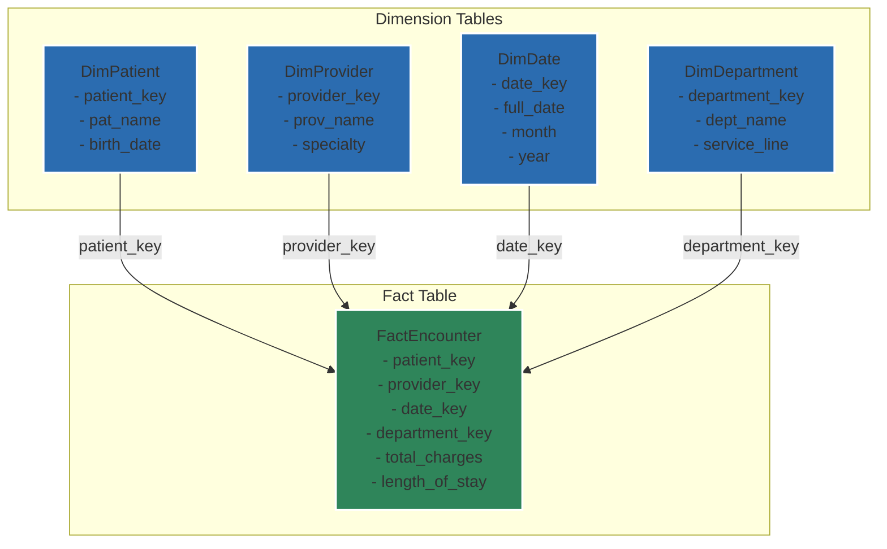

# Chapter 5.5: Transforming for Warehouses

*Purpose: Learn how to transform Epic's highly normalized EHI data into warehouse-friendly dimensional models that enable efficient analytics and reporting.*

Epic's EHI export gives you a faithful reproduction of Clarity's relational structure—over 500 tables optimized for operational reporting, not analytics. This chapter shows you how to transform this complex web into clean dimensional models that your analysts will actually want to use.

### Why Transform? The Analytics Gap

Epic Clarity serves operational reporting well, but analytics users struggle with:
- **Excessive Joins**: Simple questions require 5-10 table joins
- **Cryptic Codes**: `_C` columns everywhere requiring lookups
- **No History Tracking**: Current state only, changes overwritten
- **Performance Issues**: Queries slow on normalized structures

A proper data warehouse solves these problems through dimensional modeling—the proven approach that trades storage for simplicity and speed.

### From Epic Sprawl to Star Schema

The star schema remains the gold standard for healthcare analytics. Here's how Epic's complex relationships map to dimensional patterns:

<example-query description="Understand Epic's encounter relationships">
-- Epic's normalized structure: multiple tables for one concept
SELECT 
  pe.PAT_ENC_CSN_ID,
  pe.CONTACT_DATE,
  p.PAT_NAME,
  cs.PROV_NAME as provider,
  cd.DEPARTMENT_NAME as department
FROM PAT_ENC pe
JOIN PATIENT p ON pe.PAT_ID = p.PAT_ID
LEFT JOIN CLARITY_SER cs ON pe.VISIT_PROV_ID = cs.PROV_ID
LEFT JOIN CLARITY_DEP cd ON pe.DEPARTMENT_ID = cd.DEPARTMENT_ID
WHERE pe.PAT_ENC_CSN_ID = 131130638;
</example-query>

This becomes a single fact table with denormalized dimensions in your warehouse—one row tells the whole story.



### Building Your Dimension Tables

#### Patient Dimension with History (Type 2 SCD)

Patients change addresses, insurance, even names. Type 2 Slowly Changing Dimensions capture this history:

<example-query description="Design pattern for patient dimension">
-- Dimensional model for patient with history tracking
-- (This is the CREATE TABLE pattern, not executable in our sample)
SELECT 
  'CREATE TABLE dim_patient (' as ddl
UNION ALL SELECT '  patient_key INTEGER PRIMARY KEY,    -- Surrogate key'
UNION ALL SELECT '  pat_id TEXT,                       -- Natural key from Epic'
UNION ALL SELECT '  pat_mrn_id TEXT,'
UNION ALL SELECT '  -- Current attributes'
UNION ALL SELECT '  pat_name TEXT,'
UNION ALL SELECT '  birth_date TEXT,'
UNION ALL SELECT '  sex TEXT,'
UNION ALL SELECT '  address_line_1 TEXT,'
UNION ALL SELECT '  city TEXT,'
UNION ALL SELECT '  state TEXT,'
UNION ALL SELECT '  zip TEXT,'
UNION ALL SELECT '  -- SCD tracking'
UNION ALL SELECT '  eff_start_date DATE,'
UNION ALL SELECT '  eff_end_date DATE,'
UNION ALL SELECT '  current_flag INTEGER'
UNION ALL SELECT ');';
</example-query>

The key insight: Every time a patient's address changes, you create a new row with a new `patient_key` but the same `pat_id`. The `current_flag = 1` marks the active version.

#### Provider Dimension

Providers are more complex than you'd expect—they work in multiple departments, have changing specialties, and Epic tracks both individual providers and "provider groups":

<example-query description="Explore provider patterns in Epic">
-- Providers in our sample data
SELECT 
  PROV_ID,
  PROV_NAME,
  EXTERNAL_NAME_
FROM CLARITY_SER
WHERE PROV_ID IS NOT NULL
LIMIT 10;
</example-query>

Transform this into a dimension that captures the provider's primary attributes at any point in time. The challenge: Epic's `CLARITY_SER` table includes non-human "providers" like departments and external labs. Filter appropriately.

#### Date Dimension

Never join on raw dates. A proper date dimension enables "same day last year" and fiscal period analysis:

<example-query description="Essential date dimension attributes">
-- Date dimension structure (showing pattern, not creating)
SELECT 
  DATE('2024-01-15') as date_value,
  20240115 as date_key,
  2024 as year,
  1 as quarter,
  1 as month,
  'January' as month_name,
  15 as day_of_month,
  3 as day_of_week,
  'Monday' as day_name,
  2024 as fiscal_year,  -- Assuming July 1 fiscal start
  3 as fiscal_quarter,
  7 as fiscal_month;
</example-query>

Pre-build this for 20 years—it's only ~7,300 rows and saves massive computation.

### Building Your Fact Tables

#### Encounter Fact: The Analytics Workhorse

The encounter fact table is your primary analytical asset. It denormalizes Epic's web of tables into a single, queryable structure:

<example-query description="Core metrics for encounter fact table">
-- Gather encounter metrics from Epic's structure
SELECT 
  pe.PAT_ENC_CSN_ID,
  pe.PAT_ID,
  pe.CONTACT_DATE,
  pe.DEPARTMENT_ID,
  pe.VISIT_PROV_ID,
  pe.HSP_ACCOUNT_ID,
  pe.APPT_LENGTH_MINS,
  -- Count would-be foreign keys for dimensional model
  CASE WHEN pe.HOSP_ADMSN_TIME IS NOT NULL THEN 1 ELSE 0 END as is_admission
FROM PAT_ENC pe
WHERE pe.PAT_ENC_CSN_ID IS NOT NULL
ORDER BY pe.CONTACT_DATE DESC
LIMIT 5;
</example-query>

Your fact table should include:
- **Dimension Keys**: Links to patient, provider, department, dates
- **Degenerate Dimensions**: CSN, HAR (stored directly, no separate dimension)
- **Metrics**: Counts, durations, amounts
- **Flags**: Admission, emergency, readmission indicators

#### Financial Facts: Following the Money

Epic separates hospital (HSP) and professional (ARPB) billing. Your warehouse might combine them:

<example-query description="Explore billing transaction structures">
-- Professional billing transactions
SELECT 
  TX_ID,
  PATIENT_ID, 
  SERVICE_DATE,
  ORIG_SERVICE_DATE,
  PROCEDURE_NAME,
  AMOUNT
FROM ARPB_TRANSACTIONS
WHERE AMOUNT != 0
LIMIT 5;
</example-query>

Key design decision: One combined financial fact table or separate hospital/professional facts? Most organizations start separate and later create a unified view.

### ETL Patterns That Scale

#### Change Detection Strategy

Epic's EHI exports are full replacements—no change flags. Your ETL must detect what's new:

<example-query description="Pattern for detecting new encounters">
-- Identify new encounters since last load
-- (Showing concept - assumes you track last load date)
SELECT 
  COUNT(*) as new_encounters
FROM PAT_ENC
WHERE CONTACT_DATE >= '9/1/2023'  -- Your last_load_date
  AND PAT_ENC_CSN_ID IS NOT NULL;
</example-query>

Track high-water marks by table—Epic's `UPDATE_DATE` columns aren't always reliable for change detection.

#### The Daily Load Pattern

Most warehouses refresh nightly, after Epic's Clarity ETL completes:

```
11pm: Epic Clarity ETL starts
3am: Clarity ETL completes  
4am: Your ETL begins
5am: Dimension updates complete
6am: Fact table loads complete
7am: Aggregates refreshed
8am: Warehouse ready for users
```

#### Handling Late-Arriving Facts

Healthcare data arrives late—lab results, final diagnoses, corrected charges. Design for it:

<example-query description="Check for backdated encounters">
-- Find encounters that might update after initial load
SELECT 
  CONTACT_DATE,
  UPDATE_DATE_,
  julianday(UPDATE_DATE_) - julianday(CONTACT_DATE) as days_delay
FROM PAT_ENC
WHERE UPDATE_DATE_ IS NOT NULL
  AND julianday(UPDATE_DATE_) - julianday(CONTACT_DATE) > 7
ORDER BY days_delay DESC
LIMIT 5;
</example-query>

Reprocess the last 30-60 days of data in each load to catch late updates.

### Performance Optimization Strategies

#### Partitioning for Scale

Partition large fact tables by month:
- Encounters by `CONTACT_DATE`
- Charges by `SERVICE_DATE`  
- Transactions by `POST_DATE`

This enables partition elimination and simplifies archival.

#### Indexing Strategy

<example-query description="Identify high-cardinality columns for indexing">
-- Analyze cardinality for index decisions
SELECT 
  'DEPARTMENT_ID' as column_name,
  COUNT(DISTINCT DEPARTMENT_ID) as distinct_values,
  COUNT(*) as total_rows,
  CAST(COUNT(DISTINCT DEPARTMENT_ID) AS FLOAT) / COUNT(*) as selectivity
FROM PAT_ENC
WHERE DEPARTMENT_ID IS NOT NULL;
</example-query>

Index high-cardinality foreign keys and common filter columns. Skip low-cardinality columns—Epic has many.

#### Aggregate Tables

Pre-calculate common metrics:

<example-query description="Pattern for daily encounter aggregates">
-- Daily summary for dashboards
SELECT 
  DATE(CONTACT_DATE) as encounter_date,
  COUNT(*) as total_encounters,
  COUNT(DISTINCT PAT_ID) as unique_patients,
  COUNT(DISTINCT DEPARTMENT_ID) as departments_seen,
  COUNT(DISTINCT VISIT_PROV_ID) as providers_working
FROM PAT_ENC
WHERE CONTACT_DATE >= '1/1/2023'
GROUP BY DATE(CONTACT_DATE)
ORDER BY encounter_date DESC
LIMIT 7;
</example-query>

These aggregates serve 80% of dashboard queries at 100x the speed.

### Data Quality in Your Warehouse

#### Handling Epic's Quirks

<example-query description="Check for data quality issues">
-- Common Epic data quality checks
SELECT 
  'Encounters without providers' as issue,
  COUNT(*) as count
FROM PAT_ENC
WHERE VISIT_PROV_ID IS NULL
UNION ALL
SELECT 
  'Future dated encounters',
  COUNT(*)
FROM PAT_ENC  
WHERE DATE(CONTACT_DATE) > DATE('now');
</example-query>

Build these checks into your ETL—Epic's data has predictable quality issues.

#### Referential Integrity

Epic doesn't enforce foreign keys. You must handle orphaned records:

<example-query description="Find orphaned encounters">
-- Encounters pointing to non-existent departments
SELECT COUNT(*) as orphaned_encounters
FROM PAT_ENC pe
LEFT JOIN CLARITY_DEP cd ON pe.DEPARTMENT_ID = cd.DEPARTMENT_ID  
WHERE pe.DEPARTMENT_ID IS NOT NULL
  AND cd.DEPARTMENT_ID IS NULL;
</example-query>

Options: Default dimensions, exclusion, or investigation—choose based on volume.

### Incremental Load Strategies

Full reloads won't scale. Implement incremental patterns:

<example-query description="Track maximum values for incremental loads">
-- Capture high-water marks
SELECT 
  'PAT_ENC' as table_name,
  MAX(PAT_ENC_CSN_ID) as max_id,
  MAX(CONTACT_DATE) as max_date,
  COUNT(*) as row_count
FROM PAT_ENC;
</example-query>

Store these markers after each successful load. On failure, you know where to restart.

### Special Considerations for Healthcare

#### Merging Patient Records

Epic merges duplicate patients, but history remains:

<example-query description="Pattern for handling patient merges">
-- In production, you'd track merges
SELECT 
  'Patient merge tracking requires:' as requirement
UNION ALL SELECT '- Original PAT_ID'
UNION ALL SELECT '- Target PAT_ID'  
UNION ALL SELECT '- Merge date'
UNION ALL SELECT '- Update all fact records';
</example-query>

Your warehouse must follow merges or historical analysis breaks.

#### Privacy and Compliance

- **Audit Every Query**: Who accessed what patient when
- **Implement Row-Level Security**: Users see only their patients
- **Retention Policies**: HIPAA requires 6 years minimum
- **Right to Delete**: GDPR/state laws may require purging

#### Real-Time Requirements

Your warehouse is batch-oriented, but some use cases need real-time:
- ED dashboards → Direct Chronicles query
- Bed management → Real-time feed
- Clinical alerts → Don't use warehouse

Set expectations: The warehouse is for analytics, not operations.

---

### Key Takeaways

1. **Epic's structure isn't wrong, just different**—designed for transactions, not analytics
2. **Dimensional modeling works**—star schemas remain the best pattern for healthcare analytics
3. **History matters in healthcare**—implement Type 2 SCDs for key dimensions
4. **Plan for late data**—healthcare is full of corrections and delayed documentation
5. **Quality checks are mandatory**—Epic's data has known quirks; detect and handle them
6. **Incremental loads are essential**—full reloads don't scale beyond small datasets
7. **Set boundaries**—know when to say "that needs a real-time system"

The transformation from Epic's operational model to an analytical warehouse is substantial work, but the payoff is enormous: queries that took minutes now take seconds, and questions that were impossible to answer become trivial.

---

### Next Steps
→ Continue to Chapter 6.1: Glossary A-Z