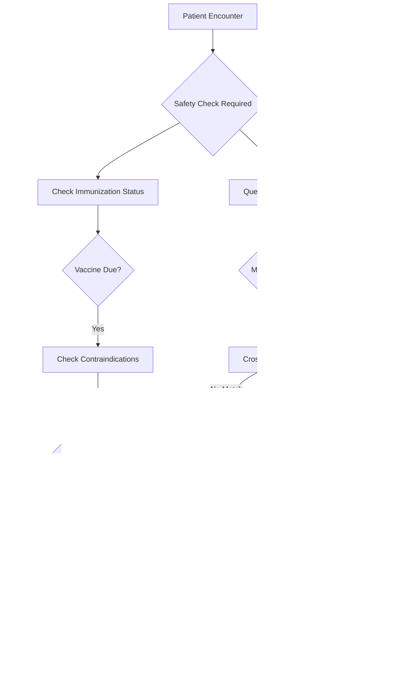

# Tracking Patient Safety: Allergies & Immunizations

*Purpose: To understand how Epic tracks critical patient safety data including allergies, reactions, and immunization histories.*

### The Foundation of Safe Care

Before prescribing a medication or administering a vaccine, clinicians need instant access to patient allergies and immunization history. Epic's Allergies & Immunizations domain provides this critical safety net through carefully designed tables that track not just current data, but complete historical context.

<example-query description="Discover the scope of allergy and immunization tracking">
SELECT 
    CASE 
        WHEN name LIKE '%ALLERG%' OR name LIKE '%ALG%' THEN 'Allergy Tables'
        WHEN name LIKE '%IMMUN%' OR name LIKE '%IMMUNE%' THEN 'Immunization Tables'
    END as domain,
    COUNT(*) as table_count,
    GROUP_CONCAT(name, ', ') as table_names
FROM sqlite_master 
WHERE type = 'table' 
  AND (name LIKE '%ALLERG%' OR name LIKE '%ALG%' 
       OR name LIKE '%IMMUN%' OR name LIKE '%IMMUNE%')
GROUP BY domain
ORDER BY domain;
</example-query>

With 9 allergy tables and 9 immunization tables, Epic maintains comprehensive safety data that follows patients across all encounters.

### The Allergy Safety Net

Let's explore how Epic structures allergy data to prevent adverse reactions:

<example-query description="View a patient's active allergies with severity">
SELECT 
    a.ALLERGEN_ID_ALLERGEN_NAME as Allergen,
    a.ALLERGY_SEVERITY_C_NAME as Severity,
    a.SEVERITY_C_NAME as Type,
    a.DATE_NOTED,
    ar.REACTION_C_NAME as Reaction
FROM PAT_ALLERGIES pa
JOIN ALLERGY a ON pa.ALLERGY_RECORD_ID = a.ALLERGY_ID
LEFT JOIN ALLERGY_REACTIONS ar ON a.ALLERGY_ID = ar.ALLERGY_ID
WHERE pa.PAT_ID = 'Z7004242'
  AND a.ALRGY_STATUS_C_NAME = 'Active'
ORDER BY a.ALLERGY_SEVERITY_C_NAME DESC, a.ALLERGEN_ID_ALLERGEN_NAME;
</example-query>

Notice the key design elements:
- **Severity levels**: High, Medium, Low guide clinical decision-making
- **Type classification**: Allergy vs. Intolerance vs. Sensitivity
- **Specific reactions**: Documented for each allergen
- **Status tracking**: Active vs. Deleted vs. Entered in Error

### The History of Allergy Reviews

Healthcare regulations require regular allergy review. Epic tracks this through a dedicated history table:

<example-query description="Track allergy review compliance">
SELECT 
    ALRG_UPDT_DATE as Review_Date,
    ALRG_UPDT_USER_ID_NAME as Reviewed_By,
    ALRG_HX_REV_STAT_C_NAME as Review_Status,
    ALRG_HX_REV_REAS_C_NAME as Review_Reason,
    ALRG_HX_REV_EPT_CSN as Encounter_ID
FROM PATIENT_ALG_UPD_HX
WHERE PAT_ID = 'Z7004242'
ORDER BY LINE DESC
LIMIT 5;
</example-query>

This audit trail proves compliance and helps identify patterns in allergy documentation.

### Multiple Reactions Per Allergen

The `ALLERGY_REACTIONS` table uses the LINE pattern to document multiple reactions:

<example-query description="Find allergens causing multiple reaction types">
SELECT 
    a.ALLERGEN_ID_ALLERGEN_NAME as Allergen,
    COUNT(ar.LINE) as Reaction_Count,
    GROUP_CONCAT(ar.REACTION_C_NAME, ' + ') as All_Reactions,
    a.ALLERGY_SEVERITY_C_NAME as Severity
FROM ALLERGY a
JOIN ALLERGY_REACTIONS ar ON a.ALLERGY_ID = ar.ALLERGY_ID
WHERE a.ALRGY_STATUS_C_NAME = 'Active'
  AND a.ALLERGY_ID IN (SELECT ALLERGY_RECORD_ID FROM PAT_ALLERGIES WHERE PAT_ID = 'Z7004242')
GROUP BY a.ALLERGY_ID, a.ALLERGEN_ID_ALLERGEN_NAME, a.ALLERGY_SEVERITY_C_NAME
ORDER BY Reaction_Count DESC;
</example-query>

### The Immunization Record

Immunizations require even more detailed tracking due to public health reporting requirements:

<example-query description="View comprehensive immunization history">
SELECT 
    i.IMMUNZATN_ID_NAME as Vaccine,
    i.IMMUNE_DATE as Date_Given,
    CASE 
        WHEN i.IMM_HISTORIC_ADM_YN = 'Y' THEN 'Historical'
        ELSE 'Given Here'
    END as Record_Type,
    i.DOSE as Dose_Number,
    i.ROUTE_C_NAME as Route,
    i.SITE_C_NAME as Site,
    i.LOT as Lot_Number,
    i.GIVEN_BY_USER_ID_NAME as Administered_By
FROM IMMUNE i
JOIN PAT_IMMUNIZATIONS pi ON i.IMMUNE_ID = pi.IMMUNE_ID
WHERE pi.PAT_ID = 'Z7004242'
ORDER BY i.IMMUNE_DATE DESC
LIMIT 10;
</example-query>

Key tracking elements include:
- **Historical vs. Given**: Distinguishes vaccines administered elsewhere
- **Lot numbers**: Critical for recalls and adverse event tracking
- **Administration details**: Route, site, and administrator for safety

### Immunization Change Tracking

The `IMMUNE_HISTORY` table tracks modifications to immunization records:

<example-query description="Examine immunization record changes">
SELECT DISTINCT
    i.IMMUNZATN_ID_NAME as Vaccine,
    ih.IMMNZTN_HX_STATUS_C_NAME as Historical_Status,
    ih.IMMNZTN_HX_ENT_DATE as Entry_Date,
    ih.IMMNZTN_HX_ENTRY_ID_NAME as Entered_By,
    'Shows audit trail of immunization documentation' as Purpose
FROM IMMUNE i
JOIN IMMUNE_HISTORY ih ON i.IMMUNE_ID = ih.IMMUNE_ID
JOIN PAT_IMMUNIZATIONS pi ON i.IMMUNE_ID = pi.IMMUNE_ID
WHERE pi.PAT_ID = 'Z7004242'
  AND ih.IMMNZTN_HX_STATUS_C_NAME IS NOT NULL
ORDER BY ih.IMMNZTN_HX_ENT_DATE DESC
LIMIT 5;
</example-query>

### The Clinical Workflow



### Pattern Recognition

Let's identify common patterns in allergy documentation:

<example-query description="Analyze allergy patterns across patients">
SELECT 
    a.ALLERGEN_ID_ALLERGEN_NAME as Allergen,
    COUNT(DISTINCT pa.PAT_ID) as Patient_Count,
    a.ALLERGY_SEVERITY_C_NAME as Common_Severity,
    GROUP_CONCAT(DISTINCT ar.REACTION_C_NAME) as Typical_Reactions
FROM PAT_ALLERGIES pa
JOIN ALLERGY a ON pa.ALLERGY_RECORD_ID = a.ALLERGY_ID
LEFT JOIN ALLERGY_REACTIONS ar ON a.ALLERGY_ID = ar.ALLERGY_ID
WHERE a.ALRGY_STATUS_C_NAME = 'Active'
GROUP BY a.ALLERGEN_ID_ALLERGEN_NAME, a.ALLERGY_SEVERITY_C_NAME
HAVING Patient_Count >= 1
ORDER BY Patient_Count DESC
LIMIT 10;
</example-query>

### Vaccine Series Tracking

Immunizations often require multiple doses. Here's how Epic tracks series completion:

<example-query description="Track COVID vaccine series">
WITH covid_doses AS (
    SELECT 
        pi.PAT_ID,
        i.IMMUNZATN_ID_NAME,
        i.IMMUNE_DATE,
        ROW_NUMBER() OVER (
            PARTITION BY pi.PAT_ID 
            ORDER BY i.IMMUNE_DATE
        ) as Dose_Number
    FROM PAT_IMMUNIZATIONS pi
    JOIN IMMUNE i ON pi.IMMUNE_ID = i.IMMUNE_ID
    WHERE i.IMMUNZATN_ID_NAME LIKE '%COVID%'
      AND pi.PAT_ID = 'Z7004242'
)
SELECT 
    Dose_Number,
    IMMUNZATN_ID_NAME as Vaccine_Type,
    IMMUNE_DATE,
    JULIANDAY(IMMUNE_DATE) - JULIANDAY(LAG(IMMUNE_DATE) OVER (ORDER BY IMMUNE_DATE)) as Days_Between_Doses
FROM covid_doses
ORDER BY Dose_Number;
</example-query>

### The Safety Integration

Epic integrates allergy and immunization data throughout the system:

<example-query description="Show allergy flag status">
SELECT 
    af.PAT_ID,
    af.ALRGY_FLAG_YN as Has_Allergies_Flag,
    COUNT(DISTINCT a.ALLERGY_ID) as Active_Allergy_Count,
    af.ALRGY_FLAG_UPD_DTTM as Flag_Last_Updated,
    af.ALRGY_FLG_UPD_BY_ID_NAME as Updated_By
FROM ALLERGY_FLAG af
LEFT JOIN PAT_ALLERGIES pa ON af.PAT_ID = pa.PAT_ID
LEFT JOIN ALLERGY a ON pa.ALLERGY_RECORD_ID = a.ALLERGY_ID 
    AND a.ALRGY_STATUS_C_NAME = 'Active'
WHERE af.PAT_ID = 'Z7004242'
GROUP BY af.PAT_ID, af.ALRGY_FLAG_YN, af.ALRGY_FLAG_UPD_DTTM, af.ALRGY_FLG_UPD_BY_ID_NAME;
</example-query>

### Best Practices for Safety Queries

**1. Always Check Active Status**
```sql
-- Include only active allergies in clinical checks
WHERE a.ALRGY_STATUS_C_NAME = 'Active'
```

**2. Consider Severity in Alerts**
```sql
-- Prioritize high-severity allergies
ORDER BY 
    CASE a.ALLERGY_SEVERITY_C_NAME 
        WHEN 'High' THEN 1 
        WHEN 'Medium' THEN 2 
        WHEN 'Low' THEN 3 
    END
```

**3. Join Reactions for Complete Picture**
```sql
-- Always LEFT JOIN to catch allergies without documented reactions
LEFT JOIN ALLERGY_REACTIONS ar ON a.ALLERGY_ID = ar.ALLERGY_ID
```

### Regulatory Compliance

<example-query description="Identify compliance gaps">
-- Find patients overdue for allergy review
WITH last_review AS (
    SELECT 
        PAT_ID,
        MAX(ALRG_UPDT_DATE) as Last_Review_Date
    FROM PATIENT_ALG_UPD_HX
    GROUP BY PAT_ID
)
SELECT 
    p.PAT_ID,
    p.PAT_NAME,
    lr.Last_Review_Date,
    CAST(JULIANDAY('now') - JULIANDAY(lr.Last_Review_Date) AS INTEGER) as Days_Since_Review,
    CASE 
        WHEN JULIANDAY('now') - JULIANDAY(lr.Last_Review_Date) > 365 THEN 'Overdue'
        WHEN JULIANDAY('now') - JULIANDAY(lr.Last_Review_Date) > 300 THEN 'Due Soon'
        ELSE 'Current'
    END as Review_Status
FROM PATIENT p
LEFT JOIN last_review lr ON p.PAT_ID = lr.PAT_ID
WHERE p.PAT_ID = 'Z7004242';
</example-query>

---

### Key Takeaways

- Epic maintains separate but linked tables for allergies and their reactions
- The `PATIENT_ALG_UPD_HX` table provides complete audit trails for regulatory compliance
- Immunizations distinguish between vaccines given at the facility vs. historical records
- Both domains use the LINE pattern for multiple values (reactions, doses)
- Status fields (`ALRGY_STATUS_C_NAME`, `IMMNZTN_STATUS_C_NAME`) enable soft deletes
- Denormalized fields like `ALLERGEN_ID_ALLERGEN_NAME` improve query performance
- Integration points throughout Epic check these tables for clinical decision support
- Regular review cycles ensure data accuracy and compliance