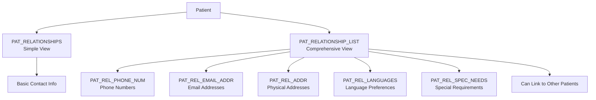

# Understanding Patient Identity & Demographics

*Purpose: To explore how Epic manages the complex challenge of patient identification and demographic tracking across healthcare systems.*

### The Foundation of Healthcare: Who Is This Patient?

Before any clinical care can begin, healthcare systems must answer a fundamental question: Who is this patient? Epic's approach to this challenge involves 95 patient-related tables that manage everything from basic demographics to complex family relationships.

<example-query description="Discover the scope of patient data management">
SELECT 
    CASE 
        WHEN name LIKE 'PATIENT%' AND name NOT LIKE 'PATIENT_%' THEN 'Core Patient Tables'
        WHEN name LIKE 'PAT_%' THEN 'Patient Attribute Tables'
        WHEN name LIKE '%IDENTITY%' THEN 'Identity Tables'
        WHEN name LIKE '%RELATIONSHIP%' THEN 'Relationship Tables'
        ELSE 'Other Patient Tables'
    END as table_category,
    COUNT(*) as table_count
FROM sqlite_master 
WHERE type = 'table' 
  AND (name LIKE '%PATIENT%' OR name LIKE '%PAT_%' OR name LIKE '%IDENTITY%')
GROUP BY table_category
ORDER BY table_count DESC;
</example-query>

### The Multi-Identifier Challenge

In healthcare, a single patient often has multiple identifiers across different systems. Epic's Master Person Index elegantly handles this complexity:

<example-query description="View how one patient has multiple identifiers">
SELECT
    i.LINE,
    t.ID_TYPE_NAME as Identifier_Type,
    i.IDENTITY_ID as Identifier_Value,
    CASE t.ID_TYPE
        WHEN 0 THEN 'Epic system-wide ID'
        WHEN 14 THEN 'Government program ID'
        WHEN 955 THEN 'Facility-specific MRN'
    END as Purpose
FROM IDENTITY_ID i
JOIN IDENTITY_ID_TYPE t ON i.IDENTITY_TYPE_ID = t.ID_TYPE
WHERE i.PAT_ID = 'Z7004242'
ORDER BY i.LINE;
</example-query>

This multi-identifier approach enables:
- Seamless care transitions between facilities
- Government program eligibility tracking
- Historical record linkage
- Cross-system interoperability

### The Overflow Table Pattern

Epic faces a technical challenge: database systems limit the number of columns per table. The solution? Split patient data across multiple numbered tables:

<example-query description="Explore Epic's overflow table pattern">
SELECT 
    name as table_name,
    (SELECT COUNT(*) FROM pragma_table_info(sm.name)) as column_count,
    CASE 
        WHEN name = 'PATIENT' THEN 'Core demographics'
        WHEN name = 'PATIENT_2' THEN 'Extended demographics'
        WHEN name = 'PATIENT_3' THEN 'Clinical demographics'
        WHEN name = 'PATIENT_4' THEN 'Identity & preferences'
        WHEN name = 'PATIENT_5' THEN 'Additional clinical'
        WHEN name = 'PATIENT_6' THEN 'Specialized fields'
    END as primary_purpose
FROM sqlite_master sm
WHERE type = 'table' 
  AND name LIKE 'PATIENT%'
  AND name NOT LIKE 'PATIENT_%'
ORDER BY name;
</example-query>

### Modern Identity: Beyond Binary

Healthcare has evolved to recognize the distinction between sex and gender identity. Epic's PATIENT_4 table reflects this modern understanding:

<example-query description="See how Epic tracks sex and gender separately">
SELECT 
    p.PAT_ID,
    p.PAT_NAME,
    p.SEX_C_NAME as Legal_Sex,
    p4.GENDER_IDENTITY_C_NAME as Gender_Identity,
    p4.SEX_ASGN_AT_BIRTH_C_NAME as Sex_Assigned_at_Birth,
    CASE 
        WHEN p.SEX_C_NAME = p4.GENDER_IDENTITY_C_NAME THEN 'Cisgender'
        WHEN p4.GENDER_IDENTITY_C_NAME IS NULL THEN 'Not specified'
        ELSE 'Gender diverse'
    END as Identity_Status
FROM PATIENT p
LEFT JOIN PATIENT_4 p4 ON p.PAT_ID = p4.PAT_ID
WHERE p.PAT_ID = 'Z7004242';
</example-query>

### Tracking Life Changes: Address History

Patients move, and Epic tracks every address change with clinical precision:

<example-query description="Follow a patient's address history">
SELECT 
    LINE as Version,
    DATE(EFF_START_DATE) as Moved_In,
    CASE 
        WHEN EFF_END_DATE IS NULL OR EFF_END_DATE = '' THEN 'Current Address'
        ELSE DATE(EFF_END_DATE)
    END as Moved_Out,
    CITY_HX || ', ' || ZIP_HX as Location,
    ADDR_CHNG_SOURCE_C_NAME as Updated_Via,
    CASE SIGNIFICANT_CHANGE_YN 
        WHEN 'Y' THEN 'Major Move'
        ELSE 'Minor Update'
    END as Change_Type
FROM PAT_ADDR_CHNG_HX
WHERE PAT_ID = 'Z7004242'
ORDER BY EFF_START_DATE;
</example-query>

This pattern enables:
- Point-in-time address reconstruction
- Geographic mobility analysis
- Care continuity across moves
- Population health mapping

### Digital Age Communications

Modern patients expect multiple communication channels. Epic accommodates this with dedicated tables:

<example-query description="View patient's communication preferences">
SELECT 
    'Primary Email' as Channel,
    p.EMAIL_ADDRESS as Contact_Info
FROM PATIENT p
WHERE p.PAT_ID = 'Z7004242' AND p.EMAIL_ADDRESS IS NOT NULL
UNION ALL
SELECT 
    'Email ' || LINE as Channel,
    EMAIL_ADDRESS as Contact_Info
FROM PAT_EMAILADDRESS
WHERE PAT_ID = 'Z7004242'
UNION ALL
SELECT 
    'Home Phone' as Channel,
    p.HOME_PHONE as Contact_Info
FROM PATIENT p
WHERE p.PAT_ID = 'Z7004242' AND p.HOME_PHONE IS NOT NULL
UNION ALL
SELECT 
    'Work Phone' as Channel,
    p.WORK_PHONE as Contact_Info
FROM PATIENT p
WHERE p.PAT_ID = 'Z7004242' AND p.WORK_PHONE IS NOT NULL
ORDER BY Channel;
</example-query>

### The Family Network

Healthcare often involves family members. Epic's relationship management is remarkably sophisticated:



<example-query description="Explore patient relationships and contacts">
SELECT 
    prl.RELATIONSHIP_LIST_NAME as Contact_Name,
    pr.PAT_REL_TO_EMP_C_NAME as Relationship,
    COUNT(DISTINCT prp.LINE) as Phone_Numbers,
    CASE 
        WHEN prl.RELATED_PAT_ID IS NOT NULL THEN 'Also a Patient'
        ELSE 'External Contact'
    END as Contact_Type
FROM PAT_RELATIONSHIPS pr
JOIN PAT_RELATIONSHIP_LIST prl ON pr.PAT_REL_RLA_ID = prl.PAT_RELATIONSHIP_ID
LEFT JOIN PAT_REL_PHONE_NUM prp ON prl.PAT_RELATIONSHIP_ID = prp.PAT_RELATIONSHIP_ID
WHERE pr.PAT_ID = 'Z7004242'
GROUP BY prl.PAT_RELATIONSHIP_ID, prl.RELATIONSHIP_LIST_NAME, pr.PAT_REL_TO_EMP_C_NAME, prl.RELATED_PAT_ID;
</example-query>

### Cultural Competency: Race and Ethnicity

Federal regulations require detailed race and ethnicity tracking. Epic separates these concepts:

<example-query description="Understand race and ethnicity data structure">
SELECT 
    p.ETHNIC_GROUP_C_NAME as Ethnicity,
    pr.PATIENT_RACE_C_NAME as Race,
    p.LANGUAGE_C_NAME as Preferred_Language,
    p.RELIGION_C_NAME as Religion,
    'Supports multiple race selections via LINE pattern' as Note
FROM PATIENT p
LEFT JOIN PATIENT_RACE pr ON p.PAT_ID = pr.PAT_ID
WHERE p.PAT_ID = 'Z7004242';
</example-query>

### Portal Engagement

Patient portals are now essential for healthcare engagement. Epic tracks this separately:

<example-query description="Check patient portal enrollment">
SELECT 
    p.PAT_ID,
    p.PAT_NAME,
    CASE 
        WHEN mp.MYPT_ID IS NOT NULL THEN 'Enrolled'
        ELSE 'Not Enrolled'
    END as Portal_Status,
    mp.MYPT_ID as Portal_Account_ID,
    COUNT(DISTINCT pe.EMAIL_ADDRESS) as Email_Addresses_Available
FROM PATIENT p
LEFT JOIN MYC_PATIENT mp ON p.PAT_ID = mp.PAT_ID
LEFT JOIN PAT_EMAILADDRESS pe ON p.PAT_ID = pe.PAT_ID
WHERE p.PAT_ID = 'Z7004242'
GROUP BY p.PAT_ID, p.PAT_NAME, mp.MYPT_ID;
</example-query>

### Name Variations and Aliases

Patients may be known by different names in different contexts:

<example-query description="Track patient name variations">
SELECT 
    'Legal Name' as Name_Type,
    p.PAT_NAME as Name_Value,
    'PATIENT table' as Source
FROM PATIENT p
WHERE p.PAT_ID = 'Z7004242'
UNION ALL
SELECT 
    'Alias ' || LINE as Name_Type,
    ALIAS_NAME as Name_Value,
    'PATIENT_ALIAS table' as Source
FROM PATIENT_ALIAS
WHERE PAT_ID = 'Z7004242'
ORDER BY Name_Type;
</example-query>

### The Complete Picture

To truly understand a patient, Epic queries multiple tables:

<example-query description="Build a comprehensive patient profile">
SELECT 
    'Demographics' as Category,
    COUNT(*) as Data_Points
FROM (
    SELECT PAT_ID FROM PATIENT WHERE PAT_ID = 'Z7004242'
    UNION ALL
    SELECT PAT_ID FROM PATIENT_2 WHERE PAT_ID = 'Z7004242'
    UNION ALL
    SELECT PAT_ID FROM PATIENT_3 WHERE PAT_ID = 'Z7004242'
    UNION ALL
    SELECT PAT_ID FROM PATIENT_4 WHERE PAT_ID = 'Z7004242'
) demographics
UNION ALL
SELECT 
    'Identifiers' as Category,
    COUNT(*) as Data_Points
FROM IDENTITY_ID WHERE PAT_ID = 'Z7004242'
UNION ALL
SELECT 
    'Email Addresses' as Category,
    COUNT(*) as Data_Points
FROM PAT_EMAILADDRESS WHERE PAT_ID = 'Z7004242'
UNION ALL
SELECT 
    'Relationships' as Category,
    COUNT(*) as Data_Points
FROM PAT_RELATIONSHIPS WHERE PAT_ID = 'Z7004242'
UNION ALL
SELECT 
    'Address History' as Category,
    COUNT(*) as Data_Points
FROM PAT_ADDR_CHNG_HX WHERE PAT_ID = 'Z7004242'
ORDER BY Data_Points DESC;
</example-query>

### Best Practices for Patient Queries

**1. Always Start with the Core**
```sql
-- Begin with PATIENT table, then join others as needed
SELECT p.*, p2.*, p3.*, p4.*
FROM PATIENT p
LEFT JOIN PATIENT_2 p2 ON p.PAT_ID = p2.PAT_ID
LEFT JOIN PATIENT_3 p3 ON p.PAT_ID = p3.PAT_ID
LEFT JOIN PATIENT_4 p4 ON p.PAT_ID = p4.PAT_ID
WHERE p.PAT_ID = :patient_id;
```

**2. Consider Historical Context**
```sql
-- For point-in-time demographics
SELECT * FROM PAT_ADDR_CHNG_HX
WHERE PAT_ID = :patient_id
  AND :target_date BETWEEN EFF_START_DATE 
  AND COALESCE(EFF_END_DATE, '9999-12-31');
```

**3. Respect Modern Identity**
```sql
-- Use appropriate fields for gender-aware queries
SELECT 
    COALESCE(p4.GENDER_IDENTITY_C_NAME, p.SEX_C_NAME) as Gender_For_Communication,
    p.SEX_C_NAME as Legal_Sex_For_Coverage
FROM PATIENT p
LEFT JOIN PATIENT_4 p4 ON p.PAT_ID = p4.PAT_ID;
```

---

### Key Takeaways

- Epic uses **95 tables** to manage patient identity and demographics
- The **Master Person Index** supports multiple identifiers per patient
- Patient data spans **6 core PATIENT tables** due to column limits
- **Modern identity fields** separate sex, gender identity, and sex assigned at birth
- **Address history** uses effective dating for point-in-time reconstruction
- **Relationship management** includes extensive detail tables for contacts
- **Communication preferences** support multiple emails and phone numbers
- **Portal enrollment** tracked separately for engagement analytics
- The **overflow table pattern** (PATIENT through PATIENT_6) manages database constraints
- **Category fields** (_C_NAME suffix) ensure data standardization
