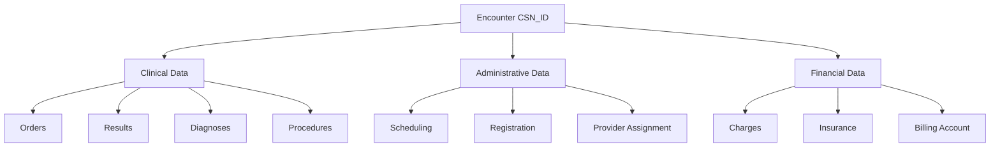

# Navigating Patient Encounters Across Care Settings

*Master the foundation of Epic's clinical data model by understanding how encounters track every patient interaction from routine checkups to complex hospital stays.*

### The Heartbeat of Healthcare Data

In healthcare, every patient interaction tells a story. Our sample patient, Joshua Mandel, has had 111 encounters documented in the Epic system - from quick lab visits to multi-day therapy sessions. Each encounter serves as a container for all clinical activities: orders placed, results received, diagnoses documented, and bills generated. Understanding encounters is fundamental to analyzing any aspect of healthcare data.

Let's explore how Epic's sophisticated encounter tracking system works, starting with the concept that makes it all possible.

### The Magic of CSN_ID

Every encounter in Epic receives a unique Contact Serial Number (CSN_ID) - think of it as a social security number for healthcare visits. This identifier links everything that happens during a patient interaction:

<example-query description="View recent encounters showing the universal CSN_ID">
SELECT 
    PAT_ENC_CSN_ID,
    CONTACT_DATE,
    APPT_STATUS_C_NAME as Status,
    DEPARTMENT_ID,
    VISIT_PROV_ID as Provider_ID,
    ENC_CLOSED_YN as Closed
FROM PAT_ENC
WHERE PAT_ID = 'Z7004242'
ORDER BY CONTACT_DATE DESC
LIMIT 10;
</example-query>

Notice how each encounter has:
- A unique CSN_ID (like 991225117.0)
- A contact date 
- An appointment status (for scheduled visits)
- A department and provider
- A closure indicator

### Decoding Encounter Types

Not all encounters are created equal. Epic distinguishes between different care settings:

<example-query description="Analyze encounter types by looking for key indicators">
SELECT 
    pe.PAT_ENC_CSN_ID,
    pe.CONTACT_DATE,
    d.DEPARTMENT_NAME,
    CASE 
        WHEN hsp.PAT_ENC_CSN_ID IS NOT NULL THEN 'Hospital'
        WHEN eds.PAT_ENC_CSN_ID IS NOT NULL THEN 'Emergency'
        WHEN pe.APPT_STATUS_C_NAME IS NOT NULL THEN 'Ambulatory'
        ELSE 'Other'
    END as Encounter_Type,
    pe.APPT_STATUS_C_NAME
FROM PAT_ENC pe
LEFT JOIN CLARITY_DEP d ON pe.DEPARTMENT_ID = d.DEPARTMENT_ID
LEFT JOIN PAT_ENC_HSP hsp ON pe.PAT_ENC_CSN_ID = hsp.PAT_ENC_CSN_ID
LEFT JOIN (SELECT DISTINCT PAT_ENC_CSN_ID FROM ED_PAT_STATUS) eds 
    ON pe.PAT_ENC_CSN_ID = eds.PAT_ENC_CSN_ID
WHERE pe.PAT_ID = 'Z7004242'
  AND pe.CONTACT_DATE >= '2023-01-01'
ORDER BY pe.CONTACT_DATE DESC;
</example-query>

This query reveals how Epic uses different tables to track different encounter types:
- **PAT_ENC**: Contains all encounters
- **PAT_ENC_HSP**: Additional details for hospital stays
- **ED_PAT_STATUS**: Emergency department tracking

### Following an ED Visit

Emergency department visits have their own detailed tracking. Let's trace a patient's journey through the ED:

<example-query description="Track the progression of an ED visit through status changes">
SELECT 
    LINE as Step,
    ED_PAT_STATUS_C_NAME as Status,
    PAT_STATUS_TIME as Time,
    PAT_STATUS_USER_ID_NAME as Staff_Member,
    ROUND((JULIANDAY(PAT_STATUS_TIME) - 
           JULIANDAY(LAG(PAT_STATUS_TIME) OVER (ORDER BY LINE))) * 24 * 60, 1) 
        as Minutes_Since_Last_Status
FROM ED_PAT_STATUS
WHERE PAT_ENC_CSN_ID = 799951565.0
ORDER BY LINE;
</example-query>

This reveals the typical ED workflow:
1. **Arrived** - Patient checks in
2. **Rooming in Progress** - Staff prepares room
3. **Waiting** - Patient in room awaiting provider
4. **Visit in Progress** - Provider seeing patient
5. **Visit Complete** - Clinical care finished
6. **Checked Out** - Discharge process complete

### Understanding Hospital Admissions

When patients require inpatient care, Epic tracks additional details:

<example-query description="Examine hospital admission details including therapy sessions">
SELECT 
    pe.PAT_ENC_CSN_ID,
    pe.CONTACT_DATE,
    hsp.ADT_PAT_CLASS_C_NAME as Patient_Class,
    hsp.HOSP_ADMSN_TIME as Admission,
    hsp.HOSP_DISCH_TIME as Discharge,
    ROUND((JULIANDAY(hsp.HOSP_DISCH_TIME) - 
           JULIANDAY(hsp.HOSP_ADMSN_TIME)) * 24, 1) as Length_of_Stay_Hours,
    hsp.ADMIT_SOURCE_C_NAME as Admitted_From,
    hsp.DISCH_DISP_C_NAME as Discharged_To
FROM PAT_ENC pe
JOIN PAT_ENC_HSP hsp ON pe.PAT_ENC_CSN_ID = hsp.PAT_ENC_CSN_ID
WHERE pe.PAT_ID = 'Z7004242'
ORDER BY pe.CONTACT_DATE DESC;
</example-query>

Notice the "Therapies Series" patient class - Epic uses this for outpatient therapy sessions that need hospital-level tracking.

### Tracking Patient Movement with ADT

The Admission, Discharge, Transfer (ADT) system tracks every patient movement:

<example-query description="View ADT events showing patient movement through the hospital">
SELECT 
    EVENT_ID,
    EVENT_TYPE_C_NAME as Event_Type,
    EFFECTIVE_TIME,
    d.DEPARTMENT_NAME,
    PAT_CLASS_C_NAME as Patient_Class,
    FROM_BASE_CLASS_C_NAME as From_Status,
    TO_BASE_CLASS_C_NAME as To_Status
FROM CLARITY_ADT adt
LEFT JOIN CLARITY_DEP d ON adt.DEPARTMENT_ID = d.DEPARTMENT_ID
WHERE adt.PAT_ID = 'Z7004242'
ORDER BY EFFECTIVE_TIME DESC
LIMIT 10;
</example-query>

ADT events capture:
- Patient class changes (e.g., Direct to Outpatient)
- Department transfers
- Admission and discharge times
- Care level transitions

### Connecting Encounters to Clinical Data

Encounters serve as the hub connecting all clinical activities. Let's see this in action:

<example-query description="Show how diagnoses link to encounters">
SELECT 
    pe.PAT_ENC_CSN_ID,
    pe.CONTACT_DATE,
    d.DEPARTMENT_NAME,
    dx.DX_ID,
    dx.PRIMARY_DX_YN as Is_Primary,
    dx.DX_CHRONIC_YN as Is_Chronic,
    dx.DX_ED_YN as Is_ED_Diagnosis
FROM PAT_ENC pe
JOIN PAT_ENC_DX dx ON pe.PAT_ENC_CSN_ID = dx.PAT_ENC_CSN_ID
LEFT JOIN CLARITY_DEP d ON pe.DEPARTMENT_ID = d.DEPARTMENT_ID
WHERE pe.PAT_ID = 'Z7004242'
  AND dx.PRIMARY_DX_YN = 'Y'
ORDER BY pe.CONTACT_DATE DESC
LIMIT 10;
</example-query>

Each encounter can have multiple diagnoses, with flags indicating:
- Primary vs. secondary diagnoses
- Chronic conditions
- ED-specific diagnoses

### Understanding Epic's Overflow Architecture

Epic's encounter table would have hundreds of columns if fully normalized. Instead, Epic splits data across multiple tables:

<example-query description="Demonstrate how encounter data spans multiple overflow tables">
SELECT 
    'PAT_ENC' as Table_Name,
    COUNT(*) as Column_Count
FROM pragma_table_info('PAT_ENC')
UNION ALL
SELECT 
    'PAT_ENC_2',
    COUNT(*)
FROM pragma_table_info('PAT_ENC_2')
UNION ALL
SELECT 
    'PAT_ENC_3',
    COUNT(*)
FROM pragma_table_info('PAT_ENC_3')
ORDER BY Table_Name;
</example-query>

All overflow tables share the same CSN_ID, making joins straightforward:

<example-query description="Query across overflow tables to get complete encounter data">
SELECT 
    pe.PAT_ENC_CSN_ID,
    pe.CONTACT_DATE,
    pe.APPT_STATUS_C_NAME,
    pe2.CYCLE_TIME_MIN,              -- From PAT_ENC_2
    pe3.CLINICAL_UTC_OFFSET,         -- From PAT_ENC_3
    pe4.VIDEO_ENCOUNTER_YN           -- From PAT_ENC_4
FROM PAT_ENC pe
LEFT JOIN PAT_ENC_2 pe2 ON pe.PAT_ENC_CSN_ID = pe2.PAT_ENC_CSN_ID
LEFT JOIN PAT_ENC_3 pe3 ON pe.PAT_ENC_CSN_ID = pe3.PAT_ENC_CSN_ID
LEFT JOIN PAT_ENC_4 pe4 ON pe.PAT_ENC_CSN_ID = pe4.PAT_ENC_CSN_ID
WHERE pe.PAT_ID = 'Z7004242'
  AND pe.CONTACT_DATE >= '2023-01-01'
  AND pe4.VIDEO_ENCOUNTER_YN = 'Y'
LIMIT 5;
</example-query>

### Analyzing Encounter Patterns

Let's explore how to derive insights from encounter data:

<example-query description="Analyze patient's encounter patterns over time">
WITH EncounterStats AS (
    SELECT 
        pe.PAT_ID,
        COUNT(DISTINCT pe.PAT_ENC_CSN_ID) as Total_Encounters,
        COUNT(DISTINCT CASE WHEN pe.APPT_STATUS_C_NAME = 'Completed' 
                           THEN pe.PAT_ENC_CSN_ID END) as Completed_Visits,
        COUNT(DISTINCT CASE WHEN hsp.PAT_ENC_CSN_ID IS NOT NULL 
                           THEN pe.PAT_ENC_CSN_ID END) as Hospital_Encounters,
        COUNT(DISTINCT CASE WHEN eds.PAT_ENC_CSN_ID IS NOT NULL 
                           THEN pe.PAT_ENC_CSN_ID END) as ED_Visits,
        COUNT(DISTINCT pe.DEPARTMENT_ID) as Departments_Visited,
        COUNT(DISTINCT DATE(pe.CONTACT_DATE)) as Days_With_Encounters
    FROM PAT_ENC pe
    LEFT JOIN PAT_ENC_HSP hsp ON pe.PAT_ENC_CSN_ID = hsp.PAT_ENC_CSN_ID
    LEFT JOIN (SELECT DISTINCT PAT_ENC_CSN_ID FROM ED_PAT_STATUS) eds 
        ON pe.PAT_ENC_CSN_ID = eds.PAT_ENC_CSN_ID
    WHERE pe.PAT_ID = 'Z7004242'
    GROUP BY pe.PAT_ID
)
SELECT 
    Total_Encounters,
    Completed_Visits,
    Hospital_Encounters,
    ED_Visits,
    ROUND(CAST(ED_Visits AS FLOAT) / Total_Encounters * 100, 1) as ED_Visit_Percentage,
    Departments_Visited,
    Days_With_Encounters
FROM EncounterStats;
</example-query>

This comprehensive view reveals utilization patterns that can inform care coordination and population health initiatives.

### Best Practices for Encounter Analysis

**1. Always Use CSN_ID for Joining**
```sql
-- CSN_ID is the universal key
SELECT *
FROM PAT_ENC pe
JOIN ORDER_PROC op ON pe.PAT_ENC_CSN_ID = op.PAT_ENC_CSN_ID
JOIN ORDER_RESULTS orr ON op.ORDER_PROC_ID = orr.ORDER_PROC_ID;
```

**2. Check Encounter Closure Status**
```sql
-- Closed encounters have complete data
SELECT *
FROM PAT_ENC
WHERE ENC_CLOSED_YN = 'Y'
  AND CONTACT_DATE >= DATE('now', '-30 days');
```

**3. Handle Missing Hospital Data Gracefully**
```sql
-- Not all encounters have hospital details
SELECT 
    pe.*,
    COALESCE(hsp.ADT_PAT_CLASS_C_NAME, 'Ambulatory') as Patient_Class
FROM PAT_ENC pe
LEFT JOIN PAT_ENC_HSP hsp ON pe.PAT_ENC_CSN_ID = hsp.PAT_ENC_CSN_ID;
```

**4. Consider Time Zones for Analysis**
```sql
-- Epic stores times in local timezone
SELECT 
    CONTACT_DATE,
    HOSP_ADMSN_TIME,
    -- Use consistent date for day-over-day analysis
    DATE(CONTACT_DATE) as Encounter_Date
FROM PAT_ENC;
```

### Clinical Significance

Understanding encounters enables critical healthcare analytics:



Every analysis ultimately traces back to encounters - they're the atomic unit of healthcare delivery.

### Summary

Epic's Encounters & Visits domain demonstrates several key design principles:

- **Universal Identifier**: CSN_ID links all clinical activities to specific patient interactions
- **Flexible Architecture**: Core table (PAT_ENC) with specialized tables for different care settings
- **Overflow Management**: Multiple tables (PAT_ENC_2-7) handle Epic's extensive attribute list
- **Workflow Tracking**: Detailed status progression for ED and hospital encounters
- **Complete Audit Trail**: User and timestamp tracking for all changes

Mastering encounter data enables you to:
- Track patient journeys across care settings
- Measure clinical efficiency and throughput
- Support quality improvement initiatives
- Enable accurate billing and reimbursement
- Facilitate population health management

Whether you're analyzing a single visit or population-wide patterns, encounters provide the foundation for understanding healthcare delivery in Epic.