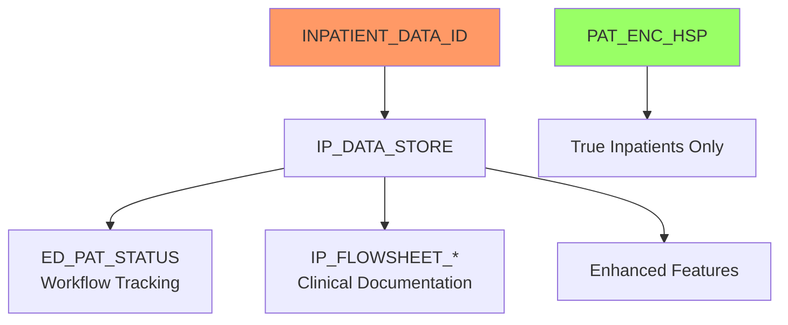

# Demystifying INPATIENT_DATA_ID: When Outpatients Go "Inpatient"

*Uncover one of Epic's most misleading field names and learn how 95% of "inpatient" data IDs actually track outpatient visits.*

### The Name That Lies

Picture this: You're analyzing Epic data and discover that 40% of encounters have an INPATIENT_DATA_ID. "Wow," you think, "this hospital has a massive inpatient population!" But wait - only 2% of those encounters have hospital admission records. What's going on?

Welcome to one of Epic's most confusing naming conventions, where INPATIENT_DATA_ID has almost nothing to do with actual inpatients.

### Discovering the Truth About INPATIENT_DATA_ID

Let's start by examining how many encounters actually have this mysteriously named field:

<example-query description="Check what fraction of encounters have INPATIENT_DATA_ID">
SELECT 
    COUNT(*) as total_encounters,
    SUM(CASE WHEN INPATIENT_DATA_ID IS NOT NULL 
             AND LENGTH(INPATIENT_DATA_ID) > 0 
        THEN 1 ELSE 0 END) as has_inpatient_id,
    ROUND(SUM(CASE WHEN INPATIENT_DATA_ID IS NOT NULL 
                   AND LENGTH(INPATIENT_DATA_ID) > 0 
              THEN 1 ELSE 0 END) * 100.0 / COUNT(*), 2) as percentage
FROM PAT_ENC
WHERE PAT_ID = 'Z7004242';
</example-query>

Nearly 40% of encounters have an INPATIENT_DATA_ID. But are they actually inpatient stays?

### The Reality Check: Hospital Admissions vs INPATIENT_DATA_ID

<example-query description="Compare INPATIENT_DATA_ID presence with actual hospital records">
SELECT 
    CASE 
        WHEN pe.INPATIENT_DATA_ID IS NOT NULL THEN 'Has INPATIENT_DATA_ID'
        ELSE 'No INPATIENT_DATA_ID'
    END as Category,
    COUNT(*) as Encounter_Count,
    SUM(CASE WHEN hsp.PAT_ENC_CSN_ID IS NOT NULL THEN 1 ELSE 0 END) as Has_Hospital_Record,
    ROUND(SUM(CASE WHEN hsp.PAT_ENC_CSN_ID IS NOT NULL THEN 1 ELSE 0 END) * 100.0 / COUNT(*), 2) as Hospital_Percentage
FROM PAT_ENC pe
LEFT JOIN PAT_ENC_HSP hsp ON pe.PAT_ENC_CSN_ID = hsp.PAT_ENC_CSN_ID
WHERE pe.PAT_ID = 'Z7004242'
GROUP BY CASE WHEN pe.INPATIENT_DATA_ID IS NOT NULL THEN 'Has INPATIENT_DATA_ID' ELSE 'No INPATIENT_DATA_ID' END;
</example-query>

The shocking truth: Only 4.55% of encounters with INPATIENT_DATA_ID are actual hospital admissions!

### Where Are These "Inpatient" IDs Actually Used?

Let's see which departments are using INPATIENT_DATA_ID:

<example-query description="List departments using INPATIENT_DATA_ID">
SELECT 
    COALESCE(d.DEPARTMENT_NAME, '[No Department]') as Department,
    COUNT(*) as Encounters_with_Inpatient_ID,
    ROUND(COUNT(*) * 100.0 / SUM(COUNT(*)) OVER(), 1) as Percentage
FROM PAT_ENC pe
LEFT JOIN CLARITY_DEP d ON pe.DEPARTMENT_ID = d.DEPARTMENT_ID
WHERE pe.INPATIENT_DATA_ID IS NOT NULL 
  AND LENGTH(pe.INPATIENT_DATA_ID) > 0
  AND pe.PAT_ID = 'Z7004242'
GROUP BY d.DEPARTMENT_NAME
ORDER BY COUNT(*) DESC;
</example-query>

Surprise! The vast majority are outpatient departments:
- Internal Medicine clinics
- Laboratory services
- Pediatrics clinics
- Central scheduling

### The ED Workflow Connection

One major use of INPATIENT_DATA_ID is to enable ED-style workflow tracking for non-emergency departments:

<example-query description="Show ED workflow tracking in non-ED departments">
SELECT 
    d.DEPARTMENT_NAME,
    eds.ED_PAT_STATUS_C_NAME as Workflow_Status,
    eds.PAT_STATUS_TIME,
    pe.APPT_STATUS_C_NAME as Appointment_Status
FROM ED_PAT_STATUS eds
JOIN PAT_ENC pe ON eds.PAT_ENC_CSN_ID = pe.PAT_ENC_CSN_ID
LEFT JOIN CLARITY_DEP d ON pe.DEPARTMENT_ID = d.DEPARTMENT_ID
WHERE pe.PAT_ID = 'Z7004242'
  AND d.DEPARTMENT_NAME LIKE '%INTERNAL MEDICINE%'
ORDER BY eds.PAT_STATUS_TIME DESC
LIMIT 10;
</example-query>

Internal Medicine clinics are using ED patient status workflows (Arrived → Rooming → Waiting → Visit in Progress) to track their patients!

### Tracing INPATIENT_DATA_ID Across Tables

The INPATIENT_DATA_ID serves as a key linking encounters to enhanced tracking features:

<example-query description="Show which tables use INPATIENT_DATA_ID for tracking">
WITH id_usage AS (
    SELECT DISTINCT INPATIENT_DATA_ID 
    FROM PAT_ENC 
    WHERE INPATIENT_DATA_ID IS NOT NULL
      AND PAT_ID = 'Z7004242'
)
SELECT 
    'IP_DATA_STORE' as Table_Name,
    COUNT(DISTINCT ids.INPATIENT_DATA_ID) as IDs_Found,
    'Master inpatient data store' as Purpose
FROM IP_DATA_STORE ids
WHERE ids.INPATIENT_DATA_ID IN (SELECT INPATIENT_DATA_ID FROM id_usage)
UNION ALL
SELECT 
    'ED_PAT_STATUS',
    COUNT(DISTINCT eds.INPATIENT_DATA_ID),
    'Workflow status tracking'
FROM ED_PAT_STATUS eds
WHERE eds.INPATIENT_DATA_ID IN (SELECT INPATIENT_DATA_ID FROM id_usage)
UNION ALL
SELECT 
    'IP_FLOWSHEET_ROWS',
    COUNT(DISTINCT ifr.INPATIENT_DATA_ID),
    'Clinical documentation'
FROM IP_FLOWSHEET_ROWS ifr
WHERE ifr.INPATIENT_DATA_ID IN (SELECT INPATIENT_DATA_ID FROM id_usage)
UNION ALL
SELECT 
    'PAT_ENC_HSP',
    COUNT(DISTINCT hsp.INPATIENT_DATA_ID),
    'True hospital admissions'
FROM PAT_ENC_HSP hsp
WHERE hsp.INPATIENT_DATA_ID IN (SELECT INPATIENT_DATA_ID FROM id_usage)
ORDER BY IDs_Found DESC;
</example-query>

### The Master Store: IP_DATA_STORE

Every encounter with an INPATIENT_DATA_ID gets a record in IP_DATA_STORE:

<example-query description="Examine IP_DATA_STORE connections">
SELECT 
    pe.PAT_ENC_CSN_ID,
    pe.CONTACT_DATE,
    d.DEPARTMENT_NAME,
    ids.INPATIENT_DATA_ID,
    ids.EPT_CSN as Linked_CSN,
    ids.RECORD_STATUS_C_NAME
FROM PAT_ENC pe
JOIN IP_DATA_STORE ids ON pe.INPATIENT_DATA_ID = ids.INPATIENT_DATA_ID
LEFT JOIN CLARITY_DEP d ON pe.DEPARTMENT_ID = d.DEPARTMENT_ID
WHERE pe.PAT_ID = 'Z7004242'
  AND d.DEPARTMENT_NAME LIKE '%LABORATORY%'
LIMIT 5;
</example-query>

The IP_DATA_STORE table serves as a central hub, linking the INPATIENT_DATA_ID back to the encounter CSN.

### Finding the Real Hospital Admissions

When you need to identify actual inpatient stays, don't rely on INPATIENT_DATA_ID:

<example-query description="Correctly identify true hospital admissions">
SELECT 
    pe.PAT_ENC_CSN_ID,
    pe.CONTACT_DATE,
    d.DEPARTMENT_NAME,
    hsp.ADT_PAT_CLASS_C_NAME as Patient_Class,
    hsp.HOSP_ADMSN_TIME as Admission_Time,
    hsp.HOSP_DISCH_TIME as Discharge_Time,
    CASE 
        WHEN pe.INPATIENT_DATA_ID IS NOT NULL THEN 'Yes'
        ELSE 'No'
    END as Has_Inpatient_Data_ID
FROM PAT_ENC pe
JOIN PAT_ENC_HSP hsp ON pe.PAT_ENC_CSN_ID = hsp.PAT_ENC_CSN_ID
LEFT JOIN CLARITY_DEP d ON pe.DEPARTMENT_ID = d.DEPARTMENT_ID
WHERE pe.PAT_ID = 'Z7004242'
ORDER BY pe.CONTACT_DATE DESC;
</example-query>

True hospital admissions are identified by records in PAT_ENC_HSP, not by the presence of INPATIENT_DATA_ID.

### Understanding the Misnomer

So what is INPATIENT_DATA_ID really? It's an "enhanced encounter tracking identifier" used when departments need:

<example-query description="Analyze what features INPATIENT_DATA_ID enables">
SELECT 
    'Features enabled by INPATIENT_DATA_ID:' as Description
UNION ALL
SELECT '• Workflow tracking: ' || COUNT(DISTINCT PAT_ENC_CSN_ID) || ' encounters'
FROM ED_PAT_STATUS 
WHERE INPATIENT_DATA_ID IN (
    SELECT INPATIENT_DATA_ID FROM PAT_ENC 
    WHERE PAT_ID = 'Z7004242' AND INPATIENT_DATA_ID IS NOT NULL
)
UNION ALL
SELECT '• Flowsheet documentation: ' || COUNT(DISTINCT INPATIENT_DATA_ID) || ' encounters'
FROM IP_FLOWSHEET_ROWS
WHERE INPATIENT_DATA_ID IN (
    SELECT INPATIENT_DATA_ID FROM PAT_ENC 
    WHERE PAT_ID = 'Z7004242' AND INPATIENT_DATA_ID IS NOT NULL
)
UNION ALL
SELECT '• Date range tracking: ' || COUNT(DISTINCT INPATIENT_DATA_ID) || ' encounters'
FROM IP_FLOW_DATERNG
WHERE INPATIENT_DATA_ID IN (
    SELECT INPATIENT_DATA_ID FROM PAT_ENC 
    WHERE PAT_ID = 'Z7004242' AND INPATIENT_DATA_ID IS NOT NULL
);
</example-query>

### Best Practices for INPATIENT_DATA_ID

**1. Don't Assume It Means Inpatient**
```sql
-- WRONG: Counting inpatients
SELECT COUNT(*) as Inpatient_Count
FROM PAT_ENC
WHERE INPATIENT_DATA_ID IS NOT NULL;

-- RIGHT: Use PAT_ENC_HSP
SELECT COUNT(*) as Inpatient_Count
FROM PAT_ENC_HSP;
```

**2. Use It for Enhanced Tracking Features**
```sql
-- Find encounters with detailed workflow tracking
SELECT pe.*, eds.ED_PAT_STATUS_C_NAME
FROM PAT_ENC pe
JOIN ED_PAT_STATUS eds ON pe.INPATIENT_DATA_ID = eds.INPATIENT_DATA_ID
WHERE pe.INPATIENT_DATA_ID IS NOT NULL;
```

**3. Join Through IP_DATA_STORE for Master Records**
```sql
-- Link to the master inpatient data store
SELECT pe.*, ids.*
FROM PAT_ENC pe
JOIN IP_DATA_STORE ids ON pe.INPATIENT_DATA_ID = ids.INPATIENT_DATA_ID;
```

### Clinical Significance

Understanding INPATIENT_DATA_ID's true purpose helps you:



The distinction matters for:
- **Accurate reporting**: Don't overcount inpatient utilization
- **Workflow analysis**: Understand which departments use enhanced tracking
- **Data integration**: Know which tables to join for complete information
- **Performance**: IP_DATA_STORE queries may be slower due to size

### Summary

INPATIENT_DATA_ID is one of Epic's most misleading field names. Despite its name, 95% of encounters using it are outpatient visits that leverage inpatient-style tracking features. The field should be understood as an "enhanced encounter tracking ID" that enables:

- ED-style workflow tracking in any department
- Detailed flowsheet documentation
- Enhanced clinical tracking features
- Connection to the IP_DATA_STORE master record

When you need to identify true hospital admissions, always use PAT_ENC_HSP records, not INPATIENT_DATA_ID. This critical distinction ensures accurate analysis and prevents the common mistake of massively overcounting inpatient utilization.

Remember: In Epic's world, "inpatient" doesn't always mean inpatient - sometimes it just means "we want fancy tracking features for this outpatient visit!"