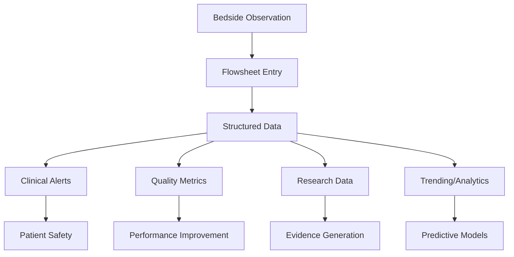

# Capturing Clinical Measurements Through Flowsheets

*Discover how Epic's flowsheet system transforms bedside observations into structured data, from depression screenings to vital signs, using a sophisticated template architecture.*

### The Digital Clipboard Revolution

Every day, healthcare workers document thousands of clinical observations - blood pressures, pain scores, screening questionnaires, and more. In Epic's world, these measurements flow through a sophisticated system called flowsheets. Our sample patient has 192 documented measurements across 17 flowsheet records, ranging from PHQ-2 depression screenings to travel history assessments.

Let's explore how Epic structures this critical clinical data, starting with understanding what makes flowsheets so powerful.

### The Template-Instance Pattern

Epic separates the "what can be measured" from the "what was measured" using templates and instances:

<example-query description="View available flowsheet templates and their usage">
SELECT 
    flt.TEMPLATE_ID,
    flt.DISPLAY_NAME as Template_Name,
    COUNT(DISTINCT fm.FSD_ID) as Times_Used,
    COUNT(fm.LINE) as Total_Measurements
FROM IP_FLT_DATA flt
LEFT JOIN IP_FLWSHT_MEAS fm ON flt.TEMPLATE_ID = fm.FLT_ID
GROUP BY flt.TEMPLATE_ID, flt.DISPLAY_NAME
ORDER BY Total_Measurements DESC;
</example-query>

This reveals Epic's template library:
- **Encounter Vitals**: Standard vital signs
- **ADULT WELLNESS SCREENINGS**: Depression, anxiety, substance use
- **Custom Formula Data**: Calculated values
- **Disease Screening**: Condition-specific assessments
- **Travel**: Exposure risk documentation

### Tracking a Depression Screening

Let's trace how a PHQ-2 depression screening flows through the system:

<example-query description="Follow PHQ-2 screening questions and responses">
SELECT 
    fm.RECORDED_TIME,
    fm.LINE,
    fr.FLO_MEAS_ID_DISP_NAME as Question,
    fm.MEAS_COMMENT as Response,
    fm.TAKEN_USER_ID_NAME as Administered_By
FROM IP_FLWSHT_REC fsr
JOIN IP_FLWSHT_MEAS fm ON fsr.FSD_ID = fm.FSD_ID
LEFT JOIN IP_FLOWSHEET_ROWS fr ON fsr.INPATIENT_DATA_ID = fr.INPATIENT_DATA_ID 
    AND fm.LINE = fr.LINE
WHERE fsr.PAT_ID = 'Z7004242'
  AND fm.FLT_ID = '281'  -- Adult Wellness Screenings
  AND fr.FLO_MEAS_ID_DISP_NAME LIKE '%PHQ-2%'
ORDER BY fm.RECORDED_TIME DESC, fm.LINE;
</example-query>

The PHQ-2 has three components:
1. Header explaining the timeframe
2. Question about interest/pleasure
3. Question about depression/hopelessness
4. Calculated total score

### Understanding Measurement Timing

Epic tracks two critical timestamps for every measurement:

<example-query description="Analyze documentation timeliness across templates">
SELECT 
    flt.DISPLAY_NAME as Template,
    COUNT(*) as Measurements,
    AVG(CASE 
        WHEN fm.ENTRY_TIME IS NOT NULL AND fm.RECORDED_TIME IS NOT NULL
        THEN ROUND((JULIANDAY(fm.ENTRY_TIME) - JULIANDAY(fm.RECORDED_TIME)) * 24 * 60, 1)
        ELSE NULL 
    END) as Avg_Documentation_Delay_Minutes,
    COUNT(CASE WHEN fm.ENTRY_TIME = fm.RECORDED_TIME THEN 1 END) as Real_Time_Entries
FROM IP_FLWSHT_MEAS fm
JOIN IP_FLT_DATA flt ON fm.FLT_ID = flt.TEMPLATE_ID
JOIN IP_FLWSHT_REC fr ON fm.FSD_ID = fr.FSD_ID
WHERE fr.PAT_ID = 'Z7004242'
  AND fm.ENTRY_TIME IS NOT NULL
GROUP BY flt.DISPLAY_NAME
ORDER BY Measurements DESC;
</example-query>

This reveals documentation patterns:
- Real-time entry (when RECORDED_TIME = ENTRY_TIME)
- Delayed documentation (common for busy clinicians)
- Batch entry workflows

### Exploring Template Usage Over Time

Let's see how different templates are used throughout the patient's care:

<example-query description="Track flowsheet template usage patterns over time">
WITH TemplateUsage AS (
    SELECT 
        DATE(fm.RECORDED_TIME) as Measurement_Date,
        flt.DISPLAY_NAME as Template,
        COUNT(*) as Daily_Measurements,
        COUNT(DISTINCT fm.TAKEN_USER_ID) as Staff_Count
    FROM IP_FLWSHT_MEAS fm
    JOIN IP_FLT_DATA flt ON fm.FLT_ID = flt.TEMPLATE_ID
    JOIN IP_FLWSHT_REC fr ON fm.FSD_ID = fr.FSD_ID
    WHERE fr.PAT_ID = 'Z7004242'
      AND fm.RECORDED_TIME IS NOT NULL
    GROUP BY DATE(fm.RECORDED_TIME), flt.DISPLAY_NAME
)
SELECT 
    Measurement_Date,
    GROUP_CONCAT(Template || ' (' || Daily_Measurements || ')', ', ') as Templates_Used,
    SUM(Daily_Measurements) as Total_Daily_Measurements
FROM TemplateUsage
GROUP BY Measurement_Date
ORDER BY Measurement_Date DESC
LIMIT 10;
</example-query>

This shows how different clinical scenarios require different templates - routine visits might use vital signs, while annual physicals include wellness screenings.

### The Power of Structured Row Definitions

Flowsheets organize measurements into defined rows:

<example-query description="Explore the variety of clinical measurements captured">
SELECT 
    fr.FLO_MEAS_ID_DISP_NAME as Measurement_Type,
    COUNT(DISTINCT fr.INPATIENT_DATA_ID) as Flowsheets_Using_This,
    COUNT(DISTINCT fsr.FSD_ID) as Records_With_This_Type
FROM IP_FLOWSHEET_ROWS fr
JOIN IP_FLWSHT_REC fsr ON fr.INPATIENT_DATA_ID = fsr.INPATIENT_DATA_ID
WHERE fsr.PAT_ID = 'Z7004242'
GROUP BY fr.FLO_MEAS_ID_DISP_NAME
HAVING COUNT(DISTINCT fsr.FSD_ID) > 0
ORDER BY Records_With_This_Type DESC
LIMIT 20;
</example_query>

Common measurement types include:
- **Vital Signs**: BP, pulse, temperature, respirations
- **Screening Questions**: Depression, substance use, safety
- **Calculated Values**: BMI, scores, risk assessments
- **Patient-Reported**: Symptoms, travel, exposures

### Tracking Clinical Decision Support

Some measurements trigger automated calculations:

<example-query description="Find calculated values and formulas in flowsheets">
SELECT 
    fm.RECORDED_TIME,
    fm.FLT_ID_DISPLAY_NAME as Template,
    fr.FLO_MEAS_ID_DISP_NAME as Calculated_Field,
    fm.MEAS_COMMENT as Value
FROM IP_FLWSHT_MEAS fm
JOIN IP_FLWSHT_REC fsr ON fm.FSD_ID = fsr.FSD_ID
LEFT JOIN IP_FLOWSHEET_ROWS fr ON fsr.INPATIENT_DATA_ID = fr.INPATIENT_DATA_ID 
    AND fm.OCCURANCE = fr.LINE
WHERE fsr.PAT_ID = 'Z7004242'
  AND fm.FLT_ID = '43'  -- Custom Formula Data
  AND fr.FLO_MEAS_ID_DISP_NAME IS NOT NULL
ORDER BY fm.RECORDED_TIME DESC
LIMIT 10;
</example-query>

Examples include:
- BMI calculations from height/weight
- Risk scores from assessment tools
- Dosing calculations based on weight
- Severity indices from multiple inputs

### Understanding the Edit Trail

Healthcare requires accountability. Let's see how Epic tracks changes:

<example-query description="Check for edited measurements showing audit trail">
SELECT 
    fm.FSD_ID,
    fm.RECORDED_TIME,
    fm.FLT_ID_DISPLAY_NAME as Template,
    CASE 
        WHEN fm.EDITED_LINE IS NOT NULL THEN 'Edited'
        ELSE 'Original'
    END as Entry_Status,
    fm.ENTRY_USER_ID_NAME as Documented_By,
    fm.ISACCEPTED_YN as Accepted
FROM IP_FLWSHT_MEAS fm
JOIN IP_FLWSHT_REC fr ON fm.FSD_ID = fr.FSD_ID
WHERE fr.PAT_ID = 'Z7004242'
  AND (fm.EDITED_LINE IS NOT NULL OR fm.ISACCEPTED_YN = 'N')
ORDER BY fm.RECORDED_TIME DESC
LIMIT 10;
</example-query>

The edit trail ensures:
- Original values are preserved
- Changes are attributed to users
- Timestamps track when edits occurred
- Acceptance status validates data

### Building a Patient Timeline

Let's create a comprehensive view of the patient's flowsheet journey:

<example-query description="Create a timeline of all flowsheet documentation">
WITH FlowsheetTimeline AS (
    SELECT 
        DATE(fm.RECORDED_TIME) as Activity_Date,
        flt.DISPLAY_NAME as Template_Used,
        COUNT(DISTINCT fm.FSD_ID) as Unique_Records,
        COUNT(*) as Total_Entries,
        GROUP_CONCAT(DISTINCT fm.TAKEN_USER_ID_NAME) as Staff_Involved
    FROM IP_FLWSHT_MEAS fm
    JOIN IP_FLT_DATA flt ON fm.FLT_ID = flt.TEMPLATE_ID
    JOIN IP_FLWSHT_REC fr ON fm.FSD_ID = fr.FSD_ID
    WHERE fr.PAT_ID = 'Z7004242'
      AND fm.RECORDED_TIME IS NOT NULL
    GROUP BY DATE(fm.RECORDED_TIME), flt.DISPLAY_NAME
)
SELECT 
    Activity_Date,
    COUNT(DISTINCT Template_Used) as Different_Templates,
    SUM(Total_Entries) as Total_Measurements,
    GROUP_CONCAT(Template_Used || ' (' || Total_Entries || ' entries)', '; ') as Details
FROM FlowsheetTimeline
GROUP BY Activity_Date
ORDER BY Activity_Date DESC
LIMIT 15;
</example-query>

This timeline reveals:
- Patterns of care (routine vs. intensive monitoring)
- Template combinations used together
- Staffing patterns and care teams
- Documentation workload distribution

### Best Practices for Flowsheet Analysis

**1. Always Use Clinical Time**
```sql
-- Use RECORDED_TIME for clinical analysis
SELECT * FROM IP_FLWSHT_MEAS
WHERE RECORDED_TIME BETWEEN ? AND ?
ORDER BY RECORDED_TIME;
```

**2. Link Through All Tables**
```sql
-- Complete join path for row names
FROM IP_FLWSHT_REC fr
JOIN IP_FLWSHT_MEAS fm ON fr.FSD_ID = fm.FSD_ID
JOIN IP_FLOWSHEET_ROWS frow ON fr.INPATIENT_DATA_ID = frow.INPATIENT_DATA_ID
    AND fm.OCCURANCE = frow.LINE;
```

**3. Handle Null Values Appropriately**
```sql
-- Not all measurements have values
SELECT 
    COUNT(*) as Total,
    COUNT(MEAS_COMMENT) as With_Values,
    COUNT(*) - COUNT(MEAS_COMMENT) as Without_Values
FROM IP_FLWSHT_MEAS;
```

**4. Consider Template Versions**
```sql
-- Templates can evolve over time
SELECT DISTINCT 
    FLT_ID,
    FLT_ID_DISPLAY_NAME,
    MIN(RECORDED_TIME) as First_Used,
    MAX(RECORDED_TIME) as Last_Used
FROM IP_FLWSHT_MEAS
GROUP BY FLT_ID, FLT_ID_DISPLAY_NAME;
```

### Clinical Significance

Understanding flowsheets enables critical healthcare capabilities:



### Summary

Epic's Flowsheets & Clinical Measurements domain demonstrates sophisticated clinical documentation:

- **Template-Instance Architecture** separates structure from data
- **Comprehensive Time Tracking** preserves both clinical and documentation timestamps  
- **Flexible Row Organization** accommodates any clinical measurement
- **Full Audit Trail** maintains accountability and quality
- **Integration Ready** feeds downstream systems with structured data

Key insights from our analysis:
- 9 different templates capture diverse clinical data
- Documentation delays average minutes, not hours
- PHQ-2 screening shows structured mental health assessment
- Edit tracking ensures data integrity
- The "IP_" prefix is historical - these tables serve all settings

Mastering flowsheet data enables you to:
- Track clinical quality metrics
- Identify documentation patterns
- Support clinical research
- Enable predictive analytics
- Ensure regulatory compliance

Whether analyzing screening compliance or building clinical dashboards, flowsheets provide the structured foundation for data-driven healthcare improvement.