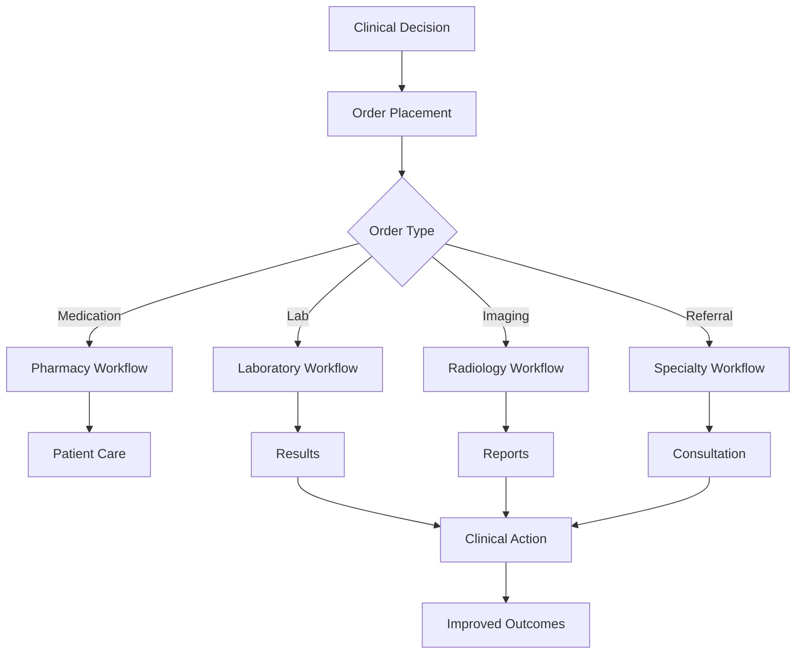

# Orchestrating Clinical Care Through Orders

*Discover how Epic's Orders Management system coordinates everything from medication prescriptions to lab tests, creating a digital symphony of clinical care delivery.*

### The Command Center of Healthcare

Every clinical decision ultimately becomes an order - a prescription for medication, a request for lab work, an imaging study, or a referral to a specialist. In Epic's EHI data, the Orders Management domain captures this complex orchestration across 70+ tables. Our sample patient has 4 medication orders and 25 procedure orders, revealing patterns of chronic disease management, preventive care, and diagnostic workups spanning five years.

Let's explore how Epic structures this critical workflow data, starting with the fundamental split between medications and procedures.

### The Two Pillars: Medications vs. Procedures

Epic separates orders into two main categories, each with its own primary table:

<example-query description="Compare medication and procedure order volumes for our patient">
SELECT 
    'Medications' as Order_Category,
    COUNT(*) as Total_Orders,
    COUNT(DISTINCT ORDERING_DATE) as Order_Days,
    MIN(SUBSTR(ORDERING_DATE, 1, 10)) as First_Order,
    MAX(SUBSTR(ORDERING_DATE, 1, 10)) as Last_Order
FROM ORDER_MED
WHERE PAT_ID = 'Z7004242'

UNION ALL

SELECT 
    'Procedures' as Order_Category,
    COUNT(*) as Total_Orders,
    COUNT(DISTINCT ORDERING_DATE) as Order_Days,
    MIN(SUBSTR(ORDERING_DATE, 1, 10)) as First_Order,
    MAX(SUBSTR(ORDERING_DATE, 1, 10)) as Last_Order
FROM ORDER_PROC
WHERE PAT_ID = 'Z7004242'
ORDER BY Total_Orders DESC;
</example-query>

This separation reflects the fundamental difference in workflows:
- **Medications**: Ongoing therapy requiring refills, dose adjustments, and adherence monitoring
- **Procedures**: Discrete events with results, from simple blood draws to complex imaging

### Following a Medication Through Time

Let's trace the lifecycle of a single medication - nortriptyline, commonly used for depression or chronic pain:

<example-query description="Track the complete history of nortriptyline orders showing refills and changes">
SELECT 
    ORDER_MED_ID,
    SUBSTR(START_DATE, 1, 10) as Start_Date,
    SUBSTR(END_DATE, 1, 10) as End_Date,
    QUANTITY,
    REFILLS,
    ORDER_STATUS_C_NAME as Status,
    RSN_FOR_DISCON_C_NAME as Discontinuation_Reason,
    CASE 
        WHEN CHNG_ORDER_MED_ID IS NOT NULL THEN 'Reorder of ' || CHNG_ORDER_MED_ID
        ELSE 'Original Order'
    END as Order_Type
FROM ORDER_MED
WHERE PAT_ID = 'Z7004242' 
  AND DESCRIPTION LIKE '%NORTRIPTYLINE%'
ORDER BY START_DATE;
</example-query>

This reveals Epic's sophisticated medication tracking:
1. **Original prescription**: 90-day supply with 1 refill
2. **Reorder**: Increased to 180-day supply with 3 refills
3. **Pharmacy change**: Patient switched from Walgreens to Costco
4. **Dose adjustment**: Increased from 10mg to 30mg

### The Laboratory Order Journey

Laboratory orders follow a different path, from order to result:

<example-query description="Trace lab orders from placement through final results">
WITH LabOrders AS (
    SELECT 
        op.ORDER_PROC_ID,
        op.ORDERING_DATE,
        op.DESCRIPTION as Test_Name,
        op.ORDER_STATUS_C_NAME as Order_Status,
        op.LAB_STATUS_C_NAME as Lab_Status,
        COUNT(orr.LINE) as Result_Components
    FROM ORDER_PROC op
    LEFT JOIN ORDER_RESULTS orr ON op.ORDER_PROC_ID = orr.ORDER_PROC_ID
    WHERE op.PAT_ID = 'Z7004242'
      AND op.ORDER_TYPE_C_NAME = 'Lab'
    GROUP BY op.ORDER_PROC_ID, op.ORDERING_DATE, op.DESCRIPTION, 
             op.ORDER_STATUS_C_NAME, op.LAB_STATUS_C_NAME
)
SELECT 
    SUBSTR(ORDERING_DATE, 1, 10) as Order_Date,
    Test_Name,
    Order_Status,
    Lab_Status,
    Result_Components,
    CASE 
        WHEN Lab_Status = 'Final result' THEN 'Complete with ' || Result_Components || ' results'
        WHEN Order_Status = 'Completed' AND Result_Components = 0 THEN 'Completed, no discrete results'
        ELSE 'Pending or canceled'
    END as Interpretation
FROM LabOrders
ORDER BY ORDERING_DATE DESC
LIMIT 10;
</example-query>

Notice the patterns:
- Most labs have multiple component results (e.g., lipid panel has 5 components)
- Some completed orders lack discrete results (stored elsewhere or as documents)
- Lab status provides more detail than general order status

### Diving Into Lab Results

Let's examine actual lab results to understand Epic's component-level storage:

<example-query description="Show detailed lab results with reference ranges and abnormal flags">
SELECT 
    op.DESCRIPTION as Test,
    orr.COMPONENT_ID_NAME as Component,
    orr.ORD_VALUE as Value,
    orr.REFERENCE_UNIT as Unit,
    orr.REFERENCE_LOW || '-' || orr.REFERENCE_HIGH as Normal_Range,
    CASE 
        WHEN orr.RESULT_FLAG_C_NAME = 'High' THEN '⬆️ HIGH'
        WHEN orr.RESULT_FLAG_C_NAME = 'Low' THEN '⬇️ LOW'
        ELSE '✓ Normal'
    END as Status
FROM ORDER_PROC op
JOIN ORDER_RESULTS orr ON op.ORDER_PROC_ID = orr.ORDER_PROC_ID
WHERE op.PAT_ID = 'Z7004242'
  AND op.ORDER_TYPE_C_NAME = 'Lab'
  AND op.ORDERING_DATE LIKE '9/28/2023%'
ORDER BY op.ORDERING_DATE DESC, op.ORDER_PROC_ID, orr.LINE
LIMIT 15;
</example-query>

This component structure enables:
- Automated flagging of abnormal values
- Trending of specific components over time
- Integration with clinical decision support
- Standardized reporting across different labs

### Tracking Refills and Medication Adherence

Epic's refill tracking reveals patient behavior patterns:

<example-query description="Analyze medication refill patterns to assess adherence">
WITH MedHistory AS (
    SELECT 
        SUBSTR(DESCRIPTION, 1, 30) as Medication,
        SUBSTR(START_DATE, 1, 10) as Start_Date,
        SUBSTR(END_DATE, 1, 10) as End_Date,
        CAST(REPLACE(QUANTITY, ' capsule', '') AS INTEGER) as Quantity,
        CASE 
            WHEN END_DATE IS NOT NULL 
            THEN 90  -- Assuming 90 day supply for simplicity
            ELSE 90
        END as Days_Supply,
        RSN_FOR_DISCON_C_NAME as Discontinuation_Reason
    FROM ORDER_MED
    WHERE PAT_ID = 'Z7004242'
      AND QUANTITY LIKE '%capsule%'
)
SELECT 
    Medication,
    Start_Date,
    End_Date,
    Quantity || ' units' as Quantity,
    Days_Supply || ' days' as Duration,
    ROUND(Quantity / Days_Supply * 30, 1) || ' units/month' as Monthly_Usage,
    COALESCE(Discontinuation_Reason, 'Active') as Status
FROM MedHistory
ORDER BY Start_Date DESC;
</example-query>

Key insights:
- Quantity and duration help calculate adherence
- Discontinuation reasons reveal clinical decisions
- Reorder patterns show prescription stability

### The Referral Network

Referrals connect primary care to specialty care:

<example-query description="Map referral patterns showing specialty consultations">
SELECT 
    SUBSTR(ORDERING_DATE, 1, 10) as Referral_Date,
    DESCRIPTION as Specialty,
    ORDER_STATUS_C_NAME as Status,
    CASE 
        WHEN REFERRING_PROV_ID IS NOT NULL AND REFERRING_PROV_ID != '' THEN 'Provider: ' || REFERRING_PROV_ID
        ELSE 'No referring provider listed'
    END as Referred_By,
    CASE 
        WHEN REFD_TO_LOC_ID IS NOT NULL THEN 'Location specified'
        ELSE 'No specific location'
    END as Destination
FROM ORDER_PROC
WHERE PAT_ID = 'Z7004242'
  AND ORDER_TYPE_C_NAME = 'Outpatient Referral'
ORDER BY ORDERING_DATE DESC;
</example-query>

This reveals care coordination patterns:
- Multiple neurology referrals suggest ongoing neurological issues
- Gastroenterology consultation for digestive concerns
- All marked as "Sent" - but completion tracked elsewhere

### Understanding Order Relationships

Orders often relate to each other - labs ordered together, medications linked to diagnoses:

<example-query description="Find orders placed together on the same encounter">
WITH OrderGroups AS (
    SELECT 
        PAT_ENC_CSN_ID,
        SUBSTR(ORDERING_DATE, 1, 10) as Order_Date,
        'Medication' as Order_Type,
        DESCRIPTION,
        ORDER_MED_ID as Order_ID
    FROM ORDER_MED
    WHERE PAT_ID = 'Z7004242'
    
    UNION ALL
    
    SELECT 
        PAT_ENC_CSN_ID,
        SUBSTR(ORDERING_DATE, 1, 10) as Order_Date,
        'Procedure: ' || ORDER_TYPE_C_NAME as Order_Type,
        DESCRIPTION,
        ORDER_PROC_ID as Order_ID
    FROM ORDER_PROC
    WHERE PAT_ID = 'Z7004242'
)
SELECT 
    Order_Date,
    COUNT(*) as Orders_Placed,
    GROUP_CONCAT(Order_Type || ': ' || SUBSTR(DESCRIPTION, 1, 30), '; ') as Order_Summary
FROM OrderGroups
WHERE PAT_ENC_CSN_ID IS NOT NULL
GROUP BY PAT_ENC_CSN_ID, Order_Date
HAVING COUNT(*) > 1
ORDER BY Order_Date DESC;
</example-query>

This shows clinical decision-making patterns:
- Labs ordered in panels for efficiency
- Medications and referrals coordinated
- Encounter-based grouping for billing

### The Power of Order Status Tracking

Every order has a detailed status history:

<example-query description="Examine order status progression for completed labs">
SELECT 
    os.ORDER_ID,
    SUBSTR(op.DESCRIPTION, 1, 30) as Test,
    os.CONTACT_TYPE_C_NAME as Status_Update,
    SUBSTR(os.INSTANT_OF_ENTRY, 1, 10) as Update_Date,
    os.ORDER_CREATOR_ID_NAME as Updated_By
FROM ORDER_STATUS os
JOIN ORDER_PROC op ON os.ORDER_ID = op.ORDER_PROC_ID
WHERE op.PAT_ID = 'Z7004242'
  AND op.ORDER_TYPE_C_NAME = 'Lab'
  AND op.ORDER_STATUS_C_NAME = 'Completed'
ORDER BY os.ORDER_ID, os.INSTANT_OF_ENTRY
LIMIT 10;
</example-query>

Status tracking enables:
- Audit trails for compliance
- Workflow bottleneck identification
- Quality metric calculation
- User activity monitoring

### Uncovering Clinical Patterns

By analyzing orders over time, we can identify care patterns:

<example-query description="Identify chronic condition management through recurring orders">
WITH OrderPatterns AS (
    SELECT 
        CASE 
            WHEN DESCRIPTION LIKE '%A1C%' THEN 'Diabetes Monitoring'
            WHEN DESCRIPTION LIKE '%LIPID%' THEN 'Cardiovascular Monitoring'
            WHEN DESCRIPTION LIKE '%HEPATITIS%' THEN 'Infection Screening'
            WHEN DESCRIPTION LIKE '%DEPRESSION%' OR DESCRIPTION LIKE '%NORTRIPTYLINE%' THEN 'Mental Health'
            WHEN DESCRIPTION LIKE '%LISINOPRIL%' THEN 'Hypertension Management'
            ELSE 'Other'
        END as Care_Category,
        COUNT(*) as Order_Count,
        MIN(SUBSTR(ORDERING_DATE, 1, 10)) as First_Order,
        MAX(SUBSTR(ORDERING_DATE, 1, 10)) as Last_Order
    FROM (
        SELECT ORDERING_DATE, DESCRIPTION FROM ORDER_MED WHERE PAT_ID = 'Z7004242'
        UNION ALL
        SELECT ORDERING_DATE, DESCRIPTION FROM ORDER_PROC WHERE PAT_ID = 'Z7004242'
    )
    GROUP BY Care_Category
)
SELECT 
    Care_Category,
    Order_Count,
    First_Order,
    Last_Order,
    CASE 
        WHEN First_Order IS NOT NULL AND Last_Order IS NOT NULL 
        THEN 'Ongoing care'
        ELSE 'Single episode'
    END as Care_Duration
FROM OrderPatterns
WHERE Care_Category != 'Other'
ORDER BY Order_Count DESC;
</example-query>

This reveals a comprehensive care picture:
- Regular diabetes monitoring with A1C tests
- Cardiovascular risk management with lipid panels
- Mental health treatment with antidepressants
- Preventive screening for hepatitis

### Best Practices for Order Analysis

**1. Always Check Order Status**
```sql
-- Include status in all queries
SELECT * FROM ORDER_MED 
WHERE ORDER_STATUS_C_NAME != 'Canceled'
  AND RSN_FOR_DISCON_C_NAME IS NULL;
```

**2. Link Orders to Results**
```sql
-- Use LEFT JOIN to include orders without results
SELECT op.*, COUNT(orr.LINE) as Result_Count
FROM ORDER_PROC op
LEFT JOIN ORDER_RESULTS orr ON op.ORDER_PROC_ID = orr.ORDER_PROC_ID
GROUP BY op.ORDER_PROC_ID;
```

**3. Consider Order Relationships**
```sql
-- Find related orders through encounters
SELECT * FROM ORDER_PROC
WHERE PAT_ENC_CSN_ID IN (
    SELECT PAT_ENC_CSN_ID FROM ORDER_MED 
    WHERE MEDICATION_ID = ?
);
```

**4. Track Provider Patterns**
```sql
-- Analyze ordering patterns by provider
SELECT AUTHRZING_PROV_ID, COUNT(*) as Orders
FROM ORDER_PROC
GROUP BY AUTHRZING_PROV_ID
ORDER BY Orders DESC;
```

### The Clinical Impact

Understanding orders data enables critical healthcare capabilities:



### Summary

Epic's Orders Management domain demonstrates sophisticated healthcare orchestration:

- **Dual architecture** separates medication and procedure workflows
- **Component-level results** enable precise clinical interpretation
- **Status tracking** provides complete audit trails
- **Relationship mapping** reveals care coordination patterns
- **Time-based analysis** uncovers adherence and care quality

Key insights from our analysis:
- 4 medications reveal chronic disease management
- 25 procedure orders show comprehensive preventive care
- Refill patterns indicate good medication adherence
- Lab results demonstrate well-controlled chronic conditions
- Multiple referrals suggest complex care needs

Mastering orders data enables you to:
- Monitor medication adherence and safety
- Track diagnostic test utilization
- Measure care quality and completeness
- Identify care gaps and opportunities
- Support population health management

Whether analyzing individual patient journeys or population-wide ordering patterns, the Orders Management domain provides the foundation for understanding how clinical decisions translate into patient care.