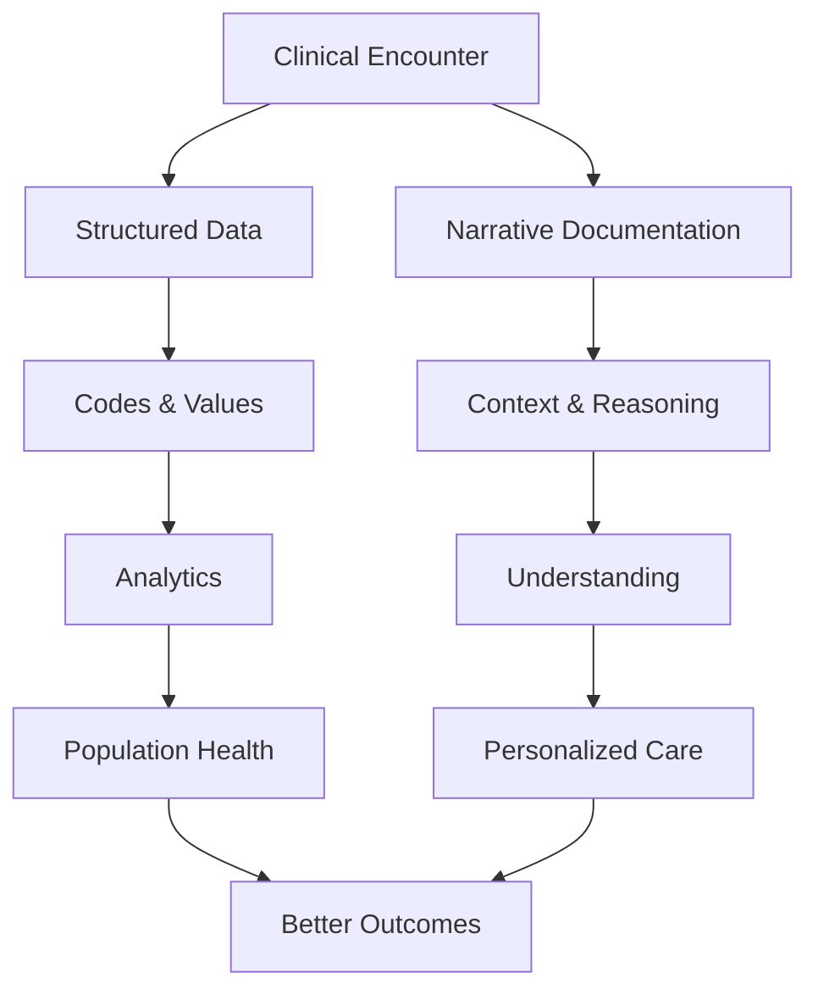

# Capturing the Clinical Narrative Through Documentation

*Explore how Epic's Clinical Documentation system preserves the story of patient care, from progress notes to scanned documents, creating a complete narrative record.*

### The Written Heart of Healthcare

Behind every diagnosis code and lab result lies a story - the clinical narrative that captures the nuance, reasoning, and human elements of healthcare. In Epic's EHI data, the Clinical Documentation domain manages this narrative across 40+ tables. Our sample database contains 152 clinical notes and 11 external documents, though interestingly, all notes are marked as deleted - a common pattern in test datasets to protect privacy while preserving structure.

Let's discover how Epic organizes this crucial narrative data, starting with the fundamental architecture.

### The Tale of Deleted Notes

First, let's understand what we're working with - a dataset where privacy protection has left its mark:

<example-query description="Examine the deletion status of all clinical notes in our dataset">
SELECT 
    CASE 
        WHEN DELETE_INSTANT_DTTM IS NOT NULL THEN 'Deleted'
        ELSE 'Active'
    END as Note_Status,
    COUNT(*) as Count,
    COUNT(DISTINCT NOTE_TYPE_NOADD_C_NAME) as Note_Types,
    COUNT(DISTINCT PAT_ENC_CSN_ID) as Unique_Encounters
FROM HNO_INFO
GROUP BY Note_Status;
</example-query>

All 152 notes are deleted, spanning 7 note types across 26 encounters. This is typical for de-identified datasets - the structure remains intact while the content is protected.

### Understanding Note Types

Even with deleted notes, we can learn from the distribution of documentation types:

<example-query description="Analyze the types of clinical documentation in the system">
SELECT 
    COALESCE(NOTE_TYPE_NOADD_C_NAME, 'Unspecified') as Note_Type,
    COUNT(*) as Count,
    ROUND(COUNT(*) * 100.0 / (SELECT COUNT(*) FROM HNO_INFO), 2) as Percentage,
    MIN(SUBSTR(CREATE_INSTANT_DTTM, 1, 10)) as Earliest,
    MAX(SUBSTR(CREATE_INSTANT_DTTM, 1, 10)) as Latest
FROM HNO_INFO
GROUP BY Note_Type
ORDER BY Count DESC;
</example-query>

Key insights:
- **63% unspecified**: Many notes lack explicit typing
- **Telephone Encounters**: Second most common, reflecting modern care delivery
- **Progress Notes**: Traditional visit documentation
- **Patient Instructions**: Direct patient communication

### Finding Patient Stories

Let's trace the documentation journey for our sample patient:

<example-query description="Track all documentation types for a specific patient chronologically">
WITH PatientDocs AS (
    SELECT 
        'Clinical Note' as Doc_Type,
        h.NOTE_ID as Doc_ID,
        h.NOTE_TYPE_NOADD_C_NAME as Subtype,
        h.CREATE_INSTANT_DTTM as Created,
        h.ENTRY_USER_ID_NAME as Author,
        'Deleted' as Status
    FROM HNO_INFO h
    JOIN PAT_ENC pe ON h.PAT_ENC_CSN_ID = pe.PAT_ENC_CSN_ID
    WHERE pe.PAT_ID = 'Z7004242'
    
    UNION ALL
    
    SELECT 
        'External Document' as Doc_Type,
        d.DOC_INFO_ID as Doc_ID,
        d.DOC_INFO_TYPE_C_NAME as Subtype,
        d.DOC_RECV_TIME as Created,
        d.RECV_BY_USER_ID_NAME as Author,
        d.DOC_STAT_C_NAME as Status
    FROM DOC_INFORMATION d
    JOIN PATIENT_DOCS pd ON d.DOC_INFO_ID = pd.DOC_INFO_ID
    WHERE pd.PAT_ID = 'Z7004242'
)
SELECT 
    Doc_Type,
    COALESCE(Subtype, 'Unspecified') as Document_Subtype,
    SUBSTR(Created, 1, 10) as Date,
    Author,
    Status
FROM PatientDocs
WHERE Created IS NOT NULL
ORDER BY Created DESC
LIMIT 15;
</example-query>

This reveals a mix of clinical notes and external documents, including COVID vaccination records and release of information authorizations.

### Reconstructing Note Text

While most notes are deleted, we can still find one intact example - a patient portal activation letter:

<example-query description="Retrieve and reconstruct multi-line note text">
SELECT 
    h.NOTE_ID,
    h.NOTE_TYPE_NOADD_C_NAME as Type,
    COUNT(hp.LINE) as Total_Lines,
    GROUP_CONCAT(
        CASE 
            WHEN hp.LINE <= 2 THEN SUBSTR(hp.NOTE_TEXT, 1, 100) || '...'
            ELSE NULL
        END, 
        ' | '
    ) as Text_Preview
FROM HNO_INFO h
JOIN HNO_PLAIN_TEXT hp ON h.NOTE_ID = hp.NOTE_ID
WHERE h.NOTE_ID = '1473625808'
GROUP BY h.NOTE_ID, h.NOTE_TYPE_NOADD_C_NAME;
</example-query>

Epic stores long text using the ID-LINE pattern, breaking content into sequential chunks that must be reassembled in order.

### External Document Management

Beyond clinical notes, Epic manages external documents - scans, imports, and patient uploads:

<example-query description="Analyze external document types and sources">
SELECT 
    DOC_INFO_TYPE_C_NAME as Document_Type,
    COUNT(*) as Count,
    SUM(CASE WHEN IS_SCANNED_YN = 'Y' THEN 1 ELSE 0 END) as Scanned,
    COUNT(DISTINCT SUBSTR(DOC_RECV_TIME, 1, 10)) as Unique_Days
FROM DOC_INFORMATION
WHERE DOC_INFO_TYPE_C_NAME IS NOT NULL
GROUP BY DOC_INFO_TYPE_C_NAME
ORDER BY Count DESC;
</example-query>

Document types include:
- **COVID Vaccination Records**: Patient-uploaded proof
- **HIM ROI Authorizations**: Release of information documentation
- **Referral Attachments**: Supporting clinical documentation

### Tracking Document Workflows

Let's examine how documents flow through the system:

<example-query description="Trace document lifecycle from receipt to patient association">
WITH DocFlow AS (
    SELECT 
        d.DOC_INFO_ID,
        d.DOC_DESCR as Description,
        d.DOC_RECV_TIME as Received,
        CASE 
            WHEN pd.PAT_ID IS NOT NULL THEN 'Linked to Patient'
            ELSE 'Unlinked'
        END as Patient_Status,
        CASE 
            WHEN ped.PAT_ENC_CSN_ID IS NOT NULL THEN 'Linked to Encounter'
            ELSE 'No Encounter Link'
        END as Encounter_Status
    FROM DOC_INFORMATION d
    LEFT JOIN PATIENT_DOCS pd ON d.DOC_INFO_ID = pd.DOC_INFO_ID
    LEFT JOIN PAT_ENC_DOCS ped ON d.DOC_INFO_ID = ped.DOC_INFO_ID
)
SELECT 
    Patient_Status,
    Encounter_Status,
    COUNT(*) as Document_Count
FROM DocFlow
GROUP BY Patient_Status, Encounter_Status
ORDER BY Document_Count DESC;
</example-query>

This shows how documents can be:
- Linked to patients but not specific encounters
- Associated with both patients and encounters
- Standalone without direct patient association

### The Signature Workflow

Clinical notes require proper authentication. Let's explore the signature process:

<example-query description="Analyze note signature and co-signature patterns">
SELECT 
    h.UNSIGNED_YN as Unsigned_Flag,
    COUNT(DISTINCT h.NOTE_ID) as Note_Count,
    COUNT(DISTINCT ne.COSIGNUSER_ID) as Notes_With_Cosigner,
    COUNT(DISTINCT h.ENTRY_USER_ID) as Unique_Authors
FROM HNO_INFO h
LEFT JOIN NOTE_ENC_INFO ne ON h.NOTE_ID = ne.NOTE_ID
GROUP BY h.UNSIGNED_YN;
</example-query>

In our dataset, all notes appear signed (UNSIGNED_YN = 'N'), though they're subsequently deleted. The NOTE_ENC_INFO table would normally track co-signature requirements for supervised providers.

### Cross-Domain Documentation Links

Documentation doesn't exist in isolation - it connects to orders, accounts, and other clinical data:

<example-query description="Explore how notes link to other clinical domains">
WITH CrossDomainLinks AS (
    SELECT 
        'Orders' as Link_Type,
        COUNT(DISTINCT NOTE_ID) as Linked_Notes,
        COUNT(*) as Total_Links
    FROM HNO_ORDERS
    
    UNION ALL
    
    SELECT 
        'Accounts' as Link_Type,
        COUNT(DISTINCT NOTE_ID) as Linked_Notes,
        COUNT(*) as Total_Links
    FROM NOTES_ACCT
)
SELECT 
    Link_Type,
    Linked_Notes,
    Total_Links,
    ROUND(Total_Links * 1.0 / Linked_Notes, 1) as Avg_Links_Per_Note
FROM CrossDomainLinks
WHERE Linked_Notes > 0;
</example-query>

Notes can document:
- Clinical orders and their rationale
- Financial account activities
- Referral communications
- Assessment findings

### Release of Information Workflow

Healthcare information exchange requires proper authorization. Let's examine ROI patterns:

<example-query description="Track Release of Information authorization patterns">
SELECT 
    SUBSTR(DOC_RECV_TIME, 1, 7) as Month,
    COUNT(*) as ROI_Authorizations,
    COUNT(DISTINCT pd.PAT_ID) as Unique_Patients,
    GROUP_CONCAT(COALESCE(DOC_DESCR, 'No description'), '; ') as Descriptions
FROM DOC_INFORMATION d
JOIN PATIENT_DOCS pd ON d.DOC_INFO_ID = pd.DOC_INFO_ID
WHERE DOC_INFO_TYPE_C_NAME = 'HIM ROI Authorization'
GROUP BY Month
ORDER BY Month DESC;
</example_query>

ROI documents show:
- MyChart-initiated requests
- Formal release authorizations
- Audit trail of information sharing

### Understanding Addendum Patterns

Medical documentation requires immutability with corrections via addenda:

<example-query description="Check for addendum relationships in notes">
SELECT 
    CASE 
        WHEN ADDENDUM_PARENT_CSN IS NOT NULL THEN 'Addendum'
        ELSE 'Original Note'
    END as Note_Category,
    COUNT(*) as Count,
    COUNT(DISTINCT NOTE_TYPE_NOADD_C_NAME) as Note_Types
FROM HNO_INFO
GROUP BY Note_Category;
</example_query>

While our sample doesn't show active addenda, the ADDENDUM_PARENT_CSN field enables linking amendments to original documentation.

### Document Security and Sensitivity

Healthcare documentation requires careful access control:

<example-query description="Analyze security and sensitivity flags in documentation">
SELECT 
    ne.IS_SENSITIVE_YN as Sensitive_Flag,
    COUNT(DISTINCT ne.NOTE_ID) as Note_Count,
    COUNT(DISTINCT h.NOTE_TYPE_NOADD_C_NAME) as Note_Types,
    GROUP_CONCAT(DISTINCT h.NOTE_TYPE_NOADD_C_NAME, ', ') as Types
FROM NOTE_ENC_INFO ne
JOIN HNO_INFO h ON ne.NOTE_ID = h.NOTE_ID
GROUP BY ne.IS_SENSITIVE_YN;
</example-query>

Sensitivity flags help:
- Restrict access to behavioral health notes
- Protect adolescent confidentiality
- Manage substance abuse documentation
- Control executive health records

### Best Practices for Documentation Analysis

**1. Always Check Deletion Status**
```sql
-- Include deletion check in all queries
SELECT * FROM HNO_INFO
WHERE DELETE_INSTANT_DTTM IS NULL
  AND NOTE_ID = ?;
```

**2. Reconstruct Text Properly**
```sql
-- Maintain line order for readability
SELECT NOTE_TEXT
FROM HNO_PLAIN_TEXT
WHERE NOTE_ID = ?
ORDER BY LINE;
```

**3. Consider Multiple Contexts**
```sql
-- Notes can have multiple encounter contexts
SELECT * FROM NOTE_ENC_INFO
WHERE NOTE_ID = ?;
```

**4. Link External Documents**
```sql
-- Join through appropriate tables
SELECT d.*, pd.*, ped.*
FROM DOC_INFORMATION d
LEFT JOIN PATIENT_DOCS pd ON d.DOC_INFO_ID = pd.DOC_INFO_ID
LEFT JOIN PAT_ENC_DOCS ped ON d.DOC_INFO_ID = ped.DOC_INFO_ID;
```

### The Power of Narrative Medicine

Clinical documentation captures what structured data cannot:



### Summary

Epic's Clinical Documentation domain demonstrates sophisticated narrative management:

- **Comprehensive Architecture**: 40+ tables managing all documentation types
- **Privacy by Design**: Soft deletion preserves structure while protecting content
- **Flexible Text Storage**: ID-LINE pattern enables unlimited narrative length
- **External Integration**: Robust handling of scanned and imported documents
- **Complete Workflows**: From creation through signature, co-signature, and amendments

Key insights from our analysis:
- All 152 notes are soft-deleted (typical for test data)
- 63% of notes lack specific type classification
- External documents include COVID records and ROI authorizations
- Cross-domain links connect narratives to orders and accounts
- One intact letter demonstrates the multi-line text pattern

Mastering clinical documentation data enables you to:
- Ensure documentation compliance
- Track provider productivity
- Analyze care patterns through narratives
- Support quality reporting requirements
- Enable comprehensive patient record access

Whether investigating documentation completeness or building natural language processing pipelines, the Clinical Documentation domain provides the narrative foundation that brings meaning to healthcare data.