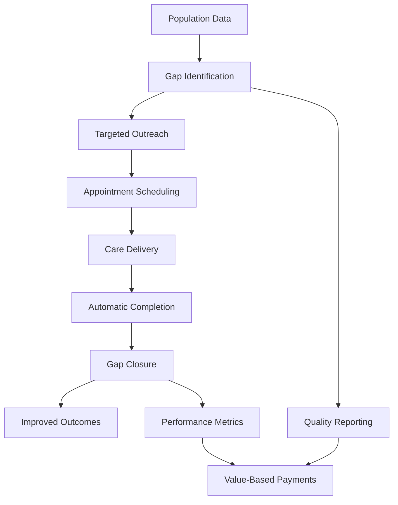

# Closing Care Gaps Through Preventive Health Tracking

*Discover how Epic's Health Maintenance system transforms preventive care from reactive reminders to proactive population health management.*

### The Prevention Paradox

Healthcare's greatest victories often come not from treating disease, but from preventing it entirely. Yet preventive care faces a fundamental challenge: how do you systematically track what hasn't happened yet? In Epic's EHI data, the Health Maintenance & Population Health domain solves this paradox across 9 tables managing 23 different preventive care topics. Our sample database tracks over 13,000 status records and 5,400 completions, revealing patterns of both success and missed opportunities in preventive care delivery.

Let's explore how Epic orchestrates this complex prevention symphony.

### The Preventive Care Universe

First, let's see what health maintenance topics Epic tracks:

<example-query description="Explore all available health maintenance topics and categorize them">
SELECT 
    HM_PLAN_ID,
    HM_PLAN_NAME as Topic,
    CASE 
        WHEN HM_PLAN_NAME LIKE '%Vaccine%' THEN 'Immunization'
        WHEN HM_PLAN_NAME LIKE '%Screening%' THEN 'Screening'
        WHEN HM_PLAN_NAME LIKE '%Visit%' THEN 'Wellness Visit'
        ELSE 'Other Prevention'
    END as Category
FROM HM_PLAN_INFO
ORDER BY Category, Topic;
</example-query>

The system tracks:
- **14 Immunizations**: From childhood vaccines to travel immunizations
- **3 Screenings**: Cholesterol, Hepatitis C, and embedded in names
- **1 Wellness Visit**: Age-specific annual checkups
- **5 Other**: Specialized preventive care topics

### Understanding the Status Lifecycle

Health maintenance items flow through a sophisticated status lifecycle:

<example-query description="Analyze the distribution of health maintenance statuses across all patients">
SELECT 
    HM_STATUS_C_NAME as Status,
    COUNT(*) as Occurrences,
    ROUND(COUNT(*) * 100.0 / (SELECT COUNT(*) FROM HM_HISTORICAL_STATUS WHERE HM_STATUS_C_NAME IS NOT NULL), 2) as Percentage,
    CASE HM_STATUS_C_NAME
        WHEN 'Overdue' THEN 'Action needed'
        WHEN 'Due On' THEN 'Due now'
        WHEN 'Due Soon' THEN 'Coming due'
        WHEN 'Not Due' THEN 'Up to date'
        WHEN 'Completed' THEN 'Done'
        WHEN 'Hidden' THEN 'Clinical only'
        WHEN 'Aged Out' THEN 'Too old'
        ELSE 'Other'
    END as Meaning
FROM HM_HISTORICAL_STATUS
WHERE HM_STATUS_C_NAME IS NOT NULL
GROUP BY HM_STATUS_C_NAME
ORDER BY 
    CASE HM_STATUS_C_NAME
        WHEN 'Overdue' THEN 1
        WHEN 'Due On' THEN 2
        WHEN 'Due Soon' THEN 3
        WHEN 'Not Due' THEN 4
        WHEN 'Completed' THEN 5
        ELSE 6
    END;
</example-query>

Key insights:
- **34% Hidden**: Many items hidden from patient view
- **18% Aged Out**: Patients who exceeded age eligibility
- **16% Due On**: Currently due for service
- **7% Overdue**: Missed prevention opportunities

### Patient-Specific Prevention Journey

Let's follow one patient's preventive care status:

<example-query description="View current health maintenance status for a specific patient">
SELECT 
    ps.ACTIVE_HM_PLAN_ID_HM_PLAN_NAME as Topic,
    hs.HM_STATUS_C_NAME as Status,
    SUBSTR(hs.NEXT_DUE_DATE, 1, 10) as Due_Date
FROM PATIENT_HMT_STATUS ps
LEFT JOIN HM_HISTORICAL_STATUS hs 
    ON ps.PAT_ID = hs.PAT_ID 
    AND ps.ACTIVE_HM_PLAN_ID = hs.HM_TOPIC_ID
WHERE ps.PAT_ID = 'Z7004242'
  AND hs.LINE = (SELECT MAX(LINE) FROM HM_HISTORICAL_STATUS 
                 WHERE PAT_ID = ps.PAT_ID 
                 AND HM_TOPIC_ID = ps.ACTIVE_HM_PLAN_ID)
ORDER BY Topic;
</example-query>

This patient shows:
- HPV vaccine overdue since September 2023
- Multiple vaccines without status (may need assessment)
- Some items hidden or aged out

### How Completions Are Recognized

Epic recognizes preventive care completions from multiple sources:

<example-query description="Analyze how health maintenance items get completed across the system">
SELECT 
    HM_COMP_TYPE_C_NAME as Completion_Source,
    COUNT(*) as Total_Completions,
    ROUND(COUNT(*) * 100.0 / (SELECT COUNT(*) FROM HM_HISTORY), 2) as Percentage,
    MIN(SUBSTR(HM_COMP_UTC_DTTM, 1, 10)) as Earliest,
    MAX(SUBSTR(HM_COMP_UTC_DTTM, 1, 10)) as Latest
FROM HM_HISTORY
GROUP BY HM_COMP_TYPE_C_NAME
ORDER BY Total_Completions DESC;
</example-query>

Completion sources:
- **Immunization (70%)**: Direct vaccine administration
- **Result Component (23%)**: Lab results satisfying requirements
- **LOS Code (4%)**: Hospital stays triggering completion
- **E/M Code (3%)**: Specific visit types

### Tracking Immunization Completions

Let's see recent immunization activity for our patient:

<example-query description="View recent immunization completions with timing details">
SELECT 
    DATE(HM_COMP_UTC_DTTM) as Completion_Date,
    COUNT(*) as Immunizations_Given,
    TIME(MIN(HM_COMP_UTC_DTTM)) as First_Time,
    TIME(MAX(HM_COMP_UTC_DTTM)) as Last_Time,
    CASE 
        WHEN COUNT(*) > 5 THEN 'Multiple vaccines batch'
        WHEN COUNT(*) > 1 THEN CAST(COUNT(*) AS TEXT) || ' vaccines given'
        ELSE 'Single vaccine'
    END as Pattern
FROM HM_HISTORY
WHERE PAT_ID = 'Z7004242'
  AND HM_COMP_TYPE_C_NAME = 'Immunization'
  AND HM_COMP_UTC_DTTM IS NOT NULL
GROUP BY DATE(HM_COMP_UTC_DTTM)
ORDER BY Completion_Date DESC
LIMIT 10;
</example-query>

Shows batch immunization patterns - multiple vaccines given during single visits for efficiency.

### Population Health Analytics

Let's analyze care gaps across the entire population:

<example-query description="Identify the most common overdue preventive care items">
WITH OverdueStats AS (
    SELECT 
        hs.HM_TOPIC_ID_NAME as Topic,
        COUNT(DISTINCT hs.PAT_ID) as Overdue_Patients
    FROM HM_HISTORICAL_STATUS hs
    WHERE hs.HM_STATUS_C_NAME = 'Overdue'
      AND hs.HM_TOPIC_ID_NAME IS NOT NULL
    GROUP BY hs.HM_TOPIC_ID_NAME
),
TotalStats AS (
    SELECT 
        HM_TOPIC_ID_NAME as Topic,
        COUNT(DISTINCT PAT_ID) as Total_Patients
    FROM HM_HISTORICAL_STATUS
    WHERE HM_TOPIC_ID_NAME IS NOT NULL
    GROUP BY HM_TOPIC_ID_NAME
)
SELECT 
    os.Topic,
    os.Overdue_Patients,
    ts.Total_Patients,
    ROUND(os.Overdue_Patients * 100.0 / ts.Total_Patients, 1) as Overdue_Rate
FROM OverdueStats os
JOIN TotalStats ts ON os.Topic = ts.Topic
WHERE ts.Total_Patients >= 1
ORDER BY os.Overdue_Patients DESC
LIMIT 10;
</example-query>

This reveals organizational care gaps requiring targeted interventions.

### The Forecasting Engine

Epic calculates when preventive care will be due:

<example-query description="Examine forecast calculations for upcoming preventive care">
SELECT 
    fi.HM_FORECAST_TOPIC_ID_NAME as Topic,
    fi.EARLIEST_VALID_DATE as Forecast_Date,
    ps.HMT_LAST_UPDATE_DT as Last_Updated,
    CASE 
        WHEN fi.EARLIEST_VALID_DATE IS NULL THEN 'No forecast'
        WHEN DATE(fi.EARLIEST_VALID_DATE) <= DATE('now') THEN 'Due now'
        WHEN DATE(fi.EARLIEST_VALID_DATE) <= DATE('now', '+30 days') THEN 'Due within 30 days'
        WHEN DATE(fi.EARLIEST_VALID_DATE) <= DATE('now', '+90 days') THEN 'Due within 90 days'
        ELSE 'Due later'
    END as Urgency
FROM HM_FORECAST_INFO fi
JOIN PATIENT_HMT_STATUS ps ON fi.PAT_ID = ps.PAT_ID
WHERE fi.PAT_ID = 'Z7004242'
  AND fi.EARLIEST_VALID_DATE IS NOT NULL
ORDER BY fi.EARLIEST_VALID_DATE;
</example-query>

The forecast helps with:
- Proactive scheduling
- Reminder timing
- Pre-visit planning
- Population outreach

### Age-Based Eligibility

Many preventive services are age-specific:

<example-query description="Analyze age-related patterns in health maintenance">
SELECT 
    HM_STATUS_C_NAME as Status,
    COUNT(DISTINCT CASE 
        WHEN HM_TOPIC_ID_NAME LIKE '%HPV%' THEN PAT_ID 
    END) as HPV_Patients,
    COUNT(DISTINCT CASE 
        WHEN HM_TOPIC_ID_NAME LIKE '%Zoster%' THEN PAT_ID 
    END) as Shingles_Patients,
    COUNT(DISTINCT CASE 
        WHEN HM_TOPIC_ID_NAME LIKE '%RSV%' THEN PAT_ID 
    END) as RSV_Patients
FROM HM_HISTORICAL_STATUS
WHERE HM_STATUS_C_NAME IN ('Aged Out', 'Not Due', 'Due On', 'Overdue')
GROUP BY HM_STATUS_C_NAME
ORDER BY 
    CASE HM_STATUS_C_NAME
        WHEN 'Overdue' THEN 1
        WHEN 'Due On' THEN 2
        WHEN 'Not Due' THEN 3
        WHEN 'Aged Out' THEN 4
    END;
</example-query>

Shows how age eligibility affects different vaccines:
- HPV: Ages 9-26
- Shingles: 50+
- RSV: Under 20 months

### Lab Results Driving Completions

Some screenings complete automatically based on lab results:

<example-query description="Track how lab results satisfy screening requirements">
SELECT 
    DATE(HM_COMP_UTC_DTTM) as Completion_Date,
    COUNT(*) as Lab_Completions,
    COUNT(DISTINCT PAT_ID) as Unique_Patients
FROM HM_HISTORY
WHERE HM_COMP_TYPE_C_NAME = 'Result Component'
  AND HM_COMP_UTC_DTTM IS NOT NULL
GROUP BY DATE(HM_COMP_UTC_DTTM)
ORDER BY Completion_Date DESC
LIMIT 10;
</example-query>

This automation:
- Reduces manual documentation
- Ensures accurate tracking
- Closes care gaps automatically
- Improves data quality

### Building Outreach Lists

Identify patients needing preventive care outreach:

<example-query description="Create prioritized outreach list for overdue patients">
WITH PatientPriority AS (
    SELECT 
        hs.PAT_ID,
        COUNT(DISTINCT hs.HM_TOPIC_ID) as Overdue_Items,
        GROUP_CONCAT(
            CASE 
                WHEN hs.HM_TOPIC_ID_NAME LIKE '%COVID%' THEN 'COVID'
                WHEN hs.HM_TOPIC_ID_NAME LIKE '%Influenza%' THEN 'Flu'
                ELSE SUBSTR(hs.HM_TOPIC_ID_NAME, 1, 15)
            END, ', '
        ) as Overdue_Services
    FROM HM_HISTORICAL_STATUS hs
    WHERE hs.HM_STATUS_C_NAME = 'Overdue'
    GROUP BY hs.PAT_ID
)
SELECT 
    PAT_ID,
    Overdue_Items,
    Overdue_Services,
    CASE 
        WHEN Overdue_Items >= 5 THEN '🔴 High Priority'
        WHEN Overdue_Items >= 3 THEN '🟠 Medium Priority'
        ELSE '🟡 Low Priority'
    END as Outreach_Priority
FROM PatientPriority
ORDER BY Overdue_Items DESC
LIMIT 20;
</example-query>

This enables:
- Targeted outreach campaigns
- Resource allocation
- Priority scheduling
- Performance tracking

### Best Practices for Preventive Care

**1. Use Latest Status Records**
```sql
-- Always get the most recent status
WITH LatestStatus AS (
    SELECT *,
        ROW_NUMBER() OVER (PARTITION BY PAT_ID, HM_TOPIC_ID ORDER BY LINE DESC) as rn
    FROM HM_HISTORICAL_STATUS
)
SELECT * FROM LatestStatus WHERE rn = 1;
```

**2. Consider All Completion Sources**
```sql
-- Don't miss any completion types
SELECT * FROM HM_HISTORY
WHERE HM_COMP_TYPE_C_NAME IN ('Immunization', 'Result Component', 'E/M Code', 'LOS Code');
```

**3. Respect Patient Preferences**
```sql
-- Check for postponements
SELECT * FROM PATIENT_HMT_STATUS
WHERE HMT_PPN_UNTL_DT IS NOT NULL;
```

**4. Filter Hidden Items**
```sql
-- Exclude clinical-only items from patient views
SELECT * FROM HM_HISTORICAL_STATUS
WHERE HM_STATUS_C_NAME != 'Hidden';
```

### The Population Health Impact

Health maintenance data enables a transformation in care delivery:



### Summary

Epic's Health Maintenance & Population Health domain demonstrates sophisticated preventive care management:

- **Comprehensive Tracking**: 23 topics covering vaccines, screenings, and wellness
- **Lifecycle Management**: 8 statuses tracking from "Not Due" to "Aged Out"
- **Multiple Completion Sources**: Automatic recognition from 4 different systems
- **Population Analytics**: Identifies care gaps across patient populations
- **Proactive Forecasting**: Calculates when services will be due

Key insights from our analysis:
- 34% of records are hidden (clinical use only)
- 70% of completions come from immunizations
- Multiple vaccines often given in single visits
- Lab results automatically satisfy screening requirements
- Age-based eligibility drives many status transitions

Mastering health maintenance data enables you to:
- Close care gaps systematically
- Improve quality scores
- Optimize preventive care delivery
- Support value-based care initiatives
- Enhance population health outcomes

Whether managing individual patient care or population-wide initiatives, the Health Maintenance domain transforms prevention from a series of reminders into a comprehensive, data-driven system for keeping populations healthy.